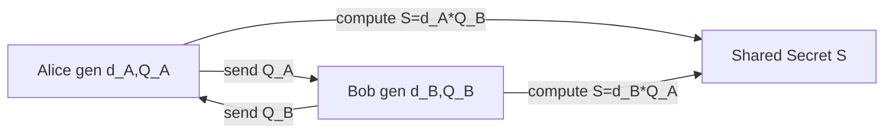

# ECC (Elliptic Curve Cryptography)

## 0. Tóm tắt ngắn
ECC cung cấp: khóa nhỏ, hiệu năng cao, phù hợp cho key-exchange (ECDH), hybrid encryption (ECIES) và chữ ký số (ECDSA). FileVault dùng ECC cho ECDH/ECIES.

## 1. Khái niệm thuật toán — Giải quyết vấn đề & Bảo vệ gì
- Mục đích: đạt thỏa thuận khóa bí mật (key exchange) và/hoặc chữ ký số với kích thước khóa nhỏ.
- Bảo vệ: tính bí mật (confidentiality) của khóa phiên, tính toàn vẹn & xác thực khi dùng với chữ ký.
- Vấn đề cơ bản được dùng: bài toán Logarit rời rạc trên đường cong elliptic (ECDLP) — khó tính toán d từ Q = dG.

## 2. Toán học & Công thức
- Đường cong (Weierstrass): y^2 = x^3 + a x + b  (mod p) cho trường hữu hạn.
- Nhóm điểm: tập các điểm (x,y) thỏa phương trình + điểm vô cực O.
- Private key: d (số nguyên, 1 <= d < n), với n là order của base point G.
- Public key: Q = d × G.
- ECDH shared secret: S = d_A × Q_B = d_A d_B × G (thuộc cùng điểm).
- KDF: K = KDF(Sx || context) — không dùng trực tiếp tọa độ x làm key.
- Chữ ký (ECDSA) tóm tắt: r = (kG).x mod n; s = k^{-1}(H(m)+d_A r) mod n.

## 3. Cách hoạt động (quy trình ngắn)
- ECDH:
    1. Mỗi bên tạo (d, Q).
    2. Trao Q; mỗi bên tính S = d × Q_peer.
    3. Dùng KDF lên S để tạo khóa giao tiếp (AES, HMAC...).
- ECIES (hybrid):
    1. Sinh ephemeral key (d_e, Q_e).
    2. Shared = d_e × Q_recipient.
    3. KDF(shared) -> K_enc || K_mac.
    4. AES-GCM(K_enc) mã hóa dữ liệu; kèm Q_e và tag.
    5. Gửi Q_e || ciphertext || tag.

## 4. Cấu trúc dữ liệu
- Private key: integer d (SEC1).
- Public key điểm Q:
    - Uncompressed: 0x04 || X || Y
    - Compressed: 0x02/0x03 || X
- Serialization: SEC1, X.509 SubjectPublicKeyInfo (DER/PEM).
- ECIES payload: Ephemeral_Public || Ciphertext || Tag || (optional) KDF-salt/info
- KDF input: Sx (coordinate) || context info || optional salt

## 5. So sánh với thuật toán khác
- RSA: ECC nhỏ hơn nhiều về key size cho cùng security level (RSA-3072 ≈ P-256). RSA thích hợp cho verify-heavy workloads; ECC tốt cho constrained devices.
- DH (finite-field): ECC cho cùng security với độ dài nhỏ hơn, tính toán nhanh hơn trên nhiều nền tảng.
- X25519/X448: thiết kế hiện đại, chống side-channel, dễ implement đúng; khi có thể, dùng X25519 cho key-exchange thay vì P-256 nếu cần tính đơn giản và an toàn.

## 6. Luồng hoạt động (mermaid)
ECDH flow:


ECIES flow:

```mermaid
flowchart LR
    Sender -->|gen d_e,Q_e| Sec[Ephemeral Key]
    Sec -->|ECDH with Q_recipient| KDF[KDF -> K_enc,K_mac]
    KDF -->|AES-GCM encrypt| CT[Ciphertext + Tag]
    Sender -->|send Q_e &#124;&#124; CT| Recipient
    Recipient -->|ECDH d_recipient * Q_e -> KDF| Decrypt
```


## 7. Các sai lầm triển khai phổ biến
- Không kiểm tra tính hợp lệ của public key (point validation).
- Dùng tọa độ x trực tiếp làm key mà không qua KDF.
- Dùng deterministic ephemeral k không an toàn (cho ECDSA).
- Không kiểm soát curve parameters (dùng curve không chuẩn).
- Forgetting cofactor handling (small-subgroup attacks) trên curve có cofactor ≠ 1.
- Không bảo vệ bên khỏi side-channel trên private scalar.

## 8. Threat Model (tóm tắt)
- Attacker đọc / thay đổi traffic (MitM).
- Attacker cố gắng phục hồi private key từ public thông qua ECDLP (computational).
- Attacker thực hiện fault/side-channel attacks trên thiết bị.
- Attacker gửi public key giả mạo (invalid curve points).

## 9. Biện pháp giảm thiểu
- Luôn validate public points (on-curve, not infinity, correct order).
- Dùng KDF chuẩn (HKDF) với salt/context.
- Dùng curves có thiết kế an toàn (x25519 hoặc NIST P- curves với cẩn trọng).
- Bảo vệ private key chống side-channel (constant-time, blinding).
- Sử dụng ephemeral keys cho mỗi session; tránh reuse.
- Áp dụng authenticated encryption (AES-GCM, ChaCha20-Poly1305).
- Áp dụng certificate pinning / signed public keys để tránh MitM.

## 10. Test Vectors (tạo reproducible vectors)
- Cách reproducible: derive private scalar từ seed bằng hàm hash rồi ec.derive_private_key.
- Ví dụ script Python (sinh vectors xác định được):
```python
import hashlib
from cryptography.hazmat.primitives.asymmetric import ec
from cryptography.hazmat.primitives import serialization

def derive_privint(seed: bytes, curve=ec.SECP256R1()):
        h = hashlib.sha256(seed).digest()
        n = curve.key_size  # bits
        priv_int = int.from_bytes(h, "big")
        # reduce mod curve order:
        order = curve.curve.order if hasattr(curve, "curve") else int("0xfffffffffffffffffffffffffffffffffffffffffffffffffffffffefffffc2f",16)
        priv = (priv_int % (order - 1)) + 1
        return ec.derive_private_key(priv, curve)

def gen_vector(seed_a, seed_b):
        a = derive_privint(seed_a)
        b = derive_privint(seed_b)
        pa = a.public_key().public_bytes(serialization.Encoding.X962, serialization.PublicFormat.UncompressedPoint)
        pb = b.public_key().public_bytes(serialization.Encoding.X962, serialization.PublicFormat.UncompressedPoint)
        shared_a = a.exchange(ec.ECDH(), b.public_key())
        shared_b = b.exchange(ec.ECDH(), a.public_key())
        return {
                "seed_a": seed_a.hex(),
                "seed_b": seed_b.hex(),
                "pub_a": pa.hex(),
                "pub_b": pb.hex(),
                "shared_a": shared_a.hex(),
                "shared_b": shared_b.hex()
        }

if __name__ == "__main__":
        v = gen_vector(b"Alice seed", b"Bob seed")
        print(v)
```
- Kết quả từ script trên là test vector có thể dùng để kiểm tra interoperability.

## 11. Code (ví dụ ngắn)
Python ECDH minimal (cryptography):
```python
from cryptography.hazmat.primitives.asymmetric import ec
from cryptography.hazmat.primitives import serialization, hashes
from cryptography.hazmat.primitives.kdf.hkdf import HKDF

def generate_ecc_key():
        return ec.generate_private_key(ec.SECP256R1())

def ecdh_to_aes_key(priv, peer_pub):
        shared = priv.exchange(ec.ECDH(), peer_pub)
        return HKDF(algorithm=hashes.SHA256(), length=32, salt=None, info=b"filevault ec").derive(shared)
```
(ECIES implementation requires AEAD + key-splitting via KDF — sử dụng thư viện AEAD chuẩn.)

## 12. Checklist Bảo Mật (mở rộng)
- [ ] Dùng curve chuẩn và được review (X25519 hoặc P-256/P-384/P-521 nếu cần).
- [ ] Validate public keys: on-curve, not infinity, correct order.
- [ ] Dùng KDF (HKDF) trên shared secret trước khi làm key.
- [ ] Dùng AEAD (AES-GCM/ChaCha20-Poly1305) cho payload.
- [ ] Sử dụng ephemeral keys cho mỗi phiên (ECIES/ECDHE).
- [ ] Bảo vệ private keys khỏi side-channel (constant-time, blinding).
- [ ] Không tái sử dụng nonces/ephemeral secrets.
- [ ] Kiểm thử bằng test vectors reproducible.
- [ ] Kiểm tra tương thích serialization (compressed/uncompressed) và chuẩn hóa format.
- [ ] Thêm authentication cho public keys (certificates/Signatures) để tránh MitM.

## 13. Ghi chú ngắn về FileVault
- Áp dụng các best-practices trên khi triển khai ECDH/ECIES trong FileVault.
- Nếu có thể, ưu tiên X25519 cho key-exchange đơn giản và an toàn; dùng NIST curves khi cần tương thích.

Nguồn tham khảo chuẩn

### Standards & RFCs
- **NIST SP 800-186:** Recommendations for Discrete Logarithm-based Cryptography: Elliptic Curve Domain Parameters
  - https://nvlpubs.nist.gov/nistpubs/SpecialPublications/NIST.SP.800-186.pdf
  
- **NIST FIPS 186-5:** Digital Signature Standard (DSS)
  - https://nvlpubs.nist.gov/nistpubs/FIPS/NIST.FIPS.186-5.pdf

- **RFC 6090:** Fundamental Elliptic Curve Cryptography Algorithms
  - https://www.rfc-editor.org/rfc/rfc6090.html

- **RFC 5639:** Elliptic Curve Cryptography (ECC) Brainpool Curves
  - https://www.rfc-editor.org/rfc/rfc5639.html

- **RFC 7748:** Elliptic Curves for Security (X25519, X448)
  - https://www.rfc-editor.org/rfc/rfc7748.html

- **RFC 5903:** Elliptic Curve Groups modulo a Prime (ECP Groups) for IKE and IKEv2
  - https://www.rfc-editor.org/rfc/rfc5903.html

### ECIES & Hybrid Encryption
- **IEEE 1363a-2004:** Standard Specifications for Public-Key Cryptography (ECIES)
- **ISO/IEC 18033-2:** Encryption algorithms - Part 2: Asymmetric ciphers (ECIES)
- **SECG SEC 1 v2.0:** Elliptic Curve Cryptography
  - https://www.secg.org/sec1-v2.pdf

### Implementation Guides
- **OpenSSL EVP_PKEY-EC:** Elliptic Curve Key Management
  - https://www.openssl.org/docs/man3.0/man7/EVP_PKEY-EC.html

- **NIST SP 800-56A Rev. 3:** Recommendation for Pair-Wise Key-Establishment Schemes Using Discrete Logarithm Cryptography
  - https://nvlpubs.nist.gov/nistpubs/SpecialPublications/NIST.SP.800-56Ar3.pdf

- **NIST SP 800-135 Rev. 1:** Recommendation for Existing Application-Specific Key Derivation Functions
  - https://nvlpubs.nist.gov/nistpubs/Legacy/SP/nistspecialpublication800-135r1.pdf

### Security Analysis
- **SafeCurves:** Choosing safe curves for elliptic-curve cryptography
  - https://safecurves.cr.yp.to/

- **IACR ePrint Archive:** ECC security research papers
  - https://eprint.iacr.org/

### Library Documentation
- **Cryptography.io (Python):** Elliptic Curve Documentation
  - https://cryptography.io/en/latest/hazmat/primitives/asymmetric/ec/

- **BoringSSL:** Google's fork with ECC implementations
  - https://boringssl.googlesource.com/boringssl/