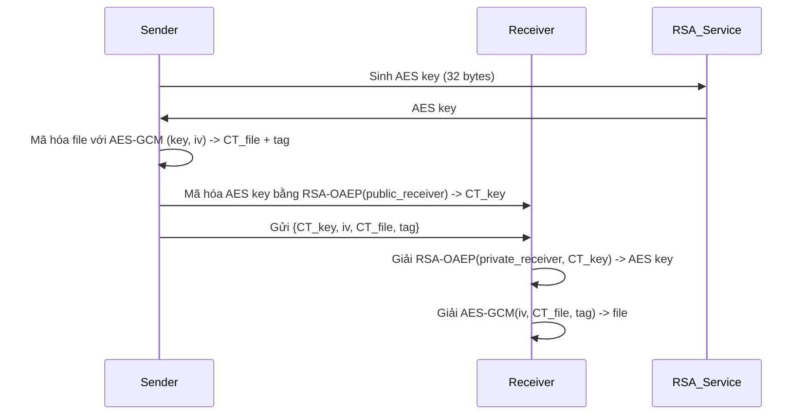

# RSA (Rivest–Shamir–Adleman)

## 0. FileVault context (ứng dụng trong hệ thống mã hóa file)

- Mục tiêu: tích hợp RSA vào hệ thống "filevault" để bảo vệ tập tin trên đĩa/backup bằng cách bọc (wrap) khóa phiên (symmetric key) và quản lý metadata, không dùng RSA để mã hóa dữ liệu lớn trực tiếp.
- Kiến trúc chung:
    - Hybrid: AES-GCM (file content) + RSA-OAEP (wrap AES key). AES key được sinh per-file hoặc per-session bằng CSPRNG.
    - Metadata kèm theo file: phiên bản định dạng, key_id, wrapped_key (RSA-OAEP), iv, ciphertext, tag, optional signature (RSA-PSS) của metadata/header.
    - Private key RSA nằm trong HSM/TPM hoặc keystore được mã hóa (PKCS#8 + AEAD), chỉ dùng để unwrap; hạn chế truy cập và audit mọi thao tác unwrap.
- Định dạng ví dụ (JSON/struct trong header — nhỏ gọn):
    - version: "1"
    - kms_provider: "local-hsm" | "kms-service"
    - key_id: "rsa-3072-v1"
    - wrapped_key: base64(...)
    - iv: base64(...)
    - cipher: "AES-GCM-256"
    - tag: base64(...)
    - signature: base64(...) // optional: PSS(SHA-256) ký header để phát hiện thay đổi metadata
- Key management / lifecycle:
    - RSA dùng chỉ để wrap/unwarp keys. Xác định key IDs và versioning để hỗ trợ key rotation.
    - Khi rotate: re-wrap AES keys với public key mới, cập nhật key_id/version trong metadata; giữ history để mở các file cũ nếu cần.
    - Đảm bảo backup của private key trong HSM hoặc qua secure export với policies.
- Recovery & Access Control:
    - Cơ chế recovery key/escrow (ví dụ: một key recovery RSA được cất ở chỗ khác) — cũng phải bảo vệ tương tự.
    - Phân quyền unwrap: chỉ các dịch vụ/role được phép truy cập private key; mọi request unwrap ghi log/audit.
- Performance & scale:
    - RSA chỉ dùng cho small payload (wrapped_key); hạn chế số phép unwrap đồng thời (HSM throughput).
    - Cân nhắc dùng KEMs/ECC (X25519/Kyber) cho hiệu năng/chi phí khi cần scale lớn.
- Security recommendations (nhắc lại liên quan FileVault):
    - RSA-OAEP (SHA-256) cho wrap; RSA-PSS (SHA-256) cho signature.
    - Key size >= 3072 cho private keys lâu dài; dùng HSM/TPM cho private keys.
    - Không leak lỗi unwrap (tránh padding oracle); xử lý lỗi chung chung cho client.
    - Kiểm thử với Wycheproof/OpenSSL vectors và kiểm tra side-channel trên HSM.
- Operational notes:
    - Định nghĩa và duy trì file format spec/versioned, có test vectors cho mỗi version.
    - Giữ tư liệu phục hồi (recovery procedure) và kế hoạch chuyển đổi PQC khi cần.

## 1. Khái niệm
RSA là thuật toán mã hóa khóa công khai (asymmetric) dùng để bảo mật tính bảo mật (confidentiality) của dữ liệu nhỏ (ví dụ: khóa phiên) và để xác thực/đảm bảo tính toàn vẹn (digital signatures). Nó giải quyết vấn đề trao đổi khóa và chứng thực giữa các bên không tin cậy bằng cặp khóa công khai/riêng tư, bảo vệ dữ liệu khỏi giải mã bởi kẻ không có khóa riêng.

## 2. Toán học & Padding
- Cơ sở toán học: dựa trên độ khó của bài toán phân tích thừa số nguyên tố.
    - Chọn 2 số nguyên tố lớn $p, q$.
    - $n = p \cdot q$.
    - $\phi(n) = (p-1)(q-1)$.
    - Chọn $e$ sao cho $1 < e < \phi(n)$ và $\gcd(e,\phi(n)) = 1$ (thường $e=65537$).
    - Tính $d \equiv e^{-1} \pmod{\phi(n)}$.
    - Public key: $(n,e)$; Private key: $(n,d)$.
- Công thức mã hóa / giải mã:
    - Mã hóa: $C \equiv M^{e} \pmod n$.
    - Giải mã: $M \equiv C^{d} \pmod n$.
- Padding (bắt buộc trong thực tế):
    - OAEP (Optimal Asymmetric Encryption Padding) với MGF1 và hàm băm (ví dụ SHA-256): thêm ngẫu nhiên và cấu trúc để chống tấn công dựa vào tính xác định và chosen-ciphertext.
    - Signature padding: PSS (Probabilistic Signature Scheme) khuyến nghị cho chữ ký RSA.
    - Ghi chú: Textbook RSA (không padding) và PKCS#1 v1.5 cho mã hóa là không an toàn.

## 3. Cách hoạt động (tóm tắt)
1. Sinh cặp khóa (p, q -> n, e, d).
2. Bên gửi lấy public key $(n,e)`.
3. Để gửi dữ liệu lớn: tạo AES key ngẫu nhiên, mã hóa dữ liệu bằng AES-GCM, mã hóa AES key bằng RSA-OAEP với public key.
4. Bên nhận dùng private key giải mã AES key rồi giải mã file.

## 4. Cấu trúc dữ liệu
- Key sizes: 2048, 3072, 4096 bits.
- PublicExponent: thường 65537.
- Private key thường lưu theo PKCS#1 hoặc PKCS#8 (PEM/DER).
- Ciphertext RSA: một số nguyên modulo $n$ có kích thước bằng key size; khi dùng OAEP, ciphertext chiều dài = chiều dài modulus (bytes).
- Định dạng kết hợp (hybrid): {RSA-encrypted-key || AES-GCM(iv, ciphertext, tag)}.

## 5. So sánh với thuật toán khác
- ECC (Elliptic-Curve Cryptography)
    - Lợi thế: kích thước khóa nhỏ hơn, cùng mức an toàn, nhanh hơn cho các thao tác khóa.
    - Hạn chế: phức tạp toán học hơn, tương thích khác nhau.
- ElGamal
    - Hấp dẫn cho một số kịch bản nhưng ciphertext lớn hơn và nhạy với lỗ hổng padding nếu không cẩn thận.
- Post-Quantum (Kyber, NewHope)
    - Kháng lượng tử; tương lai yêu cầu chuyển đổi khi năng lực lượng tử đủ mạnh.
- Khi dùng cho mã hóa khóa phiên: RSA hợp lý nhưng ECC/KEMs (e.g., X25519, Kyber) thường ưu việt về hiệu năng/kích thước.

## 6. Luồng hoạt động (mermaid)


## 7. Các sai lầm triển khai phổ biến
- Dùng PKCS#1 v1.5 cho mã hóa (Bleichenbacher oracle).
- Tự triển khai padding hoặc RNG kém chất lượng.
- Key size quá nhỏ (RSA-1024 không an toàn).
- Lưu trữ private key không an toàn (plaintext, không khoá).
- Dùng RSA để mã hóa dữ liệu lớn thay vì chỉ mã hóa key.
- Không kiểm tra tham số (e không hợp lệ, p=q,…).
- Không dùng constant-time cho thao tác nhạy cảm dẫn tới rò rỉ.

## 8. Threat Model
- Attacker có ciphertext nhưng không có private key: mục tiêu là bảo mật số liệu (IND-CCA nếu OAEP).
- Attacker có oracle giải mã (padding oracle): nguy hiểm (Bleichenbacher).
- Side-channel: rò rỉ qua timing, power, fault injection.
- Long-term: quantum adversary (Shor) phá RSA khi có máy lượng tử đủ mạnh.

## 9. Biện pháp giảm thiểu
- Luôn dùng OAEP (mã hóa) và PSS (chữ ký) với SHA-256 hoặc mạnh hơn.
- Key size >= 2048 (3072 khuyến nghị); xem kế hoạch chuyển đổi post-quantum.
- Dùng CSPRNG để sinh p,q và AES keys.
- Bảo vệ private key với HSM / TPM hoặc encrypted key storage (PKCS#8 + PBKDF2/argon2 + AEAD).
- Kiểm tra đầu vào/đầu ra, từ chối lỗi chi tiết trong môi trường sản xuất (không leak padding errors).
- Thực hiện constant-time crypto và chống fault injection.
- Sử dụng libs well-tested (OpenSSL, libsodium, Botan, RFC-validated implementations).

## 10. Test Vectors (ví dụ minh họa nhỏ)
Lưu ý: chỉ dùng các vector học thuật/kiểm thử nhỏ; không dùng cho môi trường production.
- Ví dụ số nhỏ:
    - p = 61, q = 53 -> n = 3233, phi = 3120
    - e = 17 -> d = 2753
    - M = 65 -> C = 65^17 mod 3233 = 2790
    - Giải mã: 2790^2753 mod 3233 = 65
- Với OAEP/real-world dùng các test vector RFC/Library (OpenSSL test suite, Wycheproof) để kiểm thử.

## 11. Ví dụ Code (ngắn, Python) — có thể bỏ qua
```python
from cryptography.hazmat.primitives.asymmetric import rsa, padding
from cryptography.hazmat.primitives import hashes
from cryptography.hazmat.primitives import serialization

# Sinh key
priv = rsa.generate_private_key(public_exponent=65537, key_size=3072)
pub = priv.public_key()

# Mã hóa OAEP
def rsa_encrypt(pub, msg: bytes) -> bytes:
        return pub.encrypt(
                msg,
                padding.OAEP(mgf=padding.MGF1(hashes.SHA256()), algorithm=hashes.SHA256(), label=None)
        )

# Giải mã OAEP
def rsa_decrypt(priv, ct: bytes) -> bytes:
        return priv.decrypt(
                ct,
                padding.OAEP(mgf=padding.MGF1(hashes.SHA256()), algorithm=hashes.SHA256(), label=None)
        )
```

## 12. Checklist bảo mật (tóm tắt)
- [ ] Key size >= 2048 bits (khuyến nghị 3072).
- [ ] Public exponent = 65537 (hoặc kiểm soát tốt other choices).
- [ ] Luôn dùng OAEP (SHA-256) cho mã hóa; PSS cho chữ ký.
- [ ] Không dùng RSA để mã hóa dữ liệu lớn trực tiếp.
- [ ] Sinh khóa & nonce bằng CSPRNG.
- [ ] Private key bảo vệ bằng HSM/TPM hoặc AES-encrypted storage.
- [ ] Không leak lỗi padding/chi tiết giải mã; xử lý lỗi chung chung.
- [ ] Kiểm thử với test vectors (Wycheproof, OpenSSL tests).
- [ ] Có kế hoạch chuyển đổi sang PQC khi cần.

## Nguồn tham khảo
- RFC 8017 PKCS#1 v2.2 (RSA Cryptography Specifications) — padding, PSS, OAEP.
- NIST SP 800-89, NIST recommendations (key sizes).
- Project Wycheproof (Google) — test vectors cho padding/oracles.
- Biblioteca: OpenSSL, Botan, cryptography.io docs.

