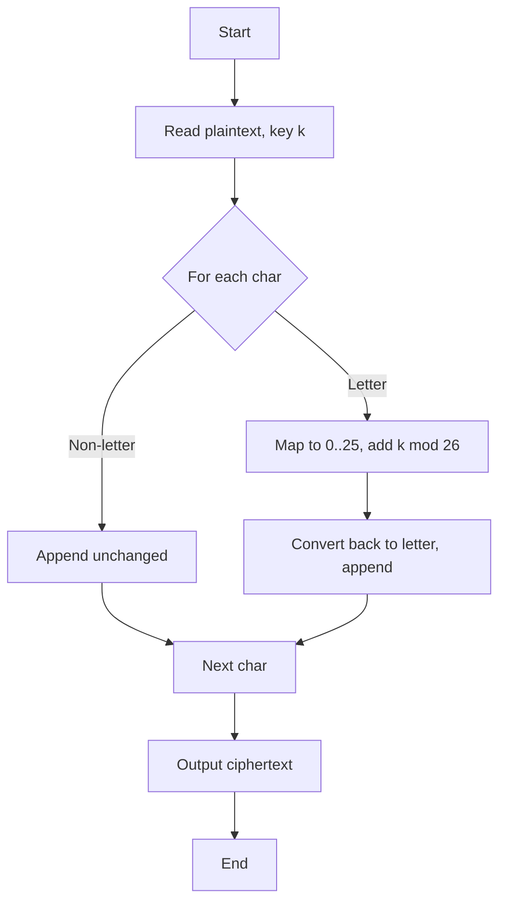

# Caesar Cipher

## 0. Filevault context
Mục tiêu: tài liệu kỹ thuật cho lớp học, phân tích bảo mật cơ bản, dùng UserMode::STUDENT.

## 1. Khái niệm thuật toán, giải quyết vấn đề gì, bảo vệ cái gì
Caesar Cipher là một mật mã thay thế đơn giản: dịch mỗi ký tự trong bảng chữ cái bởi một số vị trí cố định k. Giải quyết: che giấu nội dung văn bản thuần (confidentiality cơ bản). Không bảo vệ tính toàn vẹn, xác thực hay chống phân tích.

## 2. Toán học, công thức
- Ký hiệu: P (plaintext), C (ciphertext), k ∈ {0..25}.
*   **Key**: Một số nguyên $k$ (Shift amount), thường từ 1-25.
*   **Encryption**: $C = (P + k) \pmod{26}$.
*   **Decryption**: $P = (C - k) \pmod{26}$.


**LƯU Ý**: Thuật toán này **KHÔNG AN TOÀN**. Chỉ dùng cho mục đích giáo dục (`UserMode::STUDENT`).

**Phá mã**
*   **Brute-force**: Chỉ có 25 khóa khả thi -> Thử hết trong tích tắc.
*   **Frequency Analysis**: Phân tích tần suất xuất hiện của các chữ cái.


(Áp dụng cho chỉ chữ cái A–Z hoặc a–z; xử lý ký tự khác tuỳ cài đặt.)

## 3. Cách hoạt động
- Chọn khóa k (shift).
- Với mỗi ký tự chữ cái, dịch nó k vị trí theo vòng tuần hoàn 26 ký tự.
- Giữ nguyên ký tự không phải chữ cái hoặc xử lý theo quy tắc.

## 4. Cấu trúc dữ liệu
- Input: chuỗi (string).
- Key: integer.
- Thực hiện bằng mảng ký tự hoặc mã Unicode/codepoint (ASCII).
- Tùy chọn: bảng tra cứu (lookup table) 26 phần tử cho tăng tốc.

## 5. So sánh thuật toán khác
- Vigenère: dùng khóa chuỗi, chống phân tích tần suất tốt hơn.
- One-time pad: hoàn hảo nếu khóa ngẫu nhiên, bằng chiều dài bản rõ.
- Substitution cipher toàn cục: thay thế mỗi ký tự bằng một ánh xạ cố định (Caesar là một hoán vị đơn giản).
- So sánh: Caesar rất yếu, dễ brute-force và phân tích tần suất.

## 6. Luồng hoạt động
Mermaid:


## 7. Các sai lầm triển khai phổ biến
- Áp dụng shift cho toàn bộ Unicode (làm hỏng ký tự đa byte).
- Không chuẩn hoá chữ hoa/chữ thường dẫn đến hành vi không nhất quán.
- Dùng k cố định công khai (không phải bí mật).
- Bỏ qua xử lý ký tự không alphabet (nhưng vẫn đổi chúng).
- Không giới hạn key space (cho phép k ngoài 0..25).

## 8. Threat Model
- Tấn công: kẻ tấn công có ciphertext; mục tiêu là thu plaintext hoặc key.
- Khả năng kẻ tấn công: passive eavesdropper, có kiến thức thống kê ngôn ngữ.
- Không chống lại: chosen-plaintext, chosen-ciphertext, attacker with frequency analysis or brute force.

## 9. Biện pháp giảm thiểu
- Không dùng Caesar cho bảo mật thực tế.
- Dùng các chuẩn hiện đại: AES-GCM, ChaCha20-Poly1305.
- Nếu học thuật: kết hợp Vigenère hoặc OTP cho mục đích so sánh.
- Thêm MAC hoặc AEAD để đảm bảo tính toàn vẹn và xác thực.

## 10. Test Vectors
| Plaintext | Key | Ciphertext |
|-----------|-----:|-----------|
| HELLO     | 3    | KHOOR     |
| abc       | 1    | bcd       |
| XYZ       | 2    | ZAB       |
| attack at dawn | 5 | fyyfhp fy ifbs (nếu giữ khoảng trắng) |

## 11. Code (Python, minh hoạ)
```python
def caesar_encrypt(s: str, k: int) -> str:
        k = k % 26
        out = []
        for ch in s:
                if 'A' <= ch <= 'Z':
                        out.append(chr((ord(ch) - 65 + k) % 26 + 65))
                elif 'a' <= ch <= 'z':
                        out.append(chr((ord(ch) - 97 + k) % 26 + 97))
                else:
                        out.append(ch)
        return ''.join(out)

def caesar_decrypt(c: str, k: int) -> str:
        return caesar_encrypt(c, -k)
```

## 12. Checklist bảo mật
- [ ] Không dùng Caesar cho dữ liệu nhạy cảm.
- [ ] Key phải giữ bí mật và có chính sách quản lý khóa.
- [ ] Sử dụng chuẩn mã hoá hiện đại (AEAD) thay thế.
- [ ] Kiểm tra xử lý encoding/Unicode.
- [ ] Có test vectors và unit tests.
- [ ] Đánh giá threat model trước khi dùng cho mục đích giáo dục.

Nguồn tham khảo:
- Giới thiệu mật mã cổ điển (sách giáo khoa, bài giảng).
- RFCs và tài liệu về AES/GCM, ChaCha20-Poly1305 để chọn thay thế hiện đại.

