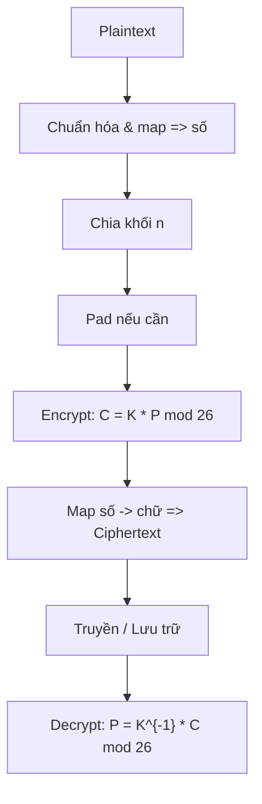

# Hill Cipher

## 0. Filevault context
Mục đích: mô tả chi tiết thuật toán Hill Cipher, toán học, cách triển khai, rủi ro bảo mật và test vectors.

## 1. Khái niệm thuật toán
Hill Cipher là mật mã thay thế đa-ký tự dựa trên đại số tuyến tính. Nó giải quyết bài toán bảo mật tính bí mật của văn bản chữ cái bằng cách mã hóa từng khối ký tự thành vector và nhân với ma trận khóa. Bảo vệ: tính kín của nội dung (confidentiality) trước kẻ nghe lén không có plaintext tham chiếu. Không bảo vệ tính toàn vẹn hay xác thực. Tóm lại, là mật mã thay thế đa ký tự dựa trên đại số tuyến tính. Nó sử dụng phép nhân ma trận modulo 26.

**LƯU Ý**: Thuật toán này **KHÔNG AN TOÀN** (dễ bị Known-plaintext attack).

## 2. Thuật toán
*   **Key**: Ma trận vuông $K$ kích thước $n \times n$ khả nghịch modulo 26.
*   **Encryption**: Chia plaintext thành các vector $P$ kích thước $n$. $C = K \times P \pmod{26}$.
*   **Decryption**: $P = K^{-1} \times C \pmod{26}$.

**Yêu cầu**
*   Định thức của ma trận khóa ($det(K)$) phải nguyên tố cùng nhau với 26.


- Không gian: tập số nguyên modulo 26 $\mathbb{Z}_{26}=\{0,1,\dots,25\}$; ánh xạ ký tự: $A\mapsto0,\;B\mapsto1,\dots,Z\mapsto25$.  
- Key: ma trận vuông $K\in\mathbb{Z}_{26}^{n\times n}$ và khả nghịch modulo 26, tức $\gcd(\det K,26)=1$.  
- Encryption: với $P\in\mathbb{Z}_{26}^n$ là vector plaintext, ciphertext là
    $$
    C \equiv K\,P \pmod{26}
    $$

    Decryption:
    $$
    P \equiv K^{-1}C \pmod{26}
    $$

    với
    $$
    K^{-1} \equiv (\det K)^{-1}\,\operatorname{adj}(K) \pmod{26}
    $$
    trong đó $(\det K)^{-1}$ là nghịch đảo của $\det K$ trong $\mathbb{Z}_{26}$.  
- Các phép toán (cộng, nhân, nghịch đảo ma trận) đều thực hiện theo toán học modulo 26.

## 3. Cách hoạt động (steps)
1. Chuẩn hóa plaintext (ký tự hoa, bỏ ký tự không thuộc bảng).  
2. Map chữ → số 0..25.  
3. Chia thành khối độ dài n; pad (ví dụ 'X' = 23) nếu cần.  
4. Với mỗi vector P: C = (K · P) mod 26.  
5. Map số → chữ để tạo ciphertext.  
6. Giải mã tương tự với K^{-1}.

## 4. Cấu trúc dữ liệu
- Key: ma trận vuông kích thước n×n (mảng số nguyên modulo 26).  
- Block/Vector: mảng chiều n của số nguyên 0..25.  
- Mapping bảng ký tự (A–Z → 0–25).  
- Padding token và chính sách padding.

## 5. So sánh với các thuật toán khác
- So với Caesar/Vigenère: mã hóa theo khối, hủy cấu trúc n-gram, mạnh hơn với kích thước khối >1.  
- So với mã hiện đại (AES): Hill là tuyến tính và dễ bị tấn công tuyến tính/biết-plaintext; không đạt độ an toàn của AES.  
- So với OTP: không đạt tính bất khả giải (perfect secrecy) vì phụ thuộc key cố định.

## 6. Luồng hoạt động (Mermaid)


## 7. Các sai lầm triển khai phổ biến
- Dùng ma trận không khả nghịch (det không nghịch với 26).  
- Kiểm tra nghịch đảo bằng phép chia thực/float thay vì inverse modulo.  
- Không xử lý padding/độ dài cuối khối.  
- Dùng phép nhân ma trận với kiểu số thực dẫn tới lỗi.  
- Tái sử dụng cùng key lâu dài, không xoay key.  
- Bỏ qua ký tự không thuộc bảng hoặc biến đổi khác không thống nhất giữa mã/giải mã.

## 8. Threat Model
- Kẻ tấn công ciphertext-only: có thể thu thập tần suất, đặc biệt với block nhỏ.  
- Known-plaintext / chosen-plaintext: có thể giải hệ tuyến tính để thu lại K (cần n khối độc lập).  
- Side-channels: triển khai rò rỉ thông tin (thời gian, cache).  
- Key compromise: mất toàn bộ khả năng bảo mật nhiều khối.

## 9. Biện pháp giảm thiểu
- Kiểm tra và buộc det(K) coprime với 26; từ chối ma trận không hợp lệ.  
- Sử dụng kích thước block lớn hơn (n tăng làm tấn công khó hơn nhưng tăng chi phí).  
- Xoay key thường xuyên, không dùng key tĩnh cho nhiều tin nhắn.  
- Kết hợp với non-linear bước (ví dụ affine addition v) hoặc dùng cipher hiện đại (AES-GCM) cho ứng dụng thật sự cần bảo mật.  
- Sử dụng chế độ mã hóa có random IV/nonce và xác thực (AEAD).  
- Kiểm soát rò rỉ thời gian/side-channel (thao tác cố định thời gian).

## 10. Test Vectors
Key ví dụ (n=2): K = [[3,3],[2,5]] (det=9, det^{-1}=3 mod26)  
K^{-1} = [[15,17],[20,9]] (mod 26)

- Plain "HI" (H=7,I=8): P=[7,8] → C = [19,2] → "TC"  
- Plain "HELP": blocks "HE" [7,4] → "HI"; "LP" [11,15] → "AT" → Cipher "HIAT"  
- Giải mã "TC" với K^{-1} → "HI"

Kiểm tra: encrypt then decrypt phải trả về chính xác plaintext (sau loại padding).

## 11. Code (ví dụ Python tối giản)
```python
def mod26_inv(a):
        for x in range(26):
                if (a*x) % 26 == 1:
                        return x
        raise ValueError("No inverse")

def mat_mul_mod(A, v):
        return [sum(a*b for a,b in zip(row,v)) % 26 for row in A]

# K: n×n list, P: list len n
def encrypt_block(K, P): return mat_mul_mod(K, P)
# To get K^{-1} compute det, adjugate, multiply by inv_det modulo 26 (implement separately)
```
(Đoạn đầy đủ cần hàm tính det, adjugate modulo 26; dùng thư viện số nguyên hoặc numpy cùng kiểm tra modulo.)

## 12. Checklist bảo mật
- [ ] Xác nhận det(K) coprime với 26 trước khi chấp nhận key.  
- [ ] Áp dụng padding deterministically và kiểm tra khi giải mã.  
- [ ] Không dùng khóa tĩnh cho nhiều phiên lớn; áp chính sách thay key.  
- [ ] Ghi log/giám sát quá trình tạo key để phát hiện lặp/khóa yếu.  
- [ ] Sử dụng chế độ có nonce/IV nếu ghép với cơ chế khác; cung cấp tính xác thực.  
- [ ] Kiểm thử với test vectors và fuzzing để phát hiện lỗi biên giới.  
- [ ] Tránh rò rỉ side-channel trong triển khai phần mềm/nhúng.

Nguồn tham khảo:
- https://en.wikipedia.org/wiki/Hill_cipher  
- Bài giảng mật mã đại số, tài liệu đại số tuyến tính (cho phép tính nghịch đảo ma trận modulo).

