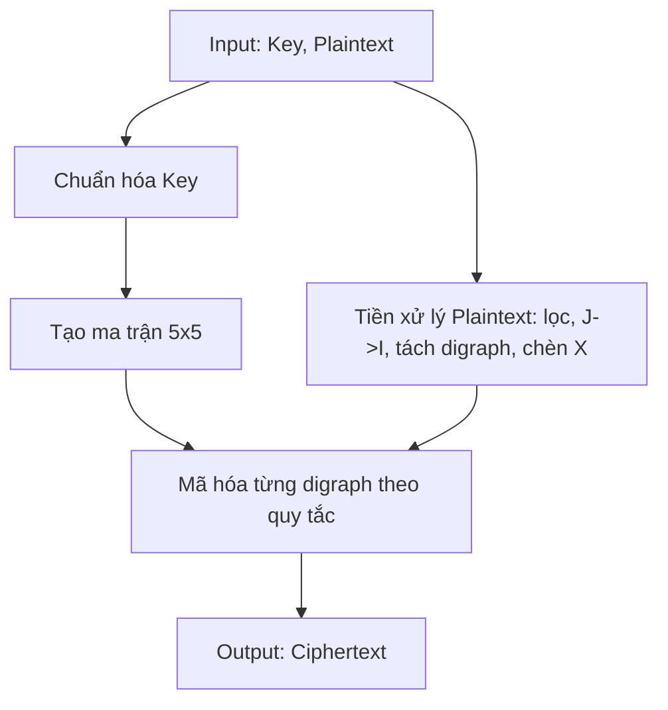

# Playfair Cipher

## 0. Filevault context
- Mục đích: Tài liệu tham khảo thuật toán Playfair trong bộ “Algorithms / Classical” của Filevault — mô tả, phân tích bảo mật, ví dụ, test vectors, và checklist.

## 1. Khái niệm, giải quyết vấn đề gì, bảo vệ cái gì
- Playfair là một cipher thay thế theo cặp ký tự (digraph substitution).
- Giải quyết: giảm bớt phân tích tần suất đơn ký tự bằng cách mã hóa cặp chữ cái.
- Bảo vệ: chống phân tích tần suất đơn giản; không bảo vệ tốt trước phân tích thống kê hiện đại hoặc hai chữ cái tần suất.

## 2. Toán học, công thức

## 3. Cách hoạt động
1. Chuẩn hóa khóa: loại trùng, ghép I/J (thường hợp I và J cùng ô).
2. Tạo ma trận 5×5 từ khóa rồi điền phần còn lại của bảng chữ cái (bỏ J).
3. Tiền xử lý plaintext: loại ký tự không chữ, đổi J→I, tách thành digraphs, chèn filler (thường X) khi hai ký tự trùng hoặc khi chữ lẻ.
4. Áp dụng quy tắc mã hóa cho từng cặp.
5. Kết hợp các cặp thành ciphertext.

## 4. Cấu trúc dữ liệu
- Ma trận 5×5 (array[5][5]) chứa ký tự.
- Bản đồ từ ký tự -> (hàng, cột) để tra cứu nhanh (dict/array).
- Plaintext tách digraphs lưu trong list/array.

## 5. So sánh với thuật toán khác
- So với Caesar/Vigenère: Playfair mã hóa theo cặp, giảm tần suất đơn ký tự.
- So với Hill cipher: Playfair là non-linear theo tọa độ trên ma trận ký tự, Hill dùng đại số tuyến tính (ma trận số) và có tính toán mô-đun.
- So với modern ciphers (AES): Playfair cực kỳ yếu, không có tính toán khóa phức tạp hay bảo mật hiện đại.

## 6. Luồng hoạt động (mermaid)


## 7. Các sai lầm triển khai phổ biến
- Quên ghép I/J hoặc xử lý J không nhất quán.
- Xử lý không đúng khi hai ký tự trùng (không chèn filler).
- Sử dụng filler không nhất quán (X vs Q) gây lỗi khi giải mã tự động.
- Không chuẩn hóa hoặc bỏ qua ký tự không phải chữ cái.
- Sai vị trí khi áp dụng vòng (mod 5) cho hàng/cột.

## 8. Threat Model
- Tấn công mục tiêu: phân tích tần suất digraph, known-plaintext, ciphertext-only.
- Kẻ tấn công có thể: nhiều ciphertext, phần plaintext biết trước, hoặc brute-force khóa ngắn.
- Không chống được: phân tích thống kê digraphs, modern cryptoanalysis, tấn công máy tính.

## 9. Biện pháp giảm thiểu
- Không dùng Playfair cho bảo mật thực tế.
- Nếu vẫn dùng trong môi trường giáo dục/historical: kết hợp với thuật toán hiện đại (ví dụ: Playfair chỉ như layer thêm, không thay thế).
- Thay đổi filler và quy ước chuẩn hoá rõ ràng; khóa dài/ngẫu nhiên hơn (dù vẫn yếu).
- Giới hạn lộ lượng ciphertext được phát hành.

## 10. Test Vectors
- Key: MONARCHY  
    Ma trận:
    M O N A R  
    C H Y B D  
    E F G I K  
    L P Q S T  
    U V W X Z
- Plaintext: HELLO → tiền xử lý: HE LX LO → Ciphertext: CF SU PM → "CFSUPM"
- Test thêm: Plaintext HIDE THE GOLD IN THE TREE STUMP (chuẩn hóa/ghép) → sử dụng vector tham khảo (tham khảo PracticalCryptography).

## 11. Code (tóm tắt Python)
```python
def build_matrix(key):
        import string
        key = "".join(dict.fromkeys(key.upper().replace("J","I")))
        alphabet = [c for c in string.ascii_uppercase if c != "J"]
        seq = [c for c in key] + [c for c in alphabet if c not in key]
        mat = [seq[i*5:(i+1)*5] for i in range(5)]
        pos = {c:(r,cx) for r,row in enumerate(mat) for cx,c in enumerate(row)}
        return mat,pos

def preprocess(pt):
        pt = "".join(ch for ch in pt.upper() if ch.isalpha()).replace("J","I")
        res=[]; i=0
        while i<len(pt):
                a=pt[i]; b=pt[i+1] if i+1<len(pt) else "X"
                if a==b:
                        res.append(a+"X"); i+=1
                else:
                        res.append(a+b); i+=2
        if len(res[-1])==1: res[-1]+= "X"
        return res

def encrypt_pair(a,b,mat,pos):
        ra,ca = pos[a]; rb,cb = pos[b]
        if ra==rb:
                return mat[ra][(ca+1)%5] + mat[rb][(cb+1)%5]
        if ca==cb:
                return mat[(ra+1)%5][ca] + mat[(rb+1)%5][cb]
        return mat[ra][cb] + mat[rb][ca]

def encrypt(pt,key):
        mat,pos = build_matrix(key)
        pairs = preprocess(pt)
        return "".join(encrypt_pair(a,b,mat,pos) for a,b in pairs)
```

## 12. Checklist bảo mật
- [ ] Không dùng Playfair cho dữ liệu nhạy cảm.
- [ ] Quy ước I/J và filler được tài liệu hoá.
- [ ] Kiểm tra kỹ tiền xử lý plaintext trên cả hai đầu (mã hóa/giải mã).
- [ ] Hạn chế lượng ciphertext công khai;
- [ ] Luôn đặt Playfair trong lớp bảo vệ mạnh (ví dụ: kết hợp với AES/HMAC nếu cần tính lịch sử).

## Nguồn tham khảo
- Wikipedia — Playfair cipher: https://en.wikipedia.org/wiki/Playfair_cipher  
- Practical Cryptography — Playfair: https://www.practicalcryptography.com/ciphers/playfair-cipher/  
- Bruce Schneier, "Applied Cryptography" (tham khảo lịch sử và ví dụ)

