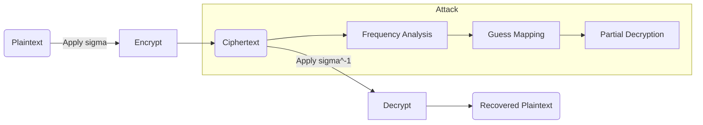

# Substitution Cipher — Filevault context

## 0. Filevault context  
- Mục tiêu: mô tả kỹ thuật Mật mã thay thế (Substitution Cipher) để hiểu rủi ro bảo mật, kiểm thử, và hướng thay thế an toàn trong Filevault tài liệu.

## 1. Khái niệm thuật toán, giải quyết vấn đề gì, bảo vệ cái gì  
- Khái niệm: thay thế mỗi ký tự plaintext bằng ký tự ciphertext theo một hoán vị (permutation) khóa.  
- Giải quyết: che giấu nội dung bằng cách biến ký tự; bảo vệ tính bảo mật (confidentiality) ở mức cơ bản.  
- Hạn chế: không bảo vệ chống phân tích tần suất, không đảm bảo bảo toàn dữ liệu hay xác thực.

## 2. Toán học, công thức  
- Không gian khóa: $26! \approx 4.03\times10^{26}$ (cho bảng chữ cái Latin 26 chữ).  
- Mô tả: khóa là hoán vị $\sigma$ trên tập ký tự $A$ (ví dụ $A=\{A..Z\}$).  
- Mã hóa: $C = E_\sigma(P)$ với $E_\sigma(p_i)=\sigma(p_i)$.  
- Giải mã: $P = D_\sigma(C)$ với $D_\sigma=\sigma^{-1}$.

## 3. Cách hoạt động  
- Khóa: cấp một hoán vị $\sigma$.  
- Mã hóa: thay mỗi ký tự theo $\sigma$. Ký tự không thuộc bảng (số, dấu) thường giữ nguyên hoặc theo chính sách.  
- Giải mã: áp dụng $\sigma^{-1}$.

## 4. Cấu trúc dữ liệu  
- Từ điển/hash map: mapping ký tự -> ký tự (với đảo ngược).  
- Mảng (size 26) cho ánh xạ nhanh.  
- Lưu trữ khóa: biểu diễn dưới dạng chuỗi 26 ký tự hoặc mảng byte; cần tính toán ngược cho giải mã.

## 5. So sánh với thuật toán khác  
- Caesar: là trường hợp con (shift) của Substitution với hoán vị dạng dịch tròn.  
- Vigenère/Polyalphabetic: chống phân tích tần suất tốt hơn (nhưng có lỗ hổng chu kỳ).  
- One-time pad: cung cấp bảo mật thông tin tuyệt đối nếu khóa thực sự ngẫu nhiên, cùng độ dài và chỉ dùng một lần — khác hẳn substitution (không an toàn).  
- Homophonic substitution: giảm mối liên hệ 1:1 để làm khó phân tích tần suất.

## 6. Luồng hoạt động (mermaid)


## 7. Các sai lầm triển khai phổ biến  
- Sinh khóa bằng RNG không đủ ngẫu nhiên.  
- Không đảm bảo hoán vị (trùng ký tự trong khóa).  
- Mã hóa/giải mã không thống nhất về chữ hoa/chữ thường hoặc Unicode.  
- Để lại metadata (spaces, punctuation) mà không cân nhắc.  
- Tái sử dụng cùng khóa cho nhiều mục đích mà không thay đổi.

## 8. Threat Model  
- Mục tiêu tấn công: thu được plaintext từ ciphertext.  
- Khả năng attacker: ciphertext-only (phổ biến), known-plaintext, chosen-plaintext.  
- Tác hại: lộ thông tin nhạy cảm do phân tích tần suất, ngôn ngữ, cấu trúc văn bản.

## 9. Biện pháp giảm thiểu  
- Không dùng Substitution cho dữ liệu nhạy cảm trong thực tế.  
- Nếu vẫn dùng cho học thuật/legacy:  
    - Kết hợp polyalphabetic/homophonic hoặc làm tiền xử lý (padding, chaff).  
    - Che metadata, normalize input, tách từ.  
    - Sử dụng RNG mật mã để sinh khóa và bảo vệ khóa.  
- Khuyến nghị: dùng chuẩn hiện đại (ví dụ AES-GCM cho confidentiality+integrity).

## 10. Test Vectors  
- Key (ví dụ): sigma = "QWERTYUIOPASDFGHJKLZXCVBNM" (A->Q, B->W, ...).  
- Plaintext: "HELLO WORLD"  
- Ciphertext: "ITSSG VGKSR" (khi mapping theo sigma, khoảng trắng giữ nguyên).  
- Kiểm tra đảo ngược: giải mã ciphertext với sigma^{-1} phải trả về plaintext ban đầu.

## 11. Code (ngắn, Python)
```python
import secrets
import string

ALPH = string.ascii_uppercase

def gen_key():
        arr = list(ALPH)
        secrets.SystemRandom().shuffle(arr)
        return ''.join(arr)

def encrypt(plain, key):
        mp = {a:k for a,k in zip(ALPH, key)}
        return ''.join(mp.get(ch, ch) for ch in plain.upper())

def decrypt(cipher, key):
        mp = {k:a for a,k in zip(ALPH, key)}
        return ''.join(mp.get(ch, ch) for ch in cipher.upper())
```

## 12. Checklist bảo mật  
- [ ] Có thay thế bằng thuật toán hiện đại (AES-GCM) khi xử lý dữ liệu nhạy cảm?  
- [ ] Khóa được sinh bằng RNG mật mã?  
- [ ] Khóa lưu trữ an toàn (KMS/HSM) và không hard-code?  
- [ ] Chuẩn hóa đầu vào (Unicode, case) trước khi mã hóa?  
- [ ] Kiểm thử với vectors và tấn công phân tích tần suất?  
- [ ] Log không chứa ciphertext/plaintext nhạy cảm?  
- [ ] Có chính sách thay khóa và bảo quản vòng đời?

Nguồn tham khảo  
- https://en.wikipedia.org/wiki/Substitution_cipher  
- Katz & Lindell, Introduction to Modern Cryptography (tham khảo khái niệm)  
- Bruce Schneier, Applied Cryptography (tham khảo lịch sử/classical)

