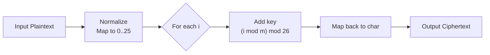

# Vigenère Cipher

## 0. Filevault context
Tài liệu này nằm trong thư mục algorithms/classical và mô tả chi tiết thuật toán Vigenère dùng làm tham chiếu giáo dục và test vectors cho Filevault.

## 1. Khái niệm thuật toán — giải quyết vấn đề gì, bảo vệ cái gì
Vigenère là một mật mã thay thế đa bảng (polyalphabetic substitution) dùng khóa chữ để làm dịch chuyển tuần tự các ký tự plaintext. Mục đích: che giấu tần suất ký tự đơn của plaintext, làm khó phân tích tần suất so với Caesar đơn bảng. Không bảo vệ chống phân tích chuyên sâu hay tấn công hiện đại.

## 2. Toán học, công thức
- Ánh xạ ký tự: A=0, B=1, …, Z=25.
- Với plaintext $P = P_0P_1…$, key $K = K_0…K_{m-1}$ (độ dài $m$).
- Mã hóa: $C_i = (P_i + K_{i \bmod m}) \bmod 26$.
- Giải mã: $P_i = (C_i - K_{i \bmod m}) \bmod 26$.
- Nếu dùng chữ thường/không chữ cái, chỉ áp dụng cho tập ký tự định trước (ví dụ A–Z).

## 3. Cách hoạt động
- Chuẩn hoá plaintext (loại bỏ/ghi nhãn ký tự không chữ, chuyển hoa).
- Chuyển mỗi ký tự thành số theo ánh xạ.
- Lặp qua chỉ số i: cộng (hoặc trừ) giá trị key tại vị trí $i \bmod m$, lấy modulo 26.
- Chuyển kết quả về ký tự.

## 4. Cấu trúc dữ liệu
- Key: mảng/chuỗi ký tự hoặc mảng số nguyên [0..25].
- Plaintext/Ciphertext: chuỗi hoặc mảng byte/char.
- Implementation-friendly: buffer input, pointer key_index, phép toán modulo nhanh.

## 5. So sánh với thuật toán khác
- So với Caesar: Vigenère sử dụng nhiều bảng -> chống phân tích tần suất đơn giản tốt hơn.
- So với OTP (One-Time Pad): Vigenère dùng khóa lặp lại => không thông tin-theoretic secure; OTP với khóa dài bằng plaintext và không lặp thì an toàn.
- So với ciphers hiện đại (AES): Vigenère yếu, không chống tấn công thống kê, không phù hợp bảo mật hiện đại.

## 6. Luồng hoạt động
Mermaid diagram:


## 7. Các sai lầm triển khai phổ biến
- Không chuẩn hoá chữ hoa/thường hoặc để lại ký tự đặc biệt mà không xử lý rõ ràng.
- Dùng key lặp ngắn (dễ bị Kasiski/Friedman).
- Ánh xạ ký tự không nhất quán (ví dụ mix Unicode).
- Áp dụng modulo sai (negative modulo không xử lý).
- Bao gồm/loại bỏ ký tự không đồng nhất giữa mã hóa/giải mã.

## 8. Threat Model
- Kẻ tấn công có ciphertext (ciphertext-only) hoặc ciphertext + vài plaintext xác định.
- Mục tiêu: phục hồi plaintext hoặc key.
- Công cụ tấn công: phân tích tần suất, Kasiski, Friedman, known-plaintext attacks.
- Không xét các kênh bên (side-channels) chi tiết; trong thực tế, side-channels cũng có thể rò rỉ khóa.

## 9. Biện pháp giảm thiểu
- Không dùng Vigenère cho bảo mật thực tế.
- Nếu bắt buộc sử dụng cho mục đích lịch sử/giáo dục:
    - Dùng key đủ dài và không lặp (về cơ bản trở thành OTP).
    - Kết hợp với lớp mã hoá hiện đại (ví dụ, sử dụng Vigenère chỉ như trình diễn, còn dữ liệu thực được mã hoá bằng AEAD).
    - Chuẩn hoá encoding (ASCII/UTF-8) và xử lý ký tự nhất quán.
    - Thực hiện kiểm tra negative modulo đúng, sanitize input.

## 10. Test Vectors
- Vector 1:
    - Plaintext: "HELLO"
    - Key: "KEY" (K=10,E=4,Y=24)
    - Ciphertext: "RIJVS"
- Vector 2:
    - Plaintext: "ATTACKATDAWN"
    - Key: "LEMON"
    - Ciphertext: "LXFOPVEFRNHR"
- Vector 3 (non-letter ignored example):
    - Plaintext: "HELLO, WORLD!"
    - Key: "ABC"
    - With policy "preserve non-letters": "HFNLP, YOSND!" (verify implementation policy)

## 11. Code (ngắn, Python)
```python
def vigenere_encrypt(plain: str, key: str) -> str:
        key_nums = [(ord(c.upper()) - 65) for c in key if c.isalpha()]
        if not key_nums: raise ValueError("empty key")
        out=[]
        k=0
        for ch in plain:
                if ch.isalpha():
                        base = 65 if ch.isupper() else 97
                        p = ord(ch) - base
                        shift = key_nums[k % len(key_nums)]
                        c = (p + shift) % 26
                        out.append(chr(c + base))
                        k += 1
                else:
                        out.append(ch)
        return ''.join(out)

def vigenere_decrypt(cipher: str, key: str) -> str:
        key_nums = [(ord(c.upper()) - 65) for c in key if c.isalpha()]
        if not key_nums: raise ValueError("empty key")
        out=[]
        k=0
        for ch in cipher:
                if ch.isalpha():
                        base = 65 if ch.isupper() else 97
                        c = ord(ch) - base
                        shift = key_nums[k % len(key_nums)]
                        p = (c - shift) % 26
                        out.append(chr(p + base))
                        k += 1
                else:
                        out.append(ch)
        return ''.join(out)
```

## 12. Checklist bảo mật
- [ ] Không dùng Vigenère cho dữ liệu nhạy cảm.
- [ ] Key không lặp, đủ dài; lưu trữ khóa an toàn nếu dùng.
- [ ] Xác định chính sách xử lý ký tự không chữ rõ ràng.
- [ ] Thực thi modulo đúng cho số âm.
- [ ] Có bộ test vectors tự động (đã nêu).
- [ ] Kiểm tra encoding (UTF-8) và normalize trước xử lý.
- [ ] Log/telemetry không tiết lộ key hoặc intermediate states.

## Nguồn tham khảo
- https://en.wikipedia.org/wiki/Vigen%C3%A8re_cipher
- https://www.crypto101.io/ (giáo dục mật mã)
- Katz & Lindell, Introduction to Modern Cryptography (để đối chiếu khái niệm bảo mật)

