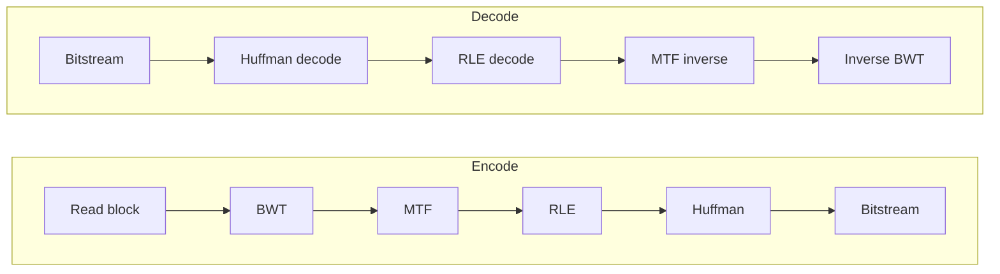

## 0. Filevault context 
Filevault sử dụng Bzip3 như một chế độ nén luồng dữ liệu không mất mát trong pipeline lưu trữ/backup; mục tiêu: giảm kích thước lưu trữ và băng thông trước khi mã hóa/chữ ký. Cần tách rạch việc nén và bảo mật (MAC/signature, encryption) — Bzip3 không thay thế bảo mật.

## 1. Khái niệm thuật toán, giải quyết vấn đề gì, bảo vệ cái gì
Bzip3 là chuỗi bước nén lossless: BWT → MTF → RLE → mã entropy (Huffman/ARN-like). Giải quyết: giảm dung lượng dữ liệu cho lưu trữ/truyền tải. Không bảo vệ tính riêng tư/độ xác thực/tính toàn vẹn (trừ khi bổ sung checksum/HMAC/signature).

## 2. Toán học, công thức
- Entropy nguồn: $H = -\sum_i p_i \log_2 p_i$ (bit/symbol).
- Giới hạn nén tối thiểu (lossless) ~ $H$ bits/symbol.
- Tỷ lệ nén xấp xỉ $1 - \dfrac{H}{\text{bit\_per\_symbol}}$ (tùy alphabet).
- Kích thước mã Huffman: $\sum_i f_i \, \ell_i$, với $\ell_i$ độ dài mã; Huffman tối ưu trong lớp mã rời rạc.
- Lưu ý: BWT tái sắp xếp dữ liệu để tăng tính lặp cục bộ nhưng không giảm entropy toàn cục.

## 3. Cách hoạt động
1. Tách input thành block kích thước giới hạn (ví dụ 100–900 KB).
2. Áp dụng BWT trên mỗi block → chuyển các ký tự tương tự về gần nhau.
3. Áp dụng MTF để chuyển ký tự thành chỉ số vị trí động (làm nổi bật các giá trị nhỏ).
4. Áp dụng RLE để nén runs trong chuỗi MTF.
5. Xây dựng bảng tần suất, mã hóa bằng Huffman hoặc mô hình entropy khác.
6. Ghi header block (metadata), bảng mã, bitstream nén, checksum tùy chọn.

## 4. Cấu trúc dữ liệu
- Block buffer: byte[].
- Suffix array / SA hoặc suffix-array induced sorting cho BWT.
- Danh sách MTF (array 256 hoặc cấu trúc linked/array động).
- Bảng tần suất: int[alphabet_size].
- Cây Huffman / bảng canonical Huffman (mã chuẩn hóa).
- Bitstream reader/writer (bit-aligned, MSB/LSB order rõ ràng).
- Checksum/HMAC (CRC32/CRC64/SHA256) cho integrity/auth.

## 5. So sánh với các thuật toán khác
- So với LZ77/LZ78 (gzip/deflate): BWT-based thường nén tốt hơn cho văn bản có lặp cục bộ dài, nhưng đòi CPU/RAM cao hơn.
- So với LZMA (xz): LZMA có khả năng nén sâu hơn trên nhiều loại dữ liệu, nhưng thường chậm và tiêu tốn bộ nhớ.
- So với zstd/snappy: zstd cân bằng tốc độ và nén; snappy ưu tốc độ rất cao, nén thấp.
- Trade-offs: throughput vs compression ratio vs memory.

## 6. Luồng hoạt động
Mermaid (encode/decode flow):


## 7. Các sai lầm triển khai phổ biến
- Dùng thuật toán BWT O(n^2) cho block lớn (không khả dụng).
- Không giới hạn kích thước block → DoS bộ nhớ.
- Lỗi bitstream: sai bit-order hoặc alignment.
- Bảng Huffman không chuẩn hóa → decode không nhất quán.
- Thiếu kiểm tra input → OOB reads/writes.
- Quên sentinel/EOF trong BWT → phục hồi sai.

## 8. Threat Model
- Malformed/huge input gây DoS (CPU/Mem).
- Truncated/malicious bitstream gây crash hoặc decode sai.
- Buffer overflow dẫn tới RCE.
- Side-channel (timing) leaking nội dung.
- Compression bomb: file nhỏ nén cao gây giải nén tiêu thụ tài nguyên lớn.

## 9. Biện pháp giảm thiểu
- Giới hạn kích thước block và tổng bộ nhớ sử dụng.
- Kiểm tra header, checksum/HMAC trước khi giải nén.
- Bound các tham số (số nút Huffman, độ dài code tối đa).
- Dùng canonical Huffman để tránh giải mã không nhất quán.
- Sử dụng ngôn ngữ an toàn hoặc sanitizers (ASan/UBSan).
- Rate limiting, timeouts, quota cho dịch vụ nén/giải nén.
- Fuzz testing decoder và static analysis.

## 10. Test Vectors
- Vector 1: Input "" → expect archive hợp lệ, block length = 0.
- Vector 2: Input "banana" → round-trip decode(encode("banana")) == "banana". Kiểm tra BWT/IBWT.
- Vector 3: Input "aaaaaaa" → RLE mạnh, high compression.
- Vector 4: Random block size = block_limit → nén kém, verify lossless.
- Vector 5: Truncated header/bitstream → decoder phải fail-safe (không crash).
- Kiểm tra checksum/HMAC failure handling.

## 11. Code (pseudo-code)
Encoder (tóm tắt):
```text
func encode(block):
    if len(block) == 0: write_empty_block(); return
    bwt = BWT(block)
    mtf = MTF_encode(bwt)
    rle = RLE_encode(mtf)
    freqs = freq_table(rle)
    table = build_canonical_huffman(freqs)
    bits = huffman_encode(rle, table)
    write_header(table, len(block))
    write_bits(bits)
    write_checksum(hash(block))
```
Decoder (tóm tắt):
```text
func decode(stream):
    header = read_header()
    validate_header(header)
    table = read_huffman_table()
    bits = read_bits()
    rle = huffman_decode(bits, table)
    mtf = RLE_decode(rle)
    bwt = MTF_decode(mtf)
    block = inverseBWT(bwt, header.orig_len)
    verify_checksum(block)
    return block
```
(Ghi chú: kiểm tra lỗi mọi bước; xử lý resource limits.)

## 12. Checklist bảo mật
- [ ] Giới hạn kích thước block và tổng bộ nhớ.
- [ ] Validate header và bảng Huffman trước khi giải mã.
- [ ] Sử dụng canonical Huffman để chuẩn hóa bảng.
- [ ] Bounds-checking cho mọi buffer access.
- [ ] Bitstream reader an toàn (không đọc vượt/underflow).
- [ ] Kiểm tra checksum/HMAC trước khi trả dữ liệu tin cậy.
- [ ] Rate limits, timeouts, CPU/memory quotas.
- [ ] Fuzz tests + CI với ASan/UBSan và static analysis.
- [ ] Log hạn chế (không tiết lộ dữ liệu nhạy cảm).
- [ ] Fail-safe: decoder phải từ chối input malformed chứ không crash.

## Nguồn tham khảo
- Burrows & Wheeler, “A Block-sorting Lossless Data Compression Algorithm”.
- Move-to-front và RLE khái niệm: sách giáo khoa nén dữ liệu.
- Huffman, D. A., “A Method for the Construction of Minimum-Redundancy Codes”.
- bzip2 implementation notes: https://sourceware.org/bzip2/
- RFC/notes về canonical Huffman và bitstream handling.

