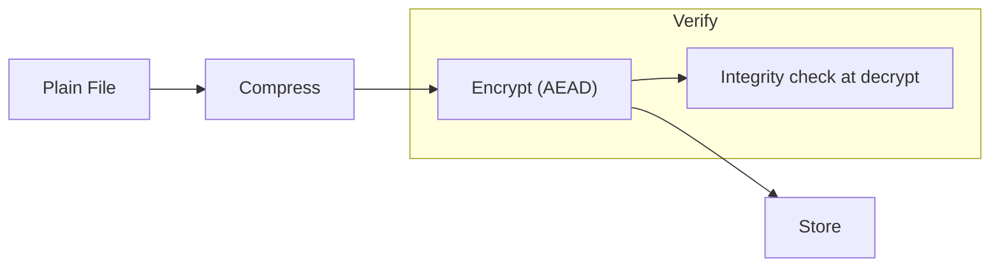

# Compression
## 0. FileVault context
FileVault nén dữ liệu trước khi mã hóa để giảm dung lượng lưu trữ và tối ưu I/O. Mô hình vận hành: dữ liệu tĩnh (file) → nén → mã hóa (AEAD) → lưu trữ.

## 1. Khái niệm thuật toán — giải quyết và bảo vệ
- Mục tiêu: loại bỏ tính dư thừa nhằm giảm kích thước và băng thông.
- Giải quyết vấn đề: giảm kích thước lưu trữ/backup, tăng hiệu quả truyền tải.
- Bảo vệ: nén không phải là bảo mật; nén trước mã hóa có thể làm lộ thông tin về kích thước/độ dài, vì vậy cần mã hóa mạnh (AEAD) và chú ý threat model.

## 2. Toán học, công thức
- Entropy Shannon: $H(X) = -\sum_i p_i \log_2 p_i$.
- Tỷ lệ nén (compression ratio): $\mathrm{CR} = \frac{\text{compressed\_size}}{\text{original\_size}}$ (nhỏ hơn 1 tốt hơn).
- Lợi ích tối đa lý thuyết khi $H(X)$ thấp; nén không thể giảm dưới entropy nguồn.

## 3. Cách hoạt động (tóm tắt)
- LZ-based (Zlib/Deflate, LZMA): tìm các chuỗi lặp (dictionary), mã hóa vị trí/độ dài, sau đó entropy-coding (Huffman/Range).
- BWT (bzip2): biến đổi Burrows–Wheeler → RLE → Huffman.
- Các bước chung: phân tích chuỗi → biểu diễn lặp lại → mã hóa entropy → output stream.

## 4. Cấu trúc dữ liệu
- Dictionary / sliding window (LZ77): buffer trượt, hash/hashtable để tìm match.
- Suffix arrays/trees (một số thuật toán tối ưu tìm match).
- Fenwick/bitstream cho entropy coding; cây Huffman hoặc coder tần suất / range coder.

## 5. So sánh với thuật toán khác (tóm tắt)
- Zlib/Deflate: nhanh, tỉ lệ trung bình — tốt cho realtime.
- LZMA: tỉ lệ cao, chậm khi nén, bộ nhớ lớn — tốt cho archival.
- Bzip2: trung gian tỉ lệ/độ trễ, CPU-bound.
- Lựa chọn dựa trên: tốc độ nén/giải nén, RAM, kích thước đầu ra, latency.

## 6. Luồng hoạt động (pipeline)
Mermaid:


## 7. Các sai lầm triển khai phổ biến
- Compress-then-encrypt bị bỏ qua → Encrypt-then-compress (vô hiệu).
- Nén theo-chunk mà dùng kích thước cố định không sạch sẽ dẫn tới rò rỉ chiều dài.
- Dùng thuật toán nén deterministic + attacker-control input → CRIME/BREACH style leakage nếu ứng dụng stream/HTTP.
- Thiếu authentication (MAC/AEAD) — cho phép tampering.
- Không kiểm soát giới hạn bộ nhớ/độc quyền dẫn đến DoS.

## 8. Threat Model (cụ thể cho FileVault)
- Kẻ tấn công có khả năng đọc ciphertext (lưu trữ bị lộ) và có thể chèn/điều chỉnh plaintext trước khi nén? (thường không trong file static).
- Mối đe dọa chính: tiết lộ độ dài, metadata, từ kích thước nén.
- Không xét threat: passive offline attacker không có khả năng chosen-plaintext.

## 9. Biện pháp giảm thiểu
- Always: Compress-then-Encrypt.
- Dùng AEAD (AES-GCM, ChaCha20-Poly1305) cho tính bảo mật & integritiy.
- Thêm padding / length-hiding nếu cần chống leak kích thước.
- Phân đoạn an toàn: chunked compression + per-chunk AEAD nonces.
- Giới hạn kích thước và tài nguyên khi giải nén để tránh DoS.
- Không cho phép attacker-chosen data gắn liền với bí mật sống trong cùng block trước khi nén.

## 10. Test Vectors (kiểm tra cơ bản)
- Round-trip test:
    - Input: "The quick brown fox jumps over the lazy dog" (UTF-8).
    - Steps: compress → encrypt → decrypt → decompress → equals original.
- Edge cases:
    - Empty file.
    - Repetitive data (1 MiB of 'A').
    - High-entropy data (random bytes) — nén không giảm kích thước.
- Đo: xác nhận CR, thành công giải nén, tag AEAD hợp lệ, không crash.

## 11. Code (ví dụ ngắn, compress-then-encrypt bằng Python + zlib + cryptography)
```python
import zlib, os
from cryptography.hazmat.primitives.ciphers.aead import AESGCM

def compress_then_encrypt(plaintext: bytes, key: bytes) -> bytes:
        comp = zlib.compress(plaintext)
        aesgcm = AESGCM(key)
        nonce = os.urandom(12)
        ct = aesgcm.encrypt(nonce, comp, None)
        return nonce + ct

def decrypt_then_decompress(blob: bytes, key: bytes) -> bytes:
        nonce, ct = blob[:12], blob[12:]
        aesgcm = AESGCM(key)
        comp = aesgcm.decrypt(nonce, ct, None)
        return zlib.decompress(comp)
```
Lưu ý: quản lý key/nonce theo chuẩn; dùng KDF cho key, không tái sử dụng nonce.

## 12. Checklist bảo mật (ngắn)
- [ ] Compress-then-encrypt được áp dụng.
- [ ] Sử dụng AEAD; kiểm tra tag trước giải nén.
- [ ] Nonce/IV quản lý an toàn (unique per key).
- [ ] Padding/length-hiding nếu threat model yêu cầu.
- [ ] Giới hạn bộ nhớ/CPU cho nén/giải nén.
- [ ] Test vectors cho edge cases đã chạy.
- [ ] Logging/monitoring cho lỗi nén/giải nén.

## Nguồn tham khảo
- RFC 1951 — DEFLATE
- LZMA SDK (docs)
- Bzip2 specification
- Articles on CRIME/BREACH (side-channel compression leaks)
- Shannon entropy fundamentals

