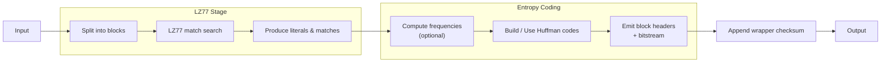

## Zlib

## 0. Filevault context  
Filevault docs — mục "algorithms/compression": tóm tắt kỹ thuật, rủi ro bảo mật và hướng dẫn kiểm thử cho zlib/DEFLATE để dùng trong đánh giá thành phần và thiết kế hệ thống lưu trữ/mã hóa.

## 1. Khái niệm thuật toán, giải quyết vấn đề gì, bảo vệ cái gì  
Zlib là thư viện và định dạng wrapper cho thuật toán DEFLATE (kết hợp LZ77 + Huffman). Mục tiêu: giảm kích thước dữ liệu để tiết kiệm băng thông/lưu trữ. Zlib không cung cấp bảo mật (không mã hóa); chỉ có checksum (Adler‑32 trong wrapper) để kiểm tra toàn vẹn bề mặt, không đảm bảo tính xác thực.

## 2. Toán học, công thức  
- LZ77: thay thế các đoạn lặp bằng cặp (distance, length).  
- Huffman coding: mã tiền tố tối ưu dựa trên tần suất; độ dài trung bình mã ≥ entropy $H(X)= -\sum_x p(x)\log_2 p(x)$.  
- Adler‑32: cập nhật A,B trên modulo $65521$, checksum $= (B \ll 16) | A$. Cập nhật cho byte $b$: $A=(A+b)\bmod 65521$, $B=(B+A)\bmod 65521$.  
- CRC32: tính theo đa thức modulo-2; tổng quát: checksum là phần dư của phép chia đa thức dữ liệu nhân $x^{32}$ cho đa thức sinh $G(x)$ (ví dụ CRC‑32/ISO‑HDLC).

## 3. Cách hoạt động  
- Dữ liệu chia thành block.  
- Trong mỗi block: tìm match LZ77 trong cửa sổ trượt (max 32 KB) và phát sinh literal hoặc (distance,length).  
- Thu thập tần suất; xây dựng Huffman dynamic (hoặc dùng mã tĩnh).  
- Ghi block header, mã hóa bằng bit-level vào bitstream, xuất wrapper header và checksum (Adler‑32 cho zlib).

## 4. Cấu trúc dữ liệu  
- Sliding window buffer (32 KB).  
- Hash table / hash chains cho tìm match nhanh.  
- Frequency table / tree cho Huffman (hoặc canonical code tables).  
- Bit buffer / bit writer-reader.  
- Struct header: CMF/FLG (zlib), tùy chọn gzip header/trailer.

## 5. So sánh với các thuật toán khác  
- gzip: cùng DEFLATE, khác wrapper/headers.  
- bzip2: BWT+MTF+Huffman — thường nén tốt hơn văn bản, chậm hơn.  
- LZ4: tối ưu tốc độ (nén/giải nén rất nhanh), tỉ lệ thấp hơn.  
- Zstandard: cân bằng tốc độ và tỉ lệ, thường vượt DEFLATE.  
- Brotli: hiệu quả nén cao cho web, tốn CPU hơn DEFLATE.

## 6. Luồng hoạt động (tóm tắt)  


## 7. Các sai lầm triển khai phổ biến  
- Không xử lý/kiểm tra return code từ API.  
- Tràn/bội/thiếu kiểm soát khi đọc/ghi bitstream hoặc window.  
- Không giới hạn kích thước giải nén (decompression bomb).  
- Tin checksum là bảo mật (Adler‑32 dễ va chạm).  
- Hash chain quá sâu gây CPU DoS.  
- Parse header/trailer không đầy đủ gây lỗi khi đọc dữ liệu tùy biến.

## 8. Threat Model  
- Attacker gửi dữ liệu nén độc hại để: gây tràn bộ nhớ, làm cạn CPU (CPU exhaustion), kích hoạt lỗ hổng native (RCE), hoặc thay đổi nội dung nếu không kiểm tra checksum/không dùng authenticity.  
- Kỳ vọng attacker có thể tạo block/streams đặc biệt để gây deep recursion hoặc very long matches.

## 9. Biện pháp giảm thiểu  
- Giới hạn kích thước giải nén tối đa và số block.  
- Thiết lập quotas: bộ nhớ, thời gian CPU, I/O.  
- Kiểm tra tất cả return codes; validate header và checksum.  
- Chạy giải nén trong sandbox/process isolation; sử dụng throttling.  
- Sử dụng phiên bản zlib đã vá; bật hardening (ASLR, DEP, stack canaries).  
- Nếu cần integrity+authenticity: dùng HMAC/signature chứ không dựa vào Adler‑32.

## 10. Test Vectors  
- Empty: "" -> zlib: 78 9C 03 00 00 00 00 01 (ví dụ).  
- Short text: "hello world" — round‑trip check.  
- Repetitive: "A"*10000 — kỳ vọng tỉ lệ nén cao.  
- Random: random bytes — không nén tốt.  
Kiểm tra: decompress(compress(x)) == x; verify checksum; kiểm thử giới hạn kích thước và tài nguyên.

## 11. Code (ví dụ ngắn)  
```python
import zlib
data = b"hello hello hello"
c = zlib.compress(data)
d = zlib.decompress(c)
assert d == data
```

## 12. Checklist bảo mật  
- [ ] Dùng phiên bản zlib đã cập nhật.  
- [ ] Validate/parse header an toàn.  
- [ ] Giới hạn kích thước giải nén và tài nguyên.  
- [ ] Kiểm tra return codes và lỗi.  
- [ ] Chạy giải nén trong sandbox nếu dữ liệu không tin cậy.  
- [ ] Dùng HMAC/signature khi cần authenticity.  
- [ ] Thêm test vectors (empty/repetitive/random/large).  
- [ ] Audit native bindings và memory handling.

Nguồn tham khảo  
- RFC 1950 (zlib format), RFC 1951 (DEFLATE)  
- https://zlib.net/  
- Tài liệu CRC/Adler (RFCs, bài báo kỹ thuật)
- Hiện thực zlib (source code) — để audit các điểm rủi ro native.