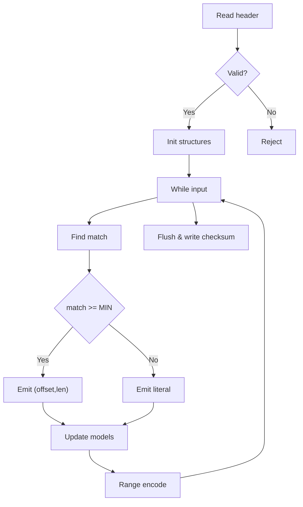

## Zlma (Filevault context)

## 0. Filevault context  
Mô tả: Zlma là biến thể LZMA dùng trong hệ thống Filevault để nén dữ liệu lưu trữ/backup trước khi (tuỳ chọn) mã hóa. Yêu cầu: an toàn trong giải nén, giới hạn tài nguyên, auditability và test vectors cho dữ liệu không tin cậy.

## 1. Khái niệm thuật toán, giải quyết vấn đề gì, bảo vệ cái gì  
Zlma kết hợp LZ (dictionary-based matching) và range/arithmetic coder để đạt tỷ lệ nén gần entropy. Mục tiêu: giảm dung lượng lưu trữ, tối ưu tỉ lệ cho file nhị phân/text. Không cung cấp confidentiality — chỉ integrity sơ bộ qua checksum; cần kết hợp MAC/cryptography để bảo vệ nội dung.

## 2. Toán học, công thức  
- Entropy: $H(X) = -\sum_x p(x)\log_2 p(x)$.  
- Giới hạn nén (kỳ vọng): không thể thấp hơn $H(X)$.  
- Tỷ lệ nén: $R = \dfrac{|C|}{|O|}$ (|C|: kích thước nén, |O|: gốc).  
- LZ references: dữ liệu biểu diễn bằng cặp (offset, length) khi xuất hiện match; benefit khi chuỗi lặp làm giảm độ entropi hiệu dụng.  
- Range coder/Arithmetic: mã hoá bit/biểu tượng theo phân phối xác suất liên tục, tiến gần tới entropy nguồn.

## 3. Cách hoạt động  
- Quét input bằng cửa sổ trượt.  
- Tìm match dài nhất (hash/chain hoặc suffix structure).  
- Nếu match >= MIN_MATCH: emit (offset,length); else emit literal.  
- Sử dụng mô hình ngữ cảnh (counters, state) để dự đoán bit/byte probabilities.  
- Mã hoá luồng bằng range coder; ghi header (properties, dict size) và checksum/footer.

## 4. Cấu trúc dữ liệu  
- Sliding window buffer (circular).  
- Hash table + chains cho tìm match nhanh.  
- (Tùy chọn) Suffix array / trie cho match dài hơn.  
- Context model: bảng counters, state machine, probability/price tables.  
- Output buffer, block header/footer, checksum/MAC slot.

## 5. So sánh với thuật toán khác  
- gzip/DEFLATE: nhanh hơn, tỉ lệ thường kém hơn với patterns dài.  
- Zstd: tốt cân bằng tốc độ/tỉ lệ; Zlma thường cho tỉ lệ tốt hơn nhưng CPU/RAM cao hơn.  
- Brotli: tối ưu cho web text; Zlma phù hợp file lớn nhị phân.  
- Trade-offs: tốc độ ↔ tỷ lệ ↔ bộ nhớ.

## 6. Luồng hoạt động (flow)  
- Parse/validate header → Init structures → Loop parse block: tìm match/emit literal → update model → range encode → flush → write checksum.  
Mermaid:


## 7. Các sai lầm triển khai phổ biến  
- Không giới hạn kích thước window/input → OOM.  
- Off-by-one dẫn đến overrun/underrun khi áp offset/length.  
- Không validate header/fiels → crash/undefined behavior.  
- Counters overflow/underflow trong model → decode mismatch.  
- Không kiểm tra offset/length từ stream → đọc ngoài vùng buffer.

## 8. Threat Model  
- Decompression bomb (DoS: CPU/RAM).  
- Malformed stream → memory corruption / RCE nếu dùng native unsafe APIs.  
- Crafted offsets/lengths → OOB reads/writes.  
- Tampering/bit-flip → integrity/denial or incorrect outputs.  
- Side-channels (timing) nếu xử lý dữ liệu nhạy cảm.

## 9. Biện pháp giảm thiểu  
- Giới hạn tài nguyên: max input, max window, timeout CPU.  
- Strict validation header/fields trước sử dụng.  
- Validate offset/length khi expand match.  
- Dùng API an toàn (checked arithmetic, bounds-checked reads).  
- Sandbox/privilege separation cho decompression.  
- Sử dụng checksum + MAC/Signature để bảo vệ integrity/authenticity.  
- Throttling/quotas cho requests nhiều luồng.

## 10. Test Vectors  
- Empty: "" → round-trip.  
- Short literals: "abc", "Hello, world!"  
- Repetition: "A" * 10000 → check high compression.  
- Structured: repeated JSON fields.  
- Random: 1 MB random → compressed ≈ original or slightly lớn hơn.  
- Malformed: header nói kích thước lớn nhưng stream ngắn → decoder phải từ chối.  
- Stress: many small streams, long runs to detect OOM/CPU spikes.  
Kiểm tra: decompress(compress(input)) == input; resource limits respected; malformed rejected.

11. Code (skeleton, pseudocode)
```c
// skeleton
init_state(props);
while(read_block(in)) {
  while(has_input()){
    match = find_longest_match(window, lookahead);
    if(match.length >= MIN_MATCH) emit_match(match);
    else emit_literal(next_byte());
    update_models(...);
    range_encode(bitstream, model);
  }
}
write_footer(checksum);
```

## 12. Checklist bảo mật  
- [ ] Giới hạn input/block/window và timeouts  
- [ ] Validate tất cả trường header trước xử lý  
- [ ] Kiểm tra overflow/underflow cho offset/length  
- [ ] Dùng checked arithmetic và API an toàn  
- [ ] Thực thi trong sandbox/process riêng với data không tin cậy  
- [ ] Thêm checksum + MAC/Signature cho integrity/authenticity  
- [ ] Unit/integration tests (round-trip, malformed, stress)  
- [ ] Review/scan mã (ASAN, UBSAN, fuzzing, SAST)

Nguồn tham khảo (chọn lọc)  
- RFC 1951 DEFLATE: https://www.ietf.org/rfc/rfc1951.txt  
- LZ77/LZMA overview: https://en.wikipedia.org/wiki/LZ77 , https://www.7-zip.org  
- Range coding overview: https://en.wikipedia.org/wiki/Arithmetic_coding  
- Practical robustness: OWASP and librosa/OSS hardening guides.

