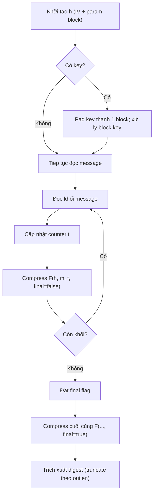
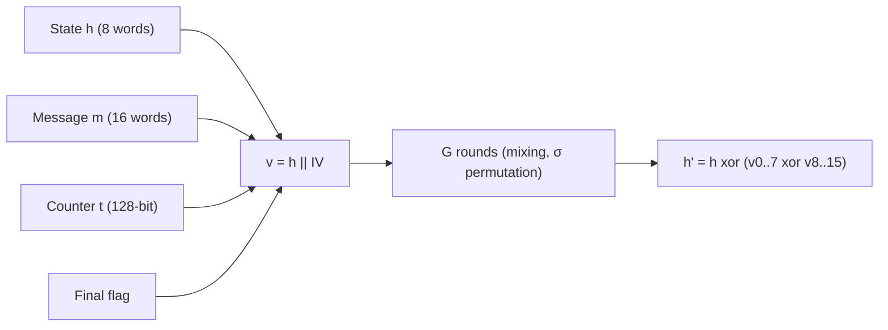

# BLAKE2

## 1. Khái niệm thuật toán, giải quyết vấn đề gì, bảo vệ cái gì
BLAKE2 là họ hàm băm mật mã nhanh, an toàn (hậu duệ của BLAKE). Mục tiêu: thay thế SHA-2/SHA-3 cho checksum, MAC, KDF, và hash table với tốc độ cao. Bảo vệ tính toàn vẹn dữ liệu, chống va chạm (collision resistance), chống preimage; hỗ trợ keyed hashing để đảm bảo tính xác thực.

## 2. Toán học, công thức (tóm tắt)
- Toán tử cơ bản:
    - Cộng modulo 2^w: a ⊞_w b ≡ (a + b) mod 2^w.
    - XOR: a ⊕ b.
    - Rotate-right: ROTR_r(x) = (x >>> r) | (x << (w - r)) (tất cả phép toán trên w bit).

- Tham số w:
    - BLAKE2b: w = 64.
    - BLAKE2s: w = 32.

- Hàm G (mixing) — với các tham số xoay r1,r2,r3,r4:
$$
\begin{aligned}
G(a,b,c,d,x,y):\quad
& a \leftarrow a \;⧺\; b \;⧺\; x &&(\text{viết }⧺\text{ cho } \bmod 2^w)\\
& d \leftarrow \operatorname{ROTR}_{r_1}(d \oplus a)\\
& c \leftarrow c \;⧺\; d\\
& b \leftarrow \operatorname{ROTR}_{r_2}(b \oplus c)\\
& a \leftarrow a \;⧺\; b \;⧺\; y\\
& d \leftarrow \operatorname{ROTR}_{r_3}(d \oplus a)\\
& c \leftarrow c \;⧺\; d\\
& b \leftarrow \operatorname{ROTR}_{r_4}(b \oplus c)
\end{aligned}
$$
- Hệ số ROTR theo biến thể:
    - BLAKE2b (w=64): r1=32, r2=24, r3=16, r4=63.
    - BLAKE2s (w=32): r1=16, r2=12, r3=8, r4=7.

- Hàm nén F(h,m,t,f):
    - Khởi tạo:
    $$
    v = [h_0,\dots,h_7,\,IV_0,\dots,IV_7]
    $$
    - Áp dụng counter và flag:
    $$
    v_{12} \leftarrow v_{12} \oplus t_{\text{low}},\quad
    v_{13} \leftarrow v_{13} \oplus t_{\text{high}}
    $$
    Nếu block cuối thì lật bit: $v_{14} \leftarrow \neg v_{14}$ (hoặc xor với all‑ones).
    - Lặp rounds r = 0..R-1 (R = 12 cho BLAKE2b; R = 10 cho BLAKE2s): áp dụng 8 lần G theo cột rồi 8 lần G theo hàng chéo, sử dụng permutation σ[r][i] để lấy từ m:
    $$
    \text{G rounds use } m_{\sigma[r][i]} \text{ as } x,y\ \text{(column/diagonal schedule).}
    $$
    - Kết quả:
    $$
    h' = h \oplus \bigl(v_{0..7} \oplus v_{8..15}\bigr).
    $$
- Ghi chú: σ là ma trận permutation (theo RFC7693) quyết định thứ tự từ thông điệp dùng trong mỗi G.

## 3. Cách hoạt động
- Init: tạo vector trạng thái h từ IV và tham số (key, outlen, fanout,…).
- Xử lý khối: chia message thành khối kích thước B (64/128 bytes), cập nhật counter t, gọi compression F cho mỗi khối.
- Finalize: xử lý khối cuối với flag final, xuất digest length bytes từ h.

## 4. Cấu trúc dữ liệu
- Trạng thái nội bộ: h (8 từ), v (16 từ tạm), m (16 từ message block).
- Tham số cấu hình (param block): digest_length, key_length, fanout, depth, leaf_length, node_offset, node_depth, inner_length, salt, personal.
- Counter t: 128-bit (hai từ) đếm tổng số byte đã xử lý.

## 5. So sánh với thuật toán khác
- So với MD5/SHA-1: an toàn hơn, không yếu về va chạm.
- So với SHA-2: thường nhanh hơn trên CPU hiện đại; bảo mật tương đương cho mục đích chung.
- So với SHA-3: thiết kế khác (sponge vs HAIFA-like); thường BLAKE2 nhanh hơn cho nhiều ứng dụng.
- Hỗ trợ keyed hashing trực tiếp (không cần HMAC) nên tiện cho MAC/KDF.

## 6. Luồng hoạt động (flow)
1. Khởi tạo h với IV và tham số.
2. Nếu có key, pad key thành một khối đầu.
3. Lặp: đọc khối message, tăng counter t, gọi compression F.
4. Ở khối cuối đặt final flag, gọi F.
5. Trích xuất digest từ h.

## 7. Các sai lầm triển khai phổ biến
- Sai kích thước từ (dùng 32-bit/64-bit không đúng biến thể).
- Không xử lý đúng counter 128-bit khi tổng bytes vượt quá 2^64.
- Bỏ quên finalization flag → digest sai hoặc kém an toàn.
- Không làm rõ padding cho key hoặc xử lý key như dữ liệu bình thường.
- Implement non-constant-time cho thao tác liên quan đến key → rò rỉ thông tin.

## 8. Threat Model
- Threats: collision attacks, preimage attacks, length-extension (BLAKE2 không mắc length-extension trong chế độ keyed), side-channel (timing, cache), chosen-prefix.
- Khả năng tấn công thực tế phụ thuộc biến thể, độ dài digest, và cách dùng (keystore, KDF, streaming).

## 9. Biện pháp giảm thiểu
- Dùng digest đủ dài (>= 256 bit cho bảo mật dài hạn).
- Dùng chế độ keyed hoặc dùng HMAC-like construction khi cần authenticate.
- Bảo vệ implementation khỏi side-channel: constant-time cho thao tác liên quan key, tránh branch phụ thuộc key.
- Kiểm soát input size và xử lý counter đúng.
- Dùng thư viện chính thức được review, không tự triển khai nếu không cần thiết.

## 10. Test Vectors
- Sử dụng RFC 7693 và bản viết tắt chính thức để kiểm tra: tạo test cases cho empty, short ASCII, long stream, keyed mode, personalization/salt.
- Ví dụ kiểm tra cơ bản (kiểm tra tự động với reference implementation):
    - empty string → compare digest với vector tham chiếu.
    - "abc" → compare với vector tham chiếu.
    - keyed("key", "message") → compare.
(Tài liệu chính thức chứa bảng giá trị hex chi tiết — luôn dùng vector RFC/implementation để kiểm tra.)

## 11. Code (bỏ qua cũng được)
- Khuyến nghị: sử dụng implementation đã được audit (libsodium, BLAKE2 reference C, OpenSSL 1.1+/libcrypto nếu hỗ trợ).
- Nếu cần minimal pseudocode:
    - init(h, param)
    - for each block B: t += len(B); compress(h, B, t, final=false)
    - compress last block with final=true
    - return truncate(h, digest_len)

## 12. Checklist bảo mật
- [ ] Dùng biến thể phù hợp (BLAKE2b cho 64-bit, BLAKE2s cho 32-bit).
- [ ] Chọn digest length đủ lớn.
- [ ] Sử dụng implementation đã audit hoặc chính thức.
- [ ] Xử lý key và param đúng (padding, param block).
- [ ] Kiểm tra test vectors (RFC 7693).
- [ ] Bảo vệ khỏi side-channel nếu dùng key.
- [ ] Kiểm soát kích thước input và counter overflow.
- [ ] Đăng ký/ghi nhận personalization/salt khi cần để tránh collision qua sử dụng chung.

Nguồn tham khảo chuẩn: RFC 7693 (BLAKE2) và implementation chính thức để test và test vectors.
## 13. Đặc điểm và biến thể
- Đặc điểm chính:
    - Rất nhanh trên CPU hiện đại; thiết kế tối ưu cho các ISA 64-bit/32-bit.
    - Hỗ trợ keyed hashing (MAC), personalization, salt, và output length biến thiên.
    - An toàn theo các thuộc tính mật mã tiêu chuẩn (collision/preimage) với mức bảo mật phụ thuộc digest length.
    - Thiết kế mô-đun: compression function nhẹ, dễ streaming và incremental.
    - Không phụ thuộc vào cấu trúc sponge → khác với SHA‑3; không cần HMAC khi dùng keyed mode.
- Biến thể tiêu biểu:
    - BLAKE2b: cho hệ 64-bit, digest tối đa 64 bytes (512 bit), tối ưu cho server/desktop.
    - BLAKE2s: cho hệ 32-bit/nhúng, digest tối đa 32 bytes (256 bit).
    - BLAKE2bp / BLAKE2sp: biến thể đa luồng (parallel) dùng tree hashing để tận dụng nhiều lõi.
    - BLAKE2X: chế độ extendable-output (tạo luồng dài output) dựa trên BLAKE2.
    - (Lưu ý) BLAKE3 là họ tiếp theo với thiết kế khác (sinh parallel mạnh hơn) — không phải biến thể trực tiếp của BLAKE2.
- Các tính năng triển khai:
    - Tree hashing cho dữ liệu lớn / parallel processing.
    - Param block cho cấu hình (personalization, salt, fanout, depth, …).
    - Hỗ trợ incremental API, streaming và keyed API.

## 14. Ứng dụng
- Kiểm tra tính toàn vẹn dữ liệu: checksums, file integrity, deduplication.
- MAC / authentication: thay thế HMAC trong nhiều trường hợp bằng keyed BLAKE2.
- KDF/PRF: dùng làm thành phần trong KDF/HKDF hoặc PRF; lưu ý cần thiết kế KDF đúng tiêu chuẩn nếu dùng cho mật khẩu.
- Content-addressed storage và hash-based IDs (ví dụ: hệ thống lưu trữ, cache, dedupe).
- Signatures / certificates: làm hash đầu vào cho chữ ký số.
- Network protocols và TLS extensions, file formats, container checksums — nơi cần hash nhanh và an toàn.
- Embedded/IoT: BLAKE2s phù hợp cho thiết bị 32-bit.
- Không khuyến nghị dùng BLAKE2 như thay thế password hash chuyên dụng (dùng Argon2/Bcrypt/scrypt cho mật khẩu).
- Lợi ích thực tế: lựa chọn biến thể theo môi trường (BLAKE2b cho server, BLAKE2s cho nhúng, BLAKE2bp/sp cho đa lõi).
- Thực tế: ưu tiên libraries đã audit (libsodium, reference impl., OpenSSL nếu hỗ trợ) thay vì tự triển khai.

Nguồn tham khảo: RFC 7693 và tài liệu implementation cho từng biến thể.