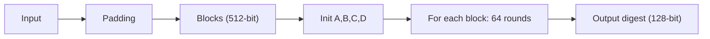

# MD5 (Message-Digest Algorithm 5)

## 0. Filevault context  
Filevault docs: mô tả ngắn MD5, nhấn mạnh rủi ro bảo mật, khuyến nghị thay thế (SHA-2/3, BLAKE2/3). Dùng để phục vụ tài liệu kỹ thuật, test vectors và chuyển đổi legacy; không khuyến khích dùng cho bảo mật.

## 1. Khái niệm, giải quyết vấn đề, bảo vệ gì  
MD5 là hàm băm mật mã sinh digest 128‑bit từ dữ liệu bất kỳ. Mục đích chính: kiểm tra tính toàn vẹn (checksum) và nhận dạng dữ liệu, không bảo vệ chống collision hiện đại hay làm khóa/mật khẩu/ chữ ký.

## 2. Toán học, công thức (sử dụng math markdown)  
- Hoạt động trên khối 512‑bit (16 từ 32‑bit). Các phép cơ bản: cộng modulo $2^{32}$, left‑rotate, và các hàm phi tuyến bitwise.  
- Hàm vòng (ví dụ tổng quát cho bước i):  
    $$
    A_{t+1} = D_t,\quad D_{t+1}=C_t,\quad C_{t+1}=B_t,\quad B_{t+1}=B_t + \mathrm{ROTL}_{s_t}\big(A_t + F_t(B_t,C_t,D_t) + M_{g(t)} + K_t\big)\ \bmod 2^{32}
    $$  
    với $F_t$ là một trong các hàm:  
    $$
    \begin{aligned}
    F(B,C,D)&=(B\land C)\lor(\neg B\land D)\\
    G(B,C,D)&=(B\land D)\lor(C\land\neg D)\\
    H(B,C,D)&=B\oplus C\oplus D\\
    I(B,C,D)&=C\oplus(B\lor\neg D)
    \end{aligned}
    $$  
- K[i] là hằng số (sine table), $s[i]$ là lượng dịch trái; cuối cùng digest là $A\parallel B\parallel C\parallel D$ (little‑endian).

## 3. Cách hoạt động (tóm tắt)  
- Padding: thêm bit 1, rồi 0 đến khi độ dài ≡ 448 mod 512, sau đó thêm 64‑bit biểu diễn độ dài ban đầu (little‑endian).  
- Chia message thành khối 512‑bit.  
- Khởi tạo 4 thanh ghi 32‑bit cố định.  
- Với mỗi khối: thực hiện 64 bước (4 vòng × 16 bước) cập nhật A,B,C,D theo hàm F/G/H/I.  
- Kết hợp A,B,C,D cho digest 128‑bit.

## 4. Cấu trúc dữ liệu  
- Block input: 512‑bit = 16 × 32‑bit words $M[0..15]$.  
- State: 4 × 32‑bit registers $(A,B,C,D)$.  
- Bảng: $K[0..63]$, $s[0..63]$.  
- Padding chứa độ dài gốc 64‑bit.

## 5. So sánh với các thuật toán khác  
- SHA‑1: dài hơn, an toàn hơn MD5 nhưng đã có collision thực tế.  
- SHA‑256 / SHA‑3: digest 256‑bit, kháng collision/preimage mạnh hơn; dùng cho hầu hết mục đích bảo mật.  
- BLAKE2/BLAKE3: nhanh hơn và an toàn hơn MD5, phù hợp thay thế cho hashing không‑trọng yếu.  
Kết luận: MD5 nhanh nhưng yếu về bảo mật; tránh dùng cho tính năng bảo mật.

## 6. Luồng hoạt động (flow)  
- Input -> Padding -> Split into 512‑bit blocks -> Init state (A,B,C,D) -> For each block: prepare M[0..15], 64 rounds update -> Output digest.

Mermaid sequence (flowchart):


## 7. Các sai lầm triển khai phổ biến  
- Dùng MD5 cho mật khẩu, token, chữ ký.  
- Implement padding/endianness sai.  
- Sử dụng đầu ra MD5 trực tiếp làm khóa mật mã.  
- Tự triển khai cryptographic primitives thay vì dùng thư viện đã được kiểm định.

## 8. Threat Model  
- Attacker có khả năng tạo collision (tạo hai input khác nhau có cùng MD5) => giả mạo file, bypass checksum.  
- Không tin cậy MD5 để chống preimage nếu attacker có nguồn lực lớn.  
- Threat surface: file distribution, backups, artifact verification, legacy APIs.

## 9. Biện pháp giảm thiểu  
- Không dùng MD5 cho bảo mật; thay bằng SHA‑256/SHA‑3/BLAKE2.  
- Với legacy: cô lập scope, chuyển sang HMAC‑SHA256 nếu cần xác thực. Tránh HMAC‑MD5 trừ khi tương thích bắt buộc.  
- Kiểm tra và sửa lỗi padding/endianness, dùng thư viện được duy trì.  
- Dùng chữ ký số/TLS và công khai nguồn tin để đảm bảo integrity/ authenticity.  
- Thêm test vectors và CI checks để phát hiện regressions.

## 10. Test Vectors  
- "" → d41d8cd98f00b204e9800998ecf8427e  
- "a" → 0cc175b9c0f1b6a831c399e269772661  
- "abc" → 900150983cd24fb0d6963f7d28e17f72  
- "message digest" → f96b697d7cb7938d525a2f31aaf161d0  
- "abcdefghijklmnopqrstuvwxyz" → c3fcd3d76192e4007dfb496cca67e13b

## 11. Code (ví dụ ngắn)  
Python:
```python
import hashlib
hashlib.md5(b"abc").hexdigest()  # -> 900150983cd24fb0d6963f7d28e17f72
```

## 12. Checklist bảo mật  
- [ ] Không dùng MD5 cho mật khẩu/khóa/chữ ký.  
- [ ] Nếu còn dùng vì tương thích, hạn chế scope và đánh giá rủi ro.  
- [ ] Thay HMAC‑MD5 bằng HMAC‑SHA256 khi có thể.  
- [ ] Dùng thư viện đã được duy trì, cập nhật CVE.  
- [ ] Thêm test vectors vào CI.  
- [ ] Kiểm tra padding và endianness khi implement.

Nguồn tham khảo (khuyến nghị)  
- RFC 1321 — The MD5 Message‑Digest Algorithm  
- NIST guidance / migration recommendations  
- Thư viện tiêu chuẩn (OpenSSL, hashlib, libsodium) để tham khảo API và ví dụ.

