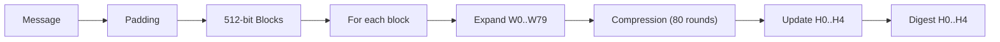

## 0. Filevault context
Tài liệu mô tả thuật toán SHA‑1 (chú ý: SHA‑1 đã bị coi là yếu; chỉ dùng cho compatibility/legacy).

## 1. Khái niệm
SHA‑1 là hàm băm mật mã tạo giá trị băm 160‑bit từ dữ liệu tuỳ ý. Giải quyết: đảm bảo tính toàn vẹn dữ liệu (integrity), nhận dạng dữ liệu; KHÔNG bảo đảm chống giả mạo nếu dùng trực tiếp làm MAC. Bảo vệ: phát hiện sửa đổi dữ liệu, kiểm tra đồng nhất.

## 2. Toán học, công thức

## 3. Cách hoạt động (tóm tắt)
1. Padding message tới bội số 512 bit.
2. Chia thành khối 512‑bit; mỗi khối thành 16 words 32‑bit.
3. Mở rộng mỗi khối thành 80 words.
4. Khởi tạo a..e = H0..H4; lặp 80 vòng cập nhật theo ft, Kt.
5. Sau mỗi khối, cộng trở lại vào H0..H4.
6. Kết quả: nối H0..H4 (big‑endian) tạo digest 160‑bit.

## 4. Cấu trúc dữ liệu
- Input block: 512 bit
- Word: 32‑bit unsigned integers
- State: 5 × 32‑bit (H0..H4)
- W array: 80 × 32‑bit
- Endianness: xử lý theo big‑endian khi ghi/đọc bytes vào words.

## 5. So sánh với các thuật toán khác
- MD5: output 128‑bit, cũng broken; SHA‑1 dài hơn (160‑bit) nhưng hiện vẫn bị tấn công collision.
- SHA‑2 family (SHA‑256, SHA‑512): hiện an toàn hơn, khác thiết kế, khuyến nghị chuyển đổi.
- SHA‑3: khác thiết kế (sponge), không chịu các lớp tấn công tương tự.

## 6. Luồng hoạt động (flow)

## 7. Các sai lầm triển khai phổ biến
- Sai endianness khi chuyển byte↔word.
- Không áp dụng padding đúng (độ dài 64‑bit).
- Dùng SHA‑1 làm MAC thay vì HMAC → dễ bị tấn công length‑extension.
- Cắt output (truncation) mà không đánh giá rủi ro.
- Reuse state giữa message không tách rõ ràng.

## 8. Threat Model
- Kẻ tấn công có khả năng tạo va chạm (collision) trong SHA‑1 — tấn công thực tế đã được demo.
- Threats: collision forging, chosen‑prefix collision (đánh lừa hệ thống chấp nhận file khác), length‑extension khi dùng để làm MAC.
- Môi trường: hệ thống chữ ký số, kiểm tra integrity, provenance.

## 9. Biện pháp giảm thiểu
- Không dùng SHA‑1 cho chữ ký số hoặc ứng dụng mới; migrate sang SHA‑256/3 hoặc SHA‑2 family.
- Nếu cần MAC: dùng HMAC‑SHA256 (hoặc HMAC‑SHA‑3).
- Kiểm tra cập nhật thư viện, validate endianness, dùng test vectors.
- Tránh tin tưởng vào SHA‑1 cho non‑repudiation/forgery-sensitive flows.

## 10. Test Vectors
- "" (empty):
    da39a3ee5e6b4b0d3255bfef95601890afd80709
- "abc":
    a9993e364706816aba3e25717850c26c9cd0d89d
- "abcdbcdecdefdefgefghfghighijhijkijkljklmklmnlmnomnopnopq":
    84983e441c3bd26ebaae4aa1f95129e5e54670f1

## 11. Code (mô tả ngắn / pseudocode)
- Khuyến nghị: dùng thư viện đã kiểm định (OpenSSL, libsodium, BoringSSL).
- Pseudocode ngắn:
    - Padding → for each 512‑bit block: W expand → a..e = H → 80 rounds update → H += a..e
(Chi tiết implement phức tạp; tránh tự triển khai trừ khi cần).

## 12. Checklist bảo mật
- [ ] Không dùng SHA‑1 cho chữ ký số, chứng chỉ, TLS.
- [ ] Nếu còn legacy: giới hạn scope, thêm detection transition.
- [ ] Dùng HMAC‑SHA256 cho MAC.
- [ ] Kiểm tra endianness và padding với test vectors.
- [ ] Sử dụng thư viện đã được duy trì, cập nhật.
- [ ] Log và cảnh báo khi nhận digest SHA‑1 từ bên ngoài.
- [ ] Có lộ trình di chuyển/migrate sang SHA‑2/SHA‑3.

Nguồn tham khảo
- FIPS PUB 180‑4 (SHA family), RFC 3174 (SHA‑1), "Shattered" collision (Google), Wikipedia (SHA‑1).
- Ví dụ implement: OpenSSL, BoringSSL docs.

