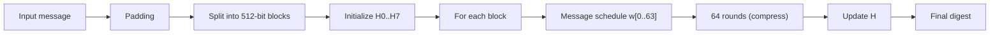

# SHA-2 (Secure Hash Algorithm 2)

## 0. FileVault context
- FileVault sử dụng SHA-256 làm hàm băm mặc định cho integrity checks và HMAC.
- Mục tiêu: bảo toàn tính toàn vẹn metadata, kiểm tra file gốc sau giải mã, và làm primitive cho HMAC-SHA256.

## 1. Khái niệm thuật toán — giải quyết vấn đề gì, bảo vệ cái gì
- SHA-2 là họ hàm băm mật mã (SHA-224/256/384/512) sinh ra digest cố định từ dữ liệu tùy chiều.
- Giải quyết: phát hiện sửa đổi dữ liệu (integrity) và làm cơ sở cho MAC/signature.
- Bảo vệ: chống sửa đổi dữ liệu (tamper detection), làm cơ sở cho xác thực và liên kết an toàn.

## 2. Toán học, công thức
- Đầu vào/đầu ra:
$$M\in\{0,1\}^*,\qquad H=\mathrm{SHA256}(M)\in\{0,1\}^{256}.$$

- Padding:
$$L=\lvert M\rvert\ (\text{bits}),$$
$$M' = M \,\|\, 1 \,\|\, 0^{k} \,\|\, \mathrm{len}_{64}(L),$$
với k là số nhỏ nhất ≥0 sao cho $|M'|\equiv 0\pmod{512}$; trường độ dài là 64 bit (big‑endian).

- Nén:
Cho các block 512 bit $B_i$,
$$H_{i+1}=f(H_i,B_i).$$

- Hàm nhỏ (SHA‑256, 32‑bit words):
$$\operatorname{Ch}(x,y,z)=(x\land y)\oplus(\lnot x\land z),$$
$$\operatorname{Maj}(x,y,z)=(x\land y)\oplus(x\land z)\oplus(y\land z),$$
$$\Sigma_0(x)=\operatorname{ROTR}^2(x)\oplus\operatorname{ROTR}^{13}(x)\oplus\operatorname{ROTR}^{22}(x),$$
$$\Sigma_1(x)=\operatorname{ROTR}^6(x)\oplus\operatorname{ROTR}^{11}(x)\oplus\operatorname{ROTR}^{25}(x).$$

- Mở rộng message schedule $w_t$:
$$
w_t=\begin{cases}
\text{(16 words của }B_i), & 0\le t\le15,\\[4pt]
\sigma_1(w_{t-2})+w_{t-7}+\sigma_0(w_{t-15})+w_{t-16}\pmod{2^{32}}, & 16\le t\le63,
\end{cases}
$$
với
$$\sigma_0(x)=\operatorname{ROTR}^7(x)\oplus\operatorname{ROTR}^{18}(x)\oplus\operatorname{SHR}^3(x),$$
$$\sigma_1(x)=\operatorname{ROTR}^{17}(x)\oplus\operatorname{ROTR}^{19}(x)\oplus\operatorname{SHR}^{10}(x).$$

- Vòng nén (mỗi vòng t = 0..63):
$$T_1 = h + \Sigma_1(e) + \operatorname{Ch}(e,f,g) + K_t + w_t \pmod{2^{32}},$$
$$T_2 = \Sigma_0(a) + \operatorname{Maj}(a,b,c) \pmod{2^{32}},$$
và cập nhật:
$$h=g,\ g=f,\ f=e,\ e=d+T_1,\ d=c,\ c=b,\ b=a,\ a=T_1+T_2\pmod{2^{32}}.$$

- Ghi chú: tất cả phép cộng là modulo $2^{32}$; $K_{0..63}$ là hằng 32‑bit chuẩn.

## 3. Cách hoạt động (tóm tắt bước)
1. Pre-processing: padding và chia block 512-bit.
2. Khởi tạo vector trạng thái H0 (8 từ 32-bit cố định).
3. Với mỗi block:
     - Mở rộng 16 từ thành 64 từ w[0..63].
     - Khởi tạo a..h = H_i.
     - Lặp t=0..63: T1 = h + Σ1(e) + Ch(e,f,g) + K[t] + w[t]; T2 = Σ0(a) + Maj(a,b,c); h=g; g=f; f=e; e=d+T1; d=c; c=b; b=a; a=T1+T2.
     - H_i+1 = H_i + (a..h).
4. Kết quả là H_final = concat(H0..H7).

## 4. Cấu trúc dữ liệu
- Input block: 512-bit chia thành 16 từ 32-bit.
- State: 8 từ 32-bit (SHA-256) hoặc 16 từ 32-bit (SHA-512 uses 64-bit words).
- Bảng hằng K[0..63] (32-bit constants).

## 5. So sánh với các thuật toán khác
- SHA-1: SHA-256 mạnh hơn, kháng collision tốt hơn.
- SHA-3: khác thiết kế (sponge), SHA-3 không phải replacement trực tiếp; SHA-2 vẫn an toàn và nhanh trên HW/SW hiện có.
- BLAKE2/BLAKE3: thường nhanh hơn và có tính năng configurable, nhưng SHA-2 phổ biến và tiêu chuẩn.

## 6. Luồng hoạt động (Mermaid)


## 7. Các sai lầm triển khai phổ biến
- Sai padding (không thêm length hoặc thêm sai endian).
- Xử lý bit-length vượt 2^64 cho SHA-256.
- Sử dụng kiểu dữ liệu không modulo 2^32 (overflow handling).
- Lưu trữ hằng sai endian khi serialize/deserialize.
- Sử dụng SHA-256 trực tiếp cho password hashing (không dùng salt hoặc KDF).
- Reuse key trực tiếp cho HMAC mà không theo chuẩn (sai khóa dài/short).

## 8. Threat Model
- Kẻ tấn công: muốn giả mạo file hoặc metadata mà FileVault dùng để verify.
- Khả năng: thay đổi file, thâm nhập vào metadata, replay.
- Mục tiêu tấn công: gây collision hay preimage để vượt kiểm tra integrity hoặc HMAC.

## 9. Biện pháp giảm thiểu
- Dùng HMAC-SHA256 cho integrity/authentication, không chỉ hash thô.
- Kiểm tra và bảo vệ metadata (signature hoặc AEAD).
- Thực hiện padding/endianness đúng chuẩn.
- Dùng KDF (PBKDF2/Argon2) cho password-derived keys.
- Bảo vệ khóa HMAC, khóa signing bằng kho khóa và ACL.
- Log và detect bất thường (tampering attempts).

## 10. Test Vectors
- SHA-256("")
    - hex: e3b0c44298fc1c149afbf4c8996fb92427ae41e4649b934ca495991b7852b855
- SHA-256("abc")
    - hex: ba7816bf8f01cfea414140de5dae2223b00361a396177a9cb410ff61f20015ad
- SHA-256("The quick brown fox jumps over the lazy dog")
    - hex: d7a8fbb307d7809469ca9abcb0082e4f8d5651e46d3cdb762d02d0bf37c9e592

## 11. Code (ví dụ nhanh — Python hashlib)
```python
import hashlib

def sha256_hex(data: bytes) -> str:
        return hashlib.sha256(data).hexdigest()

# examples
print(sha256_hex(b""))        # e3b0c4...
print(sha256_hex(b"abc"))     # ba7816...
```

## 12. Checklist bảo mật (FileVault-specific)
- [ ] Dùng HMAC-SHA256 để bảo vệ metadata, không chỉ hash.
- [ ] Bảo vệ và rotate keys theo chính sách.
- [ ] Kiểm tra padding và endian khi serialize metadata.
- [ ] Dùng KDF phù hợp cho mật khẩu (Argon2/PBKDF2) trước làm key HMAC.
- [ ] Thực hiện test vector checks trong pipeline CI.
- [ ] Audit thư viện crypto (upstream, CVEs).
- [ ] Log failed integrity checks và giới hạn retry.

## Nguồn tham khảo
- FIPS PUB 180-4 (SHA-2) — NIST
- RFC 6234 (US Secure Hash Algorithms)
- RFC 2104 (HMAC)

