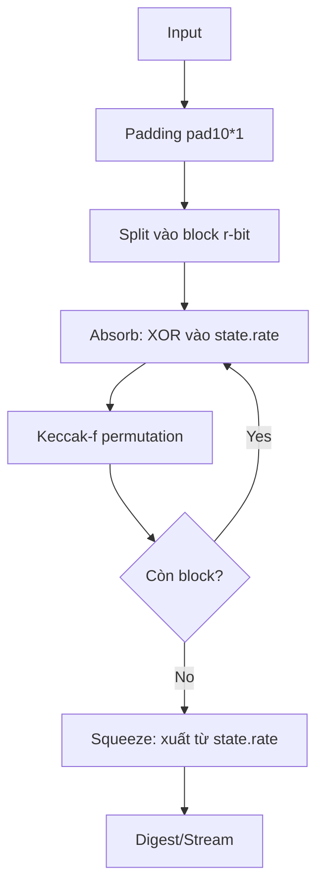

# SHA-3 (Secure Hash Algorithm 3) — FileVault Notes

## 0. FileVault context  
- Dùng trong FileVault làm hàm băm mật cho integrity, fingerprinting, và derivation (SHA3-256, SHA3-512).  
- Lựa chọn làm phương án dự phòng song song với SHA-2/KECCAK.

## 1. Khái niệm, mục tiêu bảo vệ  
- SHA‑3 (Keccak) là chuẩn hàm băm dựa trên sponge construction.  
- Giải quyết: tạo digest cố định từ dữ liệu biến độ dài, kháng collision, preimage, second‑preimage; khác cấu trúc với Merkle–Damgård (không bị length‑extension).  
- Bảo vệ: tính toàn vẹn dữ liệu, nhận dạng duy nhất, cơ sở cho MAC/KDF (khi kết hợp đúng).

## 2. Toán học, công thức (math markdown)  
- Kích thước trạng thái: $b = 1600$ (Keccak‑f[1600]). Lanes: ma trận $5\times 5$ với mỗi lane $w$ bit, với
$$
w=\frac{b}{25}=64.
$$

- Tham số sponge: rate $r$ và capacity $c$ thỏa
$$
r+c=b.
$$
Với SHA3‑n thường $c=2n$ và $r=b-c$. Ví dụ:
$$
\text{SHA3-256: } c=512,\ r=1088,\\
\text{SHA3-512: } c=1024,\ r=576.
$$

- Padding: sử dụng pad10*1 (kèm bit domain‑separation cho SHA‑3).

- Hoạt động sponge (tóm tắt toán học). Gọi $P(M)$ là message đã padding và chia thành $r$‑bit block $M_0,\dots,M_{t-1}$. Khởi tạo state $S\in\{0,1\}^b$ bằng $0^b$. Absorb:
$$
S \leftarrow \mathrm{Keccak\text{-}f}[b]\bigl(S \oplus (M_i\parallel 0^c)\bigr)\quad\text{cho }i=0,\dots,t-1.
$$
Squeeze: xuất $r$‑bit đầu của $S$; nếu cần thêm output thì lặp:
$$
Z \leftarrow Z\parallel S_{[0..r-1]},\qquad S\leftarrow \mathrm{Keccak\text{-}f}[b](S)\ \text{(khi cần thêm)}.
$$

- Mức bảo mật (lý thuyết): khoảng $\min(n,\tfrac{c}{2})$ bit. Số vòng (rounds) của Keccak‑f[1600]: $24$.

## 3. Cách hoạt động (tóm tắt)  
- Hai giai đoạn: Absorb (hấp thu) và Squeeze (vắt).  
- Absorb: chia input thành block kích thước $r$, XOR vào phần rate của state, rồi áp dụng permutation Keccak‑f. Lặp cho tất cả block.  
- Squeeze: xuất từng khối $r$ từ state, nếu cần thêm output thì tiếp tục áp dụng permutation rồi xuất thêm.

## 4. Cấu trúc dữ liệu  
- State: ma trận 5×5 lanes (mỗi lane $w$ bit).  
- Permutation Keccak‑f[b]: hàng các bước (θ, ρ, π, χ, ι) thực hiện trên state; sử dụng constants vòng (round constants).  
- Padding: pad10*1 (gồm bit domain‑separation cho SHA‑3).

## 5. So sánh với các thuật toán khác  
- VS SHA‑2: khác cấu trúc (sponge vs Merkle–Damgård), không dễ bị length‑extension; SHA‑3 không thay thế trực tiếp SHA‑2 nhưng là lựa chọn bổ sung.  
- VS Keccak‑x (original): SHA‑3 có domain separation/padding khác so với Keccak submitter.

## 6. Luồng hoạt động (flow)  
- Input -> Padding (pad10*1 + domain) -> Split vào blocks r-bit  
- For each block: state.rate ^= block; state = Keccak‑f(state)  
- Output: lấy ra từ state.rate; lặp khi cần.

Mermaid (sơ đồ đơn giản):


## 7. Các sai lầm triển khai phổ biến  
- Không dùng đúng padding hoặc domain‑separation (dẫn tới colliding với biến thể khác).  
- Endianness/bit ordering sai khi đọc/ghi lanes.  
- Không xóa state nhạy cảm khỏi bộ nhớ.  
- Không thực hiện các phép toán ở thời gian cố định khi dùng trong KDF/MAC có khóa (side‑channel).  
- Dùng SHA3 thay cho SHAKE khi cần output biến độ dài (hoặc ngược lại) sai mục đích.

## 8. Threat Model  
- Tấn công cryptanalytic: tìm collision, preimage.  
- Tấn công implementation: side‑channel (timing, cache), fault injection.  
- Tấn công phân phối/thoán đổi padding hoặc domain separation.  
- Mối nguy từ reuse state hoặc re‑initialization sai.

## 9. Biện pháp giảm thiểu  
- Sử dụng thư viện đã review và chuẩn (ví dụ OpenSSL/libkeccak/libcrypto) thay vì tự triển khai.  
- Kiểm tra padding và domain‑separation.  
- Xóa state khi không còn dùng.  
- Thiết kế constant‑time cho phần nhạy cảm (Mở khoá, KDF).  
- Giới hạn thông tin lỗi và logging.

## 10. Test Vectors (cách sinh kiểm tra)  
- Sinh bằng openssl / program để đảm bảo kết quả trong môi trường:
    - echo -n "" | openssl dgst -sha3-256
    - echo -n "abc" | openssl dgst -sha3-256
    - echo -n "" | openssl dgst -sha3-512
- So sánh với NIST/Keccak team official vectors (tham khảo phía dưới).

## 11. Code (ví dụ ngắn Python)  
```python
import hashlib
d = hashlib.sha3_256(b"abc").hexdigest()
print(d)
```
- Ghi chú: Python 3.6+ hỗ trợ sha3_* trong hashlib.

## 12. Checklist bảo mật (nhỏ gọn)  
- [ ] Dùng implementation được audit.  
- [ ] Kiểm tra đúng padding và domain bits.  
- [ ] Xử lý endianness khi thao tác lanes.  
- [ ] Xóa state sau dùng/xuất.  
- [ ] Đảm bảo constant‑time ở phần nhạy cảm.  
- [ ] Kiểm tra test vectors tự động trong CI.  
- [ ] Không dùng SHA3 làm MAC thay cho HMAC trừ khi biết rõ cơ chế (dùng KMAC nếu cần).

Nguồn tham khảo  
- Keccak team: https://keccak.team  
- NIST FIPS 202 (SHA‑3): https://nvlpubs.nist.gov/nistpubs/FIPS/NIST.FIPS.202.pdf  
- OpenSSL docs / hashlib docs

Tài liệu bổ sung: xem NIST vectors chính thức và Keccak specs để đối chiếu test vectors chính xác.
