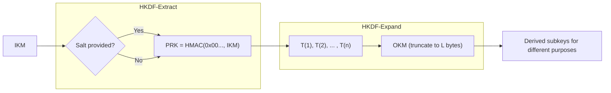

## 0/ Ngữ cảnh Filevault
Tài liệu này mô tả HKDF (HMAC-based Key Derivation Function) dùng để sinh khóa an toàn từ khóa/secret gốc trong hệ thống Filevault: phân tách trách nhiệm khóa, sinh nhiều khóa con từ một nguồn, bảo đảm tính độc lập giữa các mục đích sử dụng.

## 1/ Khái niệm
HKDF là một KDF dựa trên HMAC. Mục đích: chuyển input keying material (IKM) có thể ít ngẫu nhiên thành các khóa mật mã có tính an toàn, phân phối lại entropy, tách salt/info theo ngữ cảnh để giảm rủi ro lộ khóa.

## 2/ Toán học, công thức


## 3/ Cách hoạt động (tóm tắt)
1. EXTRACT: gom entropy từ IKM bằng HMAC với salt -> PRK (một "pseudo-random key").
2. EXPAND: dùng PRK làm HMAC key, kết hợp info + counter để sinh chuỗi khối T(i), ghép thành OKM.

## 4/ Cấu trúc dữ liệu
- IKM: input keying material (byte[])
- salt: optional (byte[]), khuyến nghị ngẫu nhiên/khác nhau
- info: context/application-specific (byte[])
- PRK: HashLen bytes
- OKM: output key material, kích thước L bytes

## 5/ So sánh với KDF khác
- PBKDF2: thích hợp cho mật khẩu (kéo dài bằng iter), HKDF thích hợp cho key material có entropy tốt.
- HKDF vs HKDF-Expand-Only: EXTRACT tăng tính robust nếu IKM ít ngẫu nhiên.
- Argon2/scrypt: dành cho làm chậm dạng mật khẩu, khác mục đích.

## 6/ Luồng hoạt động (sequence/flow)


## 7/ Các sai lầm triển khai phổ biến
- Không dùng hoặc dùng salt cố định/không ngẫu nhiên.
- Dùng info không khác nhau giữa mục đích => phát sinh reuse key.
- Cắt OKM không giữ ranh giới khối HMAC (vẫn hợp lệ nhưng phải đúng L <= 255*HashLen).
- Dùng HMAC không an toàn hoặc HMAC với hash yếu không phù hợp.
- Không kiểm soát giới hạn L dẫn tới quá dài.

## 8/ Threat Model
- Kẻ tấn công có thể thu được các khóa con cục bộ, mục tiêu: khôi phục IKM hoặc các khóa con khác.
- Kẻ tấn công có thể chỉ thấy info/salt public.
- Mục tiêu bảo vệ: tính suy biến (preimage) của IKM, tính độc lập giữa các OKM khác nhau.

## 9/ Biện pháp giảm thiểu
- Luôn dùng salt ngẫu nhiên nếu IKM có entropy thấp; nếu salt public thì vẫn tăng tính tách rời.
- Tách rõ info theo mục đích, version, context.
- Chọn hash mạnh (SHA-256/512); theo nhu cầu, tăng lên SHA-512.
- Hạn chế L theo needs; tránh cấp OKM quá dài.
- Làm toàn bộ HMAC/so sánh trong constant time khi cần.

## 10/ Test Vectors (ví dụ ngắn, theo RFC 5869)
Ví dụ (SHA-256, rút gọn):
- IKM: 0x0b0b0b0b0b0b0b0b0b0b0b
- salt: 0x000102030405060708090a0b0c
- info: 0xf0f1f2f3f4f5f6f7f8f9
- L: 42
Kết quả OKM (hex bắt đầu): 0x3cb25f25faacd57a90434f64d0362f2a2d2d...  
(Để kiểm tra chi tiết, sử dụng RFC 5869 test vectors.)

## 11/ Code (ví dụ ngắn, Python)
```python
import hmac, hashlib

def hkdf_extract(salt, ikm, hash=hashlib.sha256):
        if not salt:
                salt = b'\x00' * hash().digest_size
        return hmac.new(salt, ikm, hash).digest()

def hkdf_expand(prk, info, length, hash=hashlib.sha256):
        n = (length + hash().digest_size - 1) // hash().digest_size
        okm = b''
        t = b''
        for i in range(1, n+1):
                t = hmac.new(prk, t + (info or b'') + bytes([i]), hash).digest()
                okm += t
        return okm[:length]
```

## 12/ Checklist bảo mật (ngắn)
- [ ] Chọn hash thích hợp (SHA-256/512).
- [ ] Salt có entropy khi IKM yếu.
- [ ] Dùng info khác nhau cho từng mục đích/version.
- [ ] Kiểm tra L <= 255*HashLen.
- [ ] Thực hiện so sánh, lưu trữ khóa an toàn (constant-time).

## 13/ Hạn chế
- Không tăng cường mật khẩu yếu (dùng PBKDF2/Argon2 cho mật khẩu).
- Không bảo vệ khỏi leakage bên ngoài nếu IKM bị lộ.

## 14/ Ứng dụng
- Sinh key cho AEAD, MAC, session keys, key separation trong hệ thống lưu trữ mã hóa.

## 15/ Nguồn tham khảo
- RFC 5869 — HMAC-based Extract-and-Expand Key Derivation Function (HKDF)
- Kelsey, H., & HMAC papers / tài liệu HMAC, tài liệu hash primitives
- Kho lưu trữ mã nguồn: ví dụ triển khai OpenSSL, libsodium (tham khảo)

<!-- end -->