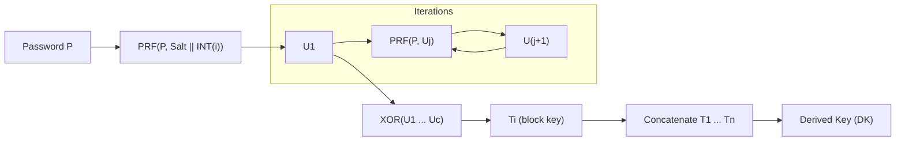

## 0. FileVault context
PBKDF2 được FileVault hỗ trợ cho tương thích ngược và chế độ `STUDENT` / `WEAK`. Không khuyến nghị cho hệ thống mới nếu có thể dùng Argon2id.

## 1. Khái niệm thuật toán — giải quyết vấn đề gì, bảo vệ cái gì
PBKDF2 biến mật khẩu (có entropy thấp) thành khóa mật mã mạnh hơn bằng cách "kéo dài" (stretching) và thêm salt để chống rainbow tables và làm tấn công brute-force ngoại tuyến tốn thời gian hơn. Bảo vệ: tính toàn vẹn/độ bí mật của khóa dẫn xuất khỏi tấn công brute-force/offline.

## 2. Toán học, công thức


## 3. Cách hoạt động (tóm tắt bước)
1. Sinh salt (ngẫu nhiên, >=16 bytes).  
2. Với mỗi khối chỉ mục $i$, tính $U_1 = PRF(P, S||INT(i))$.  
3. Lặp $c-1$ lần: $U_j = PRF(P, U_{j-1})$ và XOR vào $T_i$.  
4. Nối các $T_i$ lấy $DK$ độ dài mong muốn.

## 4. Cấu trúc dữ liệu
- salt: byte[], duy nhất, >=16 bytes.  
- iterations $c$: integer (chi phí thời gian).  
- PRF: HMAC-SHA256 / HMAC-SHA512.  
- dklen: số byte đầu ra mong muốn.

## 5. So sánh với thuật toán khác
- Argon2id: memory-hard → kháng GPU/ASIC tốt hơn. Khuyến nghị cho mật khẩu người dùng.  
- scrypt: memory-hard nhưng cấu hình phức tạp hơn.  
- bcrypt: tốt, nhưng giới hạn độ dài salt/khóa; ít linh hoạt hơn so với Argon2id.  
PBKDF2: CPU-bound, dễ tối ưu trên GPU/ASIC → cần iterations rất lớn để bù.

## 6. Luồng hoạt động (mermaid)


## 7. Các sai lầm triển khai phổ biến
- Sử dụng salt cố định hoặc thiếu salt.  
- Iterations quá thấp (dễ brute-force).  
- Dùng PRF yếu (MD5/SHA1) thay cho HMAC-SHA256/512.  
- Reuse salt cho nhiều user/khóa.  
- So sánh kết quả không constant-time (timing leak).  
- Lưu trữ iterations/salt/params không rõ ràng.

## 8. Threat Model (tấn công chính)
- Attacker có bản sao hash/DK (offline brute-force).  
- Attacker dùng GPU/ASIC để tăng tốc thử mật khẩu.  
- Server bị lộ salt/params.  
- Side-channel/timing attack khi so sánh.

## 9. Biện pháp giảm thiểu
- Ưu tiên Argon2id khi khả dụng.  
- Salt ngẫu nhiên, duy nhất, >=16 bytes.  
- Chọn iterations sao cho thao tác derivation ~0.5–1s trên target hardware (NIST khuyến nghị tăng nhiều).  
- Dùng HMAC-SHA256 hoặc HMAC-SHA512 làm PRF.  
- Lưu rõ params (salt, iterations, PRF) cùng DK.  
- So sánh constant-time; giới hạn tốc độ/khóa tài khoản; cân nhắc pepper server-side nếu phù hợp.

## 10. Test Vectors (tạo bằng code)
Sử dụng Python builtin `hashlib.pbkdf2_hmac` để sinh và kiểm tra vectors reproducible.

```python
import binascii, hashlib

def pbkdf2_hex(password, salt, iterations, dklen, algo='sha256'):
        dk = hashlib.pbkdf2_hmac(algo, password.encode(), salt, iterations, dklen)
        return binascii.hexlify(dk).decode()

# Ví dụ
print(pbkdf2_hex("password", b"salt", 1, 32, 'sha256'))
print(pbkdf2_hex("password", b"salt", 600000, 32, 'sha256'))
```

(Chạy trên môi trường bạn tin cậy để thu test vectors cụ thể; không đưa values cứng nếu không xác thực.)

## 11. Code (ví dụ ngắn Python)
```python
from hashlib import pbkdf2_hmac
def derive(password: str, salt: bytes, iterations: int = 600000, dklen: int = 32):
        return pbkdf2_hmac('sha256', password.encode(), salt, iterations, dklen)
```

## 12. Checklist Bảo Mật
- [ ] Có thể chuyển sang Argon2id không?  
- [ ] Salt ngẫu nhiên, >=16 bytes cho mỗi user.  
- [ ] Lưu iterations và PRF cùng với DK.  
- [ ] Đặt iterations sao cho derivation cost ~0.5–1s (tùy môi trường).  
- [ ] Dùng HMAC-SHA256/512, không dùng MD5/SHA1.  
- [ ] So sánh constant-time.  
- [ ] Hạn chế rate và giám sát login thử nhiều lần.  
- [ ] Xem xét pepper nếu rủi ro server leak cao.

Tài liệu tham khảo
- RFC 2898 / RFC 8018 (PKCS #5) — PBKDF2.  
- OWASP Password Storage Cheat Sheet.  
- Argon2 paper & documentation.  
- NIST guidance (authentication/password handling).

