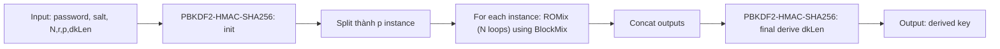

## 0. Filevault context
Tài liệu này tóm tắt scrypt (RFC 7914) để sử dụng trong Filevault: mục đích, cấu trúc, rủi ro bảo mật, test vectors, và checklist triển khai an toàn.

## 1. Khái niệm thuật toán — giải quyết vấn đề gì, bảo vệ cái gì
Scrypt là một Key Derivation Function (KDF) memory‑hard, thiết kế để làm tốn nhiều bộ nhớ và chi phí phần cứng khi thực hiện tấn công brute‑force (đặc biệt bằng ASIC/FPGA). Dùng để dẫn xuất khóa từ mật khẩu, bảo vệ khoá bí mật, mật khẩu lưu trữ và các trường hợp phải chống tấn công song song/ASIC.

## 2. Toán học, công thức


## 3. Cách hoạt động (tóm tắt)
1. Khởi tạo: sử dụng PBKDF2-HMAC-SHA256 với mật khẩu/salt để sinh các khối ban đầu.
2. ROMix/V: thực hiện $N$ lần vòng để tạo bảng phụ thuộc bộ nhớ (mixing) dựa trên Salsa20/8 (trước đây) hoặc các hàm nội bộ.
3. Sau khi mix, dùng PBKDF2-HMAC-SHA256 để trích xuất khóa cuối cùng.
Mục tiêu: buộc kẻ tấn công lưu giữ bảng độ lớn $N$ để lặp lại nhanh.

## 4. Cấu trúc dữ liệu
- V: mảng độ dài $N$ của blocks kích thước $128\cdot r$ bytes (tổng lớn nhất là bộ nhớ chính yếu).
- Blocks: mỗi block nội dung 128·r bytes, thao tác bằng XOR, scrypt sử dụng hàm Salsa/BlockMix để trộn.
- State: buffer tạm cho PBKDF2 và BlockMix.

## 5. So sánh với thuật toán khác
- Argon2: linh hoạt hơn (độc lập thời gian và bộ nhớ), tốt hơn với side‑channel, được thiết kế hiện đại hơn.
- PBKDF2: CPU‑bound, ít chống phần cứng (ASIC) hơn vì không memory‑hard.
- Bcrypt: giới hạn bộ nhớ nhỏ hơn, an toàn thời điểm ra đời nhưng cũ hơn scrypt/Argon2.

## 6. Luồng hoạt động (Mermaid)


## 7. Các sai lầm triển khai phổ biến
- Chọn $N$ quá nhỏ (không đủ memory cost).
- Thiếu kiểm tra overflow/điều kiện giới hạn (N phải là power of 2).
- Tái sử dụng salt hoặc salt quá ngắn.
- Cố gắng tiết kiệm bộ nhớ bằng cách lưu trữ không đầy đủ V (giảm tính memory‑hard).
- Không giới hạn $p$ theo khả năng bộ nhớ (dẫn đến OOM).

## 8. Threat Model
- Kẻ tấn công cố gắng brute‑force mật khẩu bằng phần cứng chuyên dụng (ASIC/FPGA/GPU).
- Mục tiêu: giảm throughput tấn công bằng cách tăng chi phí bộ nhớ và/hoặc thời gian.
- Giả định: attacker có salt và tham số ($N,r,p$) – salt không phải bí mật.

## 9. Biện pháp giảm thiểu
- Chọn $N$ lớn đủ khiến ASIC đắt đỏ; điều chỉnh theo môi trường (ví dụ server vs embedded).
- Salt ngẫu nhiên, độ dài >= 16 bytes.
- Thiết kế giới hạn $p$ theo RAM có sẵn để tránh OOM.
- Cân nhắc Argon2 (Argon2id) nếu cần kháng side‑channel tốt hơn.
- Dùng thư viện đã được review, tránh triển khai từ đầu.

## 10. Test Vectors (RFC 7914)
- Vector 1:
    - password: "password"
    - salt: "NaCl"
    - N=1024, r=8, p=16, dkLen=64
    - derived (hex):
        fdbabe1c9d3472007856e7190d01e9fe7c6ad7cbc8237830e77376634b373162
        2eaf30d92e22a3886ff109279d9830dac727afb94a83ee6d8360cbdfa2cc0640
- Vector 2:
    - password: "pleaseletmein"
    - salt: "SodiumChloride"
    - N=16384, r=8, p=1, dkLen=64
    - derived (hex):
        7023bdcb3afd7348461c06cd81fd38ebfda8fbba904f8e3ea9b543f6545da1f2
        d5432955613f0fcf62d49705242a9af9

## 11. Code (ví dụ ngắn)
- Node.js (crypto.scrypt):
```js
const { scryptSync } = require('crypto');
const dk = scryptSync('password', 'NaCl', 64, { N:1024, r:8, p:16 });
console.log(dk.toString('hex'));
```
- Python (pyscrypt hoặc hashlib.scrypt khi có):
```py
import hashlib
dk = hashlib.scrypt(b'password', salt=b'NaCl', n=1024, r=8, p=16, dklen=64)
print(dk.hex())
```

## 12. Checklist bảo mật (nhanh)
- [ ] Salt ngẫu nhiên, độ dài >= 16 bytes.
- [ ] N là power of 2 và đủ lớn cho môi trường.
- [ ] r/p phù hợp với bộ nhớ/CPU.
- [ ] Dùng thư viện chính thống, không triển khai custom crypto primitives.
- [ ] Kiểm tra OOM/exception handling.
- [ ] Lưu metadata tham số (N,r,p,salt) cùng với derived key.
- [ ] Cân nhắc Argon2 nếu cần kháng side‑channel tốt hơn.

## Nguồn tham khảo
- RFC 7914 — scrypt: https://datatracker.ietf.org/doc/html/rfc7914
- Tài liệu Argon2 (for comparison): https://www.cryptolib.org/argon2
- Bài báo gốc scrypt: Colin Percival (tài liệu kỹ thuật)

