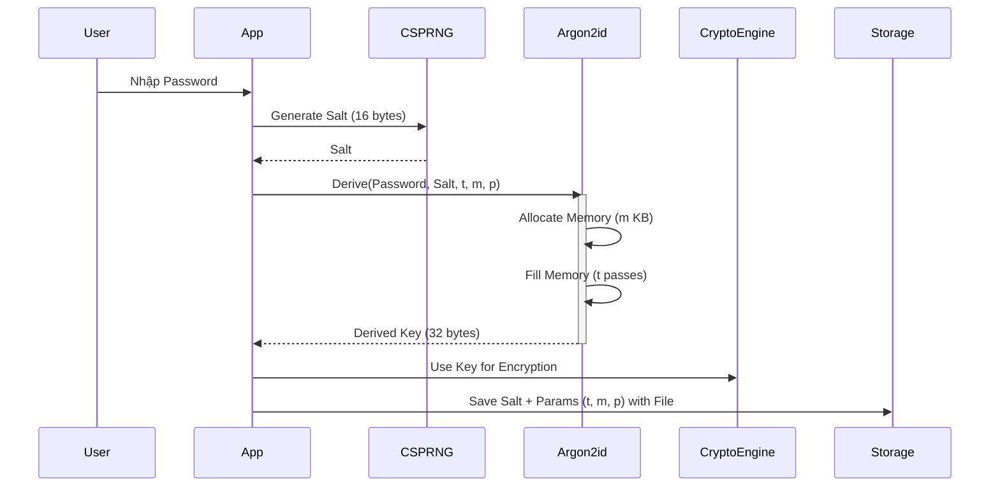

# Argon2 (Key Derivation Function)

## 1. Tóm tắt
**Argon2** là thuật toán chiến thắng cuộc thi Password Hashing Competition (PHC) năm 2015. Nó được thiết kế để chống lại các cuộc tấn công brute-force bằng GPU, ASIC và FPGA bằng cách yêu cầu nhiều bộ nhớ (memory-hard).

Trong FileVault, **Argon2id** là KDF mặc định cho chế độ `PROFESSIONAL` và `ADVANCED`, được dùng để chuyển đổi mật khẩu người dùng thành khóa mã hóa (encryption key) 256-bit.

## 2. Thuật toán & Nền tảng
Argon2 có 3 biến thể chính:
1.  **Argon2d**: Tối ưu kháng GPU (data-dependent addressing), nhưng dễ bị side-channel attacks. Dùng cho tiền mã hóa (cryptocurrencies).
2.  **Argon2i**: Tối ưu kháng side-channel (data-independent addressing). Dùng cho xác thực mật khẩu.
3.  **Argon2id**: Kết hợp cả hai (nửa đầu là Argon2i, nửa sau là Argon2d). **Đây là biến thể được khuyến nghị và sử dụng trong FileVault.**

## 3. Cách hoạt động
Argon2 hoạt động bằng cách điền đầy một vùng nhớ lớn (memory buffer) với các giá trị giả ngẫu nhiên được tính toán từ mật khẩu và salt.
1.  **Initialization**: Khởi tạo lane (luồng song song) và memory blocks.
2.  **Filling Loop**: Tính toán giá trị cho từng block dựa trên các block trước đó.
    *   Với Argon2i: Địa chỉ block tham chiếu được xác định bởi bộ sinh số giả ngẫu nhiên.
    *   Với Argon2d: Địa chỉ block tham chiếu phụ thuộc vào dữ liệu trong block trước.
3.  **Finalization**: XOR các block cuối cùng của mỗi lane và hash để tạo ra output key.

## 4. Cấu trúc dữ liệu & Tham số
FileVault sử dụng các tham số sau cho Argon2id:

*   **Salt**: 16 bytes (128 bits), sinh ngẫu nhiên cho mỗi file.
*   **Output Key Length**: 32 bytes (256 bits) - dùng làm khóa cho AES-256 hoặc ChaCha20.
*   **Parallelism (p)**: Số luồng xử lý song song.
*   **Memory (m)**: Lượng RAM sử dụng (tính bằng KB).
*   **Iterations (t)**: Số vòng lặp qua bộ nhớ.

### Cấu hình trong FileVault (theo Security Level)
| Level | Iterations (t) | Memory (m) | Parallelism (p) | Ước tính thời gian |
| :--- | :--- | :--- | :--- | :--- |
| **WEAK** | 1 | 4 MB | 1 | Rất nhanh (< 0.1s) |
| **MEDIUM** | 2 | 16 MB | 2 | ~1-2s (Default) |
| **STRONG** | 3 | 64 MB | 4 | ~5-10s |
| **PARANOID** | 4 | 128 MB | 4 | ~20-30s |

## 5. Luồng dữ liệu (Key Derivation)



## 6. Các sai lầm triển khai phổ biến
1.  **Hardcoded Salt**: Dùng cùng một salt cho mọi user/file.
    *   *Hậu quả*: Rainbow table attack khả thi.
    *   *FileVault Check*: Code luôn gọi `generate_salt(16)` cho mỗi file mới.
2.  **Tham số quá thấp**: Dùng $m=1MB, t=1$ trên phần cứng hiện đại.
    *   *Hậu quả*: GPU có thể brute-force nhanh.
    *   *FileVault Check*: Level `MEDIUM` (default) dùng 16MB, 2 iterations là mức chấp nhận được cho desktop app, nhưng nên cân nhắc tăng lên 64MB nếu có thể.
3.  **Dùng sai biến thể**: Dùng Argon2d cho password hashing (dễ bị side-channel).
    *   *FileVault Check*: Code sử dụng `Argon2id` (hoặc `Argon2i` nếu cấu hình), tránh `Argon2d`.

## 7. Threat Model
*   **Asset**: Master Password của người dùng.
*   **Attacker**: Có file đã mã hóa (chứa salt + params) và muốn tìm password.
*   **Attack Scenarios**:
    1.  **Offline Brute-force**: Attacker dùng GPU cluster để thử hàng tỷ password/giây.
        *   *Mitigation*: Argon2 memory-hardness làm giảm tốc độ thử của GPU đáng kể so với PBKDF2/SHA256.
    2.  **Time-Memory Tradeoff (TMTO)**: Attacker dùng ít bộ nhớ hơn nhưng tính toán nhiều hơn.
        *   *Mitigation*: Argon2id kháng TMTO tốt.

## 8. Ví dụ Code (Python)
Sử dụng thư viện `argon2-cffi`:

```python
from argon2 import PasswordHasher, Type

def derive_key_argon2id(password, salt):
    # Cấu hình tương đương SecurityLevel::STRONG
    ph = PasswordHasher(
        time_cost=3,         # Iterations
        memory_cost=65536,   # 64 MB
        parallelism=4,       # Threads
        hash_len=32,         # 256-bit key
        salt_len=16,
        type=Type.ID
    )
    
    # Lưu ý: thư viện argon2-cffi thường tự sinh salt và trả về chuỗi encoded
    # Để derive raw key với salt cụ thể cần dùng low-level API hoặc hash_raw
    # Đây là ví dụ hash_raw giả định (API thực tế có thể khác tùy version)
    return ph.hash(password, salt=salt)

# Kiểm tra verify
ph = PasswordHasher()
hash = ph.hash("correct horse battery staple")
assert ph.verify(hash, "correct horse battery staple")
```

## 9. Checklist Bảo Mật
- [ ] Luôn sử dụng **Argon2id** cho password hashing.
- [ ] Salt phải là 16 bytes ngẫu nhiên (CSPRNG).
- [ ] Tham số bộ nhớ ($m$) nên càng lớn càng tốt (tùy thuộc vào RAM khả dụng của thiết bị người dùng).
- [ ] Lưu trữ tham số ($t, m, p$) cùng với salt trong header file để có thể giải mã lại trong tương lai (future-proof nếu đổi default).

## 10. Test Vectors
Do Argon2 dùng salt ngẫu nhiên, test vectors thường yêu cầu fix salt.
Giả sử:
*   Password: `password`
*   Salt: `somesalt` (8 bytes - *lưu ý: FileVault dùng 16 bytes*)
*   Params: t=2, m=65536 (64MB), p=1

Output (Encoded):
`$argon2id$v=19$m=65536,t=2,p=1$c29tZXNhbHQ$ctMy0p+G...`

# Argon2id

## 1. Tóm tắt
**Argon2id** là biến thể an toàn nhất của Argon2, được khuyến nghị cho hầu hết các ứng dụng lưu trữ mật khẩu và sinh khóa (KDF).

## 2. Tại sao chọn Argon2id?
*   **Argon2d**: Kháng GPU tốt nhất nhưng yếu trước side-channel attacks (cache timing).
*   **Argon2i**: Kháng side-channel tốt nhất nhưng kháng GPU kém hơn Argon2d.
*   **Argon2id**: Kết hợp cả hai.
    *   Nửa đầu (First Pass): Hoạt động như Argon2i để tránh side-channel khi bộ nhớ chưa được điền đầy.
    *   Nửa sau (Subsequent Passes): Hoạt động như Argon2d để tối đa hóa chi phí bộ nhớ (Memory Hardness).

## 3. Cấu hình trong FileVault
FileVault sử dụng Argon2id làm mặc định.
*   **Salt**: 16 bytes.
*   **Parallelism**: 4 threads (tận dụng CPU đa nhân).
*   **Memory**: Tùy chọn từ 16MB đến 1GB.
*   **Iterations**: Tùy chỉnh (mặc định 3).