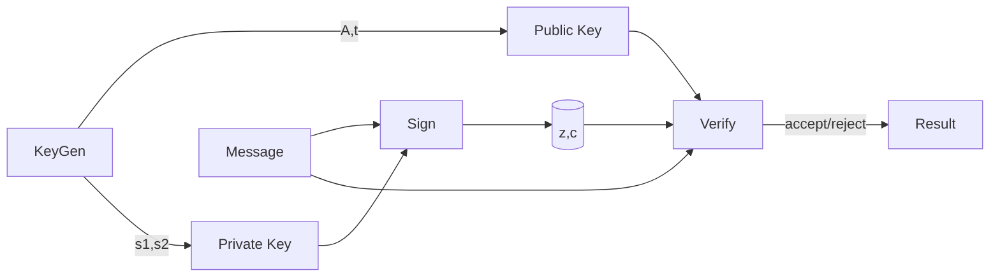

## 0/ Filevault context  
- Nội dung: tóm tắt, toán học, vận hành, triển khai, kiểm thử, giảm thiểu rủi ro, tham khảo.

## 1/ Khái niệm thuật toán  
- CRYSTALS‑Dilithium là một chữ ký số hậu lượng tử (post‑quantum digital signature).  
- Giải quyết: xác thực tính toàn vẹn và nguồn gốc dữ liệu chống lại kẻ tấn công có máy tính lượng tử.  
- Bảo vệ: tính xác thực (authenticity), tính toàn vẹn (integrity), chống giả mạo chữ ký.

## 2/ Toán học, công thức (markdown math)  

## 3/ Cách hoạt động (tóm tắt)  

## 4/ Cấu trúc dữ liệu  
- Răng buộc: polynôm cỡ $n$ (e.g., $n=256$), lưu dưới dạng coeffs modulo $q$.  
- Vectơ: $s_1,s_2,t$ là vectơ polynôm dài $l,k$ tùy tham số.  
- Encoding: dùng packer bit để nén $t$ và chữ ký (chú ý nén t0/t1, sử dụng giúp tiết kiệm băng thông).

## 5/ So sánh với thuật toán khác  
- So với ECDSA/RSA: hậu lượng tử (không dựa trên rời rạc logarit hay RSA).  
- So với SPHINCS+: Dilithium nhanh hơn, kích thước chữ ký nhỏ hơn SPHINCS+ nhưng an toàn dựa trên lattice.  
- So với Falcon: Falcon có chữ ký nhỏ hơn ở mức một số tham số nhưng Dilithium thiên về đơn giản và an toàn theo chứng minh.

## 6/ Luồng hoạt động (mermaid)

## 7/ Các sai lầm triển khai phổ biến  
- Rò rỉ nonce/randomness (y) ⇒ phục hồi khóa bí mật.  
- Không kiểm tra giới hạn $z$ và vòng phủ ⇒ dẫn đến forge.  
- Biến đổi số học không theo modulo chuẩn (overflow).  
- Lưu trữ khóa/buffer không sạch (no zeroize).  
- Side‑channel: thời gian, cache, đo công suất.

## 8/ Threat Model  
- Kẻ tấn công có khả năng: passive eavesdrop, chosen‑message, side‑channel (timing, cache, power).  
- Mục tiêu: phục hồi khóa riêng, tạo chữ ký giả, gây từ chối dịch vụ (resource exhaustion).  
- Giả sử: kẻ tấn công có máy tính lượng tử của NISQ/đầy đủ (Dilithium an toàn theo giả thiết lattice khó giải).

## 9/ Biện pháp giảm thiểu  
- Sử dụng RNG an toàn, lấy y hoàn toàn ngẫu nhiên.  
- Kiểm tra đầy đủ các ràng buộc (norm bounds).  
- Implement constant‑time cho các phép toán then chốt (NTT, inner product packing).  
- Zeroize khoá sau sử dụng, bảo vệ mem.  
- Kể cả detection và rate‑limiting để chống chosen‑message abuse.

## 10/ Test Vectors  
- Format: message (hex), public key (hex), signature (hex).  
- Ví dụ mẫu (không phải vector chính thức):
    - message: 48656c6c6f (ASCII "Hello")  
    - pk: 0a1b2c... (hex, placeholder)  
    - sig: ffeedd... (hex, placeholder)  
- Lấy test vectors chính thức từ PQClean / NIST submission để kiểm tra tương thích.

## 11/ Code  
- Có thể tham chiếu PQClean impls, liboqs, reference specs. (Bỏ qua code ở đây.)

## 12/ Checklist bảo mật (tối thiểu)  
- [ ] RNG được audit và seed an toàn  
- [ ] Kiểm tra giới hạn z, t0/t1 đúng  
- [ ] Mọi thao tác nhạy cảm constant‑time  
- [ ] Memory zeroized khi kết thúc  
- [ ] Test vectors chính thức passed  
- [ ] Fuzz và property tests với PQClean vectors

## 13/ Hạn chế (nếu có)  
- Kích thước khóa và chữ ký lớn hơn ECC truyền thống.  
- Tri thức toán học (lattice) phức tạp, sai triển khai dễ gây mất an toàn.  
- Hiệu năng phụ thuộc mạnh vào tối ưu NTT và packing.

## 14/ Ứng dụng  
- Chữ ký cơ sở cho PKI hậu lượng tử, TLS, firmware signing, code signing, secure boot.

## 15/ Nguồn tham khảo  
- Original paper: CRYSTALS‑Dilithium authors (Dang, Ducas, Kiltz, Lepoint, Lyubashevsky, Poettering, Prest, Schwabe).  
- NIST PQC: https://csrc.nist.gov/projects/post-quantum-cryptography  
- PQClean reference implementations: https://github.com/PQClean/PQClean  
- IETF / RFC drafts and PQ implementations (libs: liboqs, OpenQuantumSafe).

Ghi chú: lấy test vectors và tham khảo code từ các repo chính thức để tránh sai lệch.