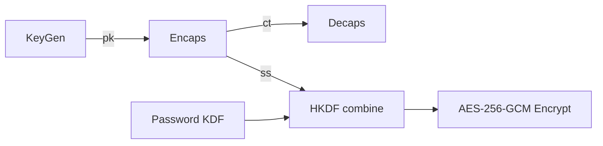

# 🛡️ Kyber (ML‑KEM) — Redesigned Reference

> Tài liệu tóm tắt, theo khuôn FileVault: khái niệm, toán học, triển khai, threat model, mitigations, test vectors, checklist.

---

0. FileVault context
- Mục tiêu: cung cấp KEM post‑quantum để hybrid với password‑based KDF → khóa AES‑256‑GCM.
- Thiết kế: mặc định Kyber‑768; tuỳ chọn Kyber‑512 / Kyber‑1024.

---

1. Khái niệm — Thuật toán, giải quyết vấn đề gì, bảo vệ cái gì
- Kyber: Key‑Encapsulation Mechanism (KEM) dựa trên Module‑LWE.
- Giải quyết: thiết lập shared secret bí mật giữa hai bên; không mã hoá dữ liệu trực tiếp.
- Bảo vệ: an toàn trước tấn công sử dụng máy tính lượng tử (dựa trên hardness của LWE/Module‑LWE). Hữu ích để chống "harvest‑now, decrypt‑later".

---

2. Toán học & công thức (math markdown)
- Dịch vụ nền tảng: LWE, Module‑LWE trên vòng $R_q=\mathbb{Z}_q[X]/(X^n+1)$.
- LWE: bền với nhiễu
    $$b = A\,s + e \pmod q$$
    với $A$ public, $s$ secret, $e$ small error.
- Module‑LWE (Kyber): vectơ/polynomial dimension $k$, polynomial degree $n$ (Kyber: $n=256$, $q=3329$).
- Encapsulation/Decapsulation cơ bản:
    - KeyGen: $t = A s + e$ → pk = $(\rho, t)$, sk = $s$.
    - Encaps: chọn $r$ từ $m$ → $u = A^T r + e_1$, $v = t^T r + e_2 + \lfloor q/2 \rceil\cdot \text{encode}(m)$.
    - Decaps: tính $v - s^T u \approx \lfloor q/2\rceil\cdot\text{encode}(m)$ rồi decode $m$.

---

3. Cách hoạt động (tóm tắt flow)
- KeyGen → publish pk.
- Encaps(pk) → (ct, ss) gửi ct, giữ ss.
- Decaps(sk, ct) → ss' (FO transform: re‑encapsulate verify, tránh adaptive chosen‑ciphertext).
- Kết hợp (FileVault): ss_kyber + ss_password → HKDF → AES‑256‑GCM key.

Mermaid (flow):


---

4. Cấu trúc dữ liệu (sizes)
- Kyber‑512 / 768 / 1024:
    - Public key ≈ 800 / 1184 / 1568 B
    - Private key ≈ 1632 / 2400 / 3168 B
    - Ciphertext ≈ 768 / 1088 / 1568 B
    - Shared secret = 32 B
- Nội dung: pk = seed ρ + compressed t (polynomials); ct = compressed u + compressed v.

---

5. So sánh với thuật toán khác
- NTRU / SABER: cũng lattice/structured; kích thước & hiệu năng khác.
- FrodoKEM: LWE unstructured — kích thước lớn hơn nhưng less structure (different tradeoff).
- Classic McEliece: public key rất lớn, proven older hardness.
- SIKE: đã bị phá — không dùng.
- Lựa chọn: Kyber = tốt cho hiệu năng, kích thước hợp lý, chuẩn hóa NIST.

---

6. Luồng hoạt động (chi tiết ngắn)
- KeyGen: seed ρ → expand → tạo A bằng PRNG → sample s,e → compute t.
- Encaps: derive randomness từ m → xây dựng u,v → compress → output ct, ss = H(m).
- Decaps: compute v − s^T u → decode m → verify bằng re‑encapsulation (FO) → derive ss.

---

7. Sai lầm triển khai phổ biến
- Sai sampling phân phối lỗi (non‑constant, non‑bounded) → leak.
- Không validate/không áp dụng FO transform → adaptive CCA vulnerabilities.
- Không constant‑time arithmetic / NTT → side‑channel.
- Nén/serialize không đúng leading to incompatibility hoặc leak.
- Reuse RNG hoặc dùng non‑cryptographic PRNG.

---

8. Threat Model
- Attacker: network eavesdrop + chosen‑ciphertext + side‑channel local attacker + long‑term store for harvest‑now decrypt‑later.
- Assumptions: attacker không có đủ QC để phá Module‑LWE ngay; nhưng có thể thu thập ciphertexts.

---

9. Biện pháp giảm thiểu
- FO transform (or KEM with CCA protection).
- Constant‑time NTT, poly ops, and rejection sampling.
- Use CSPRNG for all sampling; avoid reusing nonces/seeds.
- Validate public keys and ciphertext lengths; reject malformed.
- Combine Kyber with classical AEAD (hybrid) for defense‑in‑depth.
- Limit exposure: rotate keys, enforce key usage policies.

---

10. Test Vectors (ví dụ ngắn)
- Kích thước kiểm tra Kyber‑768 (Botan):
    - pk length = 1184, sk length = 2400, ct length = 1088, ss = 32.
- Minimal example (hex placeholders):
    - pk: 0x... (1184 B)
    - ct: 0x... (1088 B)
    - ss: 0x0123456789abcdef... (32 B)
- Chạy tích hợp unit test: KeyGen → Encaps → Decaps → ss match.

---

11. Code (ví dụ combine keys — giữ gọn)
```cpp
// Combine Kyber + password key → final AES key (HKDF-SHA256)
std::vector<uint8_t> combine_keys(
    const std::vector<uint8_t>& kyber_secret,
    const std::vector<uint8_t>& passwd_key) {
    std::vector<uint8_t> ikm; ikm.reserve(kyber_secret.size()+passwd_key.size());
    ikm.insert(ikm.end(), kyber_secret.begin(), kyber_secret.end());
    ikm.insert(ikm.end(), passwd_key.begin(), passwd_key.end());
    return hkdf_sha256(ikm, /*info=*/"FileVault-Kyber-Hybrid-v1", 32);
}
```
(Ghi chú: hkdf_sha256 là wrapper an toàn; dùng secure memory cho secret.)

---

12. Checklist bảo mật (trước deploy)
- [ ] Sử dụng Kyber implementation chính thức / audited (Botan, PQClean,...).
- [ ] CCA protection (FO) hoặc KEM đã CCA.
- [ ] Constant‑time NTT, rejection sampling.
- [ ] RNG: CSPRNG hệ thống (no deterministic/reused seeds).
- [ ] Validate sizes và formats cho pk/ct/sk.
- [ ] Zeroize secret material sau dùng.
- [ ] Logging không chứa secret/keys.
- [ ] Key rotation & lifetime policy.
- [ ] Hybrid mode enabled bằng mặc định.
- [ ] Tích hợp test vectors trong CI.

---

Tham khảo
- NIST FIPS 203 — Module‑Lattice‑Based KEM Standard: https://csrc.nist.gov/pubs/fips/203
- CRYSTALS‑Kyber: https://pq-crystals.org/kyber/
- PQClean / Botan implementations
- NIST PQC project: https://csrc.nist.gov/projects/post-quantum-cryptography

--- 
