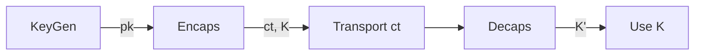

# Post-Quantum Cryptography (PQC) — Tài liệu tóm tắt

0/ Filevault context
- Vị trí: /d:/code/filevault/docs/algorithms/pqc/pqc.md
- Mục tiêu: cung cấp khuôn mẫu toàn diện cho thuật toán PQC (khái niệm, toán học, hoạt động, dữ liệu, test vectors, checklist bảo mật, mermaid, nguồn tham khảo).

1/ Khái niệm — mục đích & bảo vệ gì
- PQC: họ thuật toán mật mã thiết kế để an toàn trước adversary có máy tính lượng tử.
- Giải quyết: thay thế primitives dựa trên factoring/DLOG (RSA, ECC) bằng primitives dựa trên LWE, NTRU, lattice, code-based, multivariate, hash-based, isogeny.
- Bảo vệ: tính bí mật dữ liệu, tính toàn vẹn/ý thực chủ, chống phục hồi khóa từ máy lượng tử.

2/ Toán học, công thức (math markdown)
- LWE (Learning With Errors): cho ma trận $A \in \mathbb{Z}_q^{m\times n}$, bí mật $s\in\mathbb{Z}_q^n$, nhiễu $e$, ta có
    $$b = A s + e \pmod q.$$
    Khó: trích $s$ từ $(A,b)$.
- Ring-LWE / polynomial ring: sử dụng vòng $R_q=\mathbb{Z}_q[x]/(f(x))$; tương tự:
    $$b = a\cdot s + e \in R_q.$$
- NTRU-like: phép toán là nhân đa thức modulo $(x^N-1)$ và modulo $q$; tìm vector rời rạc gần nhất (SVP/approx-SVP).
- Code-based (McEliece): công khai là ma trận sinh/cosets của mã tuyến tính; phá bằng decoding NP-hard.
- Hash-based (XMSS): an toàn cho ký số một lần; dựa trên tính không thể đảo ngược hash.
- Notation: security parameter $\lambda$, modulus $q$, dimension $n$, error distribution $\chi$.

3/ Cách hoạt động (generic KEM/Signature)
- KEM (Key Encapsulation):
    - KeyGen() → (pk, sk)
    - Encaps(pk) → (ct, K)
    - Decaps(sk, ct) → K'
    - Yêu cầu: K == K' với xác suất cao.
- Signature:
    - KeyGen() → (sk, pk)
    - Sign(sk, m) → σ
    - Verify(pk, m, σ) → {true,false}

4/ Cấu trúc dữ liệu
- Public key / Private key: ma trận, đa thức, vector ko lớn; thường serialize theo định dạng little-endian, độ dài cố định.
- Ciphertext / Signature: blob nhị phân, có cấu trúc field (tag || payload || checksum/seed).
- Random seeds: entropy source cho sampling noise; giữ bí mật cho sk hoặc public cho determinism.
- Các tham số: (n, q, k, η, seed_len, hash_len).

5/ So sánh với thuật toán khác
- Lattice (Kyber/Dilithium/NTRU):
    - Pros: hiệu năng tốt, kích thước moderate.
    - Cons: tấn công cấu trúc, side-channel.
- Code-based (McEliece):
    - Pros: an toàn tốt, long-term.
    - Cons: kích thước khóa lớn.
- Hash-based (XMSS):
    - Pros: đơn giản, bằng chứng an toàn rõ.
    - Cons: stateful hoặc phi-stateful với chi phí.
- Isogeny (SIKE):
    - Pros: chìa khoá nhỏ.
    - Cons: tấn công gần đây làm giảm độ an toàn; nghiên cứu tiếp tục.

6/ Luồng hoạt động (mermaid)
- High-level KEM flow:


7/ Các sai lầm triển khai phổ biến
- Sử dụng RNG yếu/không đủ entropy để sinh noise hoặc seed.
- Không dùng timing-constant/side-channel safe sampling và kiểm tra lỗi.
- Kiểm tra lỗi sai lệch (fail-open) khi decoding thất bại.
- Không xác thực ciphertext trước xử lý (=> oracle attacks).
- Lỗi serialization/parsing dẫn tới injection hoặc truncation.

8/ Threat Model
- Adversary có:
    - Máy lượng tử với các cổng lượng tử chuẩn (Shor không phá được lattice/LWE).
    - Khả năng adaptive chosen-ciphertext (CCA) hoặc chosen-message.
    - Khả năng side-channel (power, timing, fault).
- Mục tiêu adversary: phá khóa bí mật, nhận diện plaintext, forgery.

9/ Biện pháp giảm thiểu
- Dùng RNG có chứng nhận (CSPRNG / HSM).
- Thực hiện constant-time và masking cho thao tác đa thức/FFT.
- Harden chống fault injection; validate ciphertext trước decapsulation.
- Sử dụng phiên bản được chuyển thể sang CCA-secure (KEM có CCA transform).
- Thiết kế định dạng phiên, key rotation, forward secrecy bằng hybrid với classical crypto.

10/ Test Vectors (ví dụ toy)
- Ghi chú: ở production dùng test vectors chính thức (NIST/standards).
- Toy KEM (n=2, q=11) ví dụ:
    - params: n=2, q=11
    - KeyGen: s = [3,7], a = [[2,5],[6,4]], e=[1,0] → b = a·s+e mod11 = [ (2*3+5*7+1)=? , ...] → b = [ (6+35+1)=42≡9, ...]
    - Encaps: choose r,e'..., produce ct = (u= a·r+e', v = b·r + e'' + m)
    - Decaps: recover m via round/threshold
- Thực tế: dùng test vectors từ NIST PQC finalist archives (Kyber/Dilithium/CRYSTALS,...).

11/ Code (tùy chọn, pseudocode)
- Pseudocode KEM (sơ lược):
```text
KeyGen():
    seed ← RNG(seed_len)
    a ← Expand(seed)
    s ← SampleNoise()
    e ← SampleNoise()
    pk = (seed, b = a*s + e)
    sk = s
    return (pk, sk)

Encaps(pk):
    seed ← RNG()
    r ← SampleNoise(seed)
    u = a*r + e1
    v = b*r + e2 + Hash(seed||m)
    K = KDF(v)
    ct = (u, v)
    return (ct, K)

Decaps(sk, ct):
    (u, v) = ct
    v' = u*sk
    m = Recover(v - v')
    K = KDF(v)
    return K
```

12/ Checklist bảo mật
- [ ] Sử dụng CSPRNG đã kiểm chứng.
- [ ] Sử dụng thư viện PQC chuẩn (NIST finalists/implementations).
- [ ] Kiểm tra constant-time cho thao tác bí mật.
- [ ] Validate input formats và ciphertext trước xử lý.
- [ ] Thực hiện test vectors chính thức trong CI.
- [ ] Key rotation & hybrid-mode (classical + PQC) cho compatibility.
- [ ] Logging/telemetry không rò rỉ bí mật.
- [ ] Review mã nguồn và audit bên thứ ba.

Nguồn tham khảo
- NIST Post-Quantum Cryptography: https://csrc.nist.gov/projects/post-quantum-cryptography
- CRYSTALS-Kyber / CRYSTALS-Dilithium papers & implementations
- Bernstein, Buchmann, Dahmen — "Post-Quantum Cryptography" (tổng quan)
- PQClean / Open Quantum Safe projects
