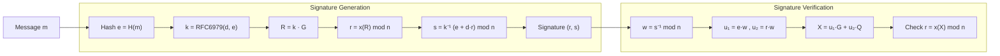

## 0. FileVault context  
- FileVault dùng ECDSA để ký dữ liệu nhạy cảm (xác thực người dùng, chữ ký giao dịch). Ưu tiên: P‑256/P‑384, Deterministic ECDSA (RFC 6979), kiểm soát nonce k.

## 1. Khái niệm — giải quyết vấn đề gì, bảo vệ gì  
- ECDSA (Elliptic Curve Digital Signature Algorithm) là thuật toán chữ ký số trên đường cong elliptic.  
- Mục tiêu: xác thực nguồn gốc và tính toàn vẹn của tin nhắn; bảo vệ khóa riêng khỏi việc bị suy ra thông qua các chữ ký.

## 2. Toán học, công thức  
- Đường cong: $$y^2 \equiv x^3 + a x + b \pmod p.$$ Nhóm cyclic sinh bởi điểm $G$ có order $n$. Khóa riêng $d\in\{1,\dots,n-1\}$, khóa công khai $Q=dG$.  
- Ký (truyền thống): chọn $k \xleftarrow{\$} \{1,\dots,n-1\}$. $R=kG=(R_x,R_y)$. $r \equiv R_x \pmod n$. $e=\mathrm{Hash}(m)$. $s \equiv k^{-1}(e + d\,r)\pmod n$. Signature $=(r,s)$.  
- Xác minh: $w \equiv s^{-1}\pmod n$, $u_1 \equiv e\,w\pmod n$, $u_2 \equiv r\,w\pmod n$. Tính $(x_1,y_1)=u_1G+u_2Q$. Chấp nhận nếu $r \equiv x_1 \pmod n$.  
- Deterministic $k$ (RFC 6979): $k=\mathrm{HMAC\text{-}DRBG}(\mathrm{priv},\mathrm{Hash}(m))$ thay vì dùng RNG ngẫu nhiên.

## 3. Cách hoạt động (tóm tắt bước)  
- Ký:
    1. e = Hash(m) (ví dụ SHA‑256 cho P‑256).  
    2. k = RFC6979(priv, e) hoặc RNG mạnh.  
    3. R = k·G, r = R.x mod n. Nếu r = 0 → chọn k mới.  
    4. s = k^(−1) (e + d·r) mod n. Nếu s = 0 → chọn k mới.  
    5. Xuất (r,s) (hoặc canonicalize s = min(s, n−s)).  
- Xác minh: theo công thức ở mục 2.

## 4. Cấu trúc dữ liệu  
- Private key: integer d (padded).  
- Public key: point Q = (x,y) — uncompressed (0x04||x||y) hoặc compressed (0x02/0x03||x).  
- Signature: (r,s) — thường ASN.1/DER, hoặc compact 64‑byte (r||s).  
- Curve params: (p,a,b,G,n,h).

## 5. So sánh với thuật toán khác  
- RSA: cùng mục tiêu nhưng ECDSA cung cấp kích thước khóa và chữ ký nhỏ hơn ở cùng mức bảo mật.  
- EdDSA (Ed25519): thao tác nhanh, deterministic by design, chống nhiều sai lầm ECDSA (khuyến nghị nếu môi trường hỗ trợ).  
- DSA: ECDSA là phiên bản elliptic của DSA.

## 6. Luồng hoạt động (mermaid)


## 7. Các sai lầm triển khai phổ biến  
- Tái sử dụng k (hoặc k suy ra từ RNG yếu) → rò rỉ private key.  
- Không canonicalize s (một số hệ yêu cầu low‑S).  
- Không kiểm tra 0 < r,s < n.  
- Không validate public key Q hoặc dùng curve không đáng tin.  
- Triển khai không constant‑time → side‑channel (timing, cache, power).  
- Không xóa k khỏi bộ nhớ sau sử dụng.

## 8. Threat Model  
- Kẻ tấn công: đọc được chữ ký, có khả năng truy cập RNG, side‑channel, hoặc tiến hành chosen‑message.  
- Mục tiêu attacker: suy ra khóa riêng, ký dữ liệu giả, replay/forgery.  
- Khả năng: passive observation, local code execution, side‑channel extraction, network adversary.

## 9. Biện pháp giảm thiểu  
- Dùng RFC6979 để tránh lỗi RNG.  
- Sử dụng curves tiêu chuẩn (P‑256/P‑384) hoặc Ed25519 nếu phù hợp.  
- Triển khai toán học constant‑time, validate điểm, canonicalize signatures (low‑S).  
- Sử dụng HSM/TPM hoặc secure enclave cho private key.  
- Xóa sạch giá trị k, tránh logging khóa/nonce.  
- Kiểm thử với test vectors và fuzzing.

## 10. Test Vectors (ví dụ minh họa, KHÔNG DÙNG TRONG SẢN PHẨM)  
- Curve: P‑256, Hash=SHA‑256 (ví dụ minh họa không thực tế):  
    - priv d = 0x1c0d... (32B)  
    - pub Q = 0x04||x||y  
    - msg = "sample" → e = SHA256(msg) = 0x...  
    - deterministic k (RFC6979) = 0x...  
    - signature (r,s) = (0x..., 0x...)  
- Thực tế: kiểm tra với vectors trong RFC 6979 Appendix và các test suite (BoringSSL, OpenSSL, Wycheproof).

## 11. Code (pseudocode ngắn)
- Signing (pseudocode):
```
e = Hash(m)
k = RFC6979_generate_k(d, e)
R = point_mul(k, G)
r = R.x mod n
s = inv_mod(k, n) * (e + d*r) mod n
if r==0 or s==0: retry
return encode_signature(r,s)
```
- Verifying (pseudocode):
```
e = Hash(m)
if not (1<=r<n and 1<=s<n): reject
w = inv_mod(s,n)
u1 = (e*w) mod n
u2 = (r*w) mod n
X = point_add(point_mul(u1,G), point_mul(u2,Q))
accept if X.x mod n == r
```

## 12. Checklist bảo mật (tối thiểu trước deployment)  
- [ ] Dùng curves và primitives được duyệt.  
- [ ] Sử dụng RFC6979 hoặc RNG mạnh.  
- [ ] Validate điểm public key và r,s.  
- [ ] Triển khai constant‑time cho các phép toán chính.  
- [ ] Low‑S canonicalization (nếu cần).  
- [ ] Erase nonce k và tài nguyên tạm.  
- [ ] Bảo vệ private key bằng HSM/keystore.  
- [ ] Có test vectors, unit tests, fuzz tests, CI.  
- [ ] Kiểm tra compatibility encoding (DER vs compact).

Nguồn tham khảo  
- RFC 6979 — Deterministic Usage of DSA and ECDSA  
- SEC 1 (Standards for Efficient Cryptography) — Elliptic Curve Cryptography  
- NIST FIPS/Standards, OpenSSL/BoringSSL docs, Project Wycheproof

Ghi chú: dùng vector thực tế từ RFC và test suite chính thức để kiểm thử triển khai.
