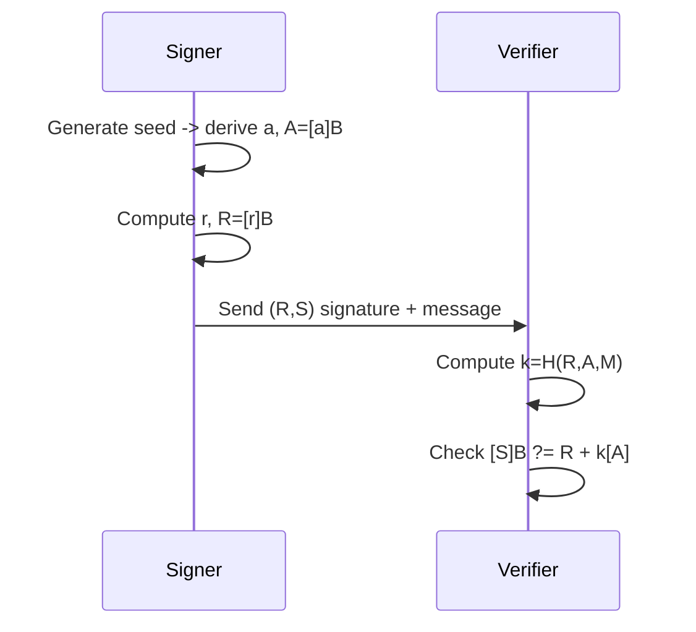

# Ed25519 (Edwards-curve Digital Signature Algorithm)

## 0. FileVault context
Ed25519 là thuật toán chữ ký được khuyến nghị cho FileVault: nhanh, an toàn, kích thước khóa nhỏ, phù hợp cho xác thực bản ghi, metadata signing và boot chain integrity.

## 1. Khái niệm — giải quyết vấn đề gì, bảo vệ cái gì
Ed25519 cung cấp:
- Chữ ký số không cần RNG khi ký (deterministic), giảm rủi ro do RNG kém.
- Tính toàn vẹn và xác thực nguồn của dữ liệu (mã hóa bất đối xứng cho chữ ký).
- Khả năng chống giả mạo, replay (kết hợp với nonce/timestamp), và né các tấn công từ nhóm nhỏ nếu triển khai đúng.

## 2. Toán học (với công thức)
- Trường: $p = 2^{255}-19$.
- Đường cong Edwards: $-x^{2} + y^{2} = 1 + d x^{2} y^{2}$ với $d = -121665/121666$.
- Bộ sinh (base point) $B$ có cấp (order) $l$ với $l$ là số nguyên lớn (khoảng $2^{252} + \dots$). Cofactor $h = 8$.
- Toán tử nhân vô hướng: $[k]P$ là nhân điểm theo scalar $k$.
- Biểu diễn public key: điểm nén bằng hoành độ $y$ (32 bytes) + bit dấu của $x$.

## 3. Cách hoạt động (tóm tắt thuật toán)
- Key generation:
    - Seed (32 bytes) → $H = \mathrm{SHA512}(\mathrm{seed})$ → derive scalar $a$ (clamp bits).
    - Public key $A = [a]B$ (nén thành 32 bytes).
- Signing (vắn tắt RFC8032 style):
    - $r = H(\text{prefix}, M) \bmod l$; $R = [r]B$.
    - $k = H(R, A, M) \bmod l$.
    - $S = (r + k\cdot a) \bmod l$.
    - Signature = encode(R) || encode(S) (64 bytes).
- Verification:
    - Kiểm tra $S < l$ và canonical encoding.
    - Chấp nhận nếu $[S]B = R + H(R,A,M)[A]$.

## 4. Cấu trúc dữ liệu
- Seed/private seed: 32 bytes (bí mật).
- Secret scalar (được derive): 32 bytes (clamped).
- Public key: 32 bytes (compressed).
- Signature: 64 bytes = 32-byte $R$ || 32-byte $S$.
- Lưu ý: một số thư viện lưu private key 64 bytes (seed + pub).

## 5. So sánh với các thuật toán khác
- So với ECDSA:
    - Ed25519: deterministic, an toàn khỏi lỗi RNG, nhỏ hơn, nhanh hơn.
    - ECDSA: dễ mắc lỗi nonce, ký không deterministic.
- So với RSA: kích thước khóa/ chữ ký nhỏ hơn, hiệu năng tốt hơn cho ký số.
- So với Ed448: Ed448 cung cấp bảo mật cao hơn, nhưng chậm và cồng kềnh hơn.

## 6. Luồng hoạt động (Mermaid)

## 7. Các sai lầm triển khai phổ biến
- Không "clamp" scalar (làm lộ bits quan trọng).
- Không kiểm tra canonical encoding của signature hoặc $S<l$.
- Chấp nhận public key với small-order hoặc điểm vô hướng (không validate).
- Không xử lý cofactor khi cần (ví dụ trong các giao thức chia sẻ khóa).
- Thông tin bí mật bị lộ do side-channel (timing, cache).
- Sử dụng RNG kém cho seed khi không dùng seed deterministic.

## 8. Threat Model
- Kẻ tấn công đọc/ghi tin nhắn giữa client và server (man-in-the-middle).
- Kẻ tấn công cố gắng ký tài liệu trái phép (chiếm khóa).
- Rò rỉ mem, side-channel extraction.
- Tấn công small-subgroup hoặc lỗi kiểm tra public key.
- Fault injection (làm sai kết quả nhân điểm).

## 9. Biện pháp giảm thiểu
- Luôn dùng thư viện Ed25519 đã được audit (libsodium, BoringSSL, OpenSSL recent).
- Clamp scalar, kiểm tra $S<l$, validate public key (không phải điểm vô hướng).
- Thao tác toán học constant-time, tránh branching theo bí mật.
- Lưu trữ seed trong vùng bảo mật, xóa bộ đệm sau dùng.
- Sử dụng deterministic signing (theo RFC8032) để tránh phụ thuộc RNG tại ký.
- Thêm xác thực ngữ cảnh (context, domain separation) khi cần.

## 10. Test Vectors
- Kiểm tra với test vectors chuẩn (RFC 8032). Ví dụ kiểu dữ liệu:
    - seed (hex): ...
    - public key (hex): ...
    - message (hex): ...
    - signature (hex): ...
- Luôn kiểm tra:
    - signatures đúng/không đúng,
    - public key canonical,
    - từ chối signature có S >= l.

## 11. Code (tóm tắt / tham khảo)
- Khuyến nghị dùng thư viện: libsodium (crypto_sign_ed25519_*), BoringSSL, OpenSSL 1.1+.
- Pseudocode ký:
    - seed = random32()
    - a = clamp(SHA512(seed)[0:32])
    - A = scalar_mult(a, B)
    - r = SHA512(prefix || message) mod l
    - R = scalar_mult(r, B)
    - S = (r + SHA512(R||A||M)*a) mod l
    - return encode(R)||encode(S)

## 12. Checklist bảo mật (ngắn)
- [ ] Dùng lib đã audit.
- [ ] Clamp scalar.
- [ ] Kiểm tra canonical encoding & S<l.
- [ ] Validate public key (không phải điểm đặc biệt).
- [ ] Constant-time implementation.
- [ ] Xóa key/seed khỏi bộ nhớ sau dùng.
- [ ] Test với vectors chuẩn.
- [ ] Kiểm tra cofactor khi giao thức yêu cầu.

## Tài nguyên & tham khảo
- RFC 8032 — Ed25519 specification.
- D. J. Bernstein et al., Curve25519/Ed25519 papers.
- libsodium, BoringSSL, SUPERCOP.

<!-- Thêm tham khảo cụ thể vào tài liệu FileVault nếu cần -->
