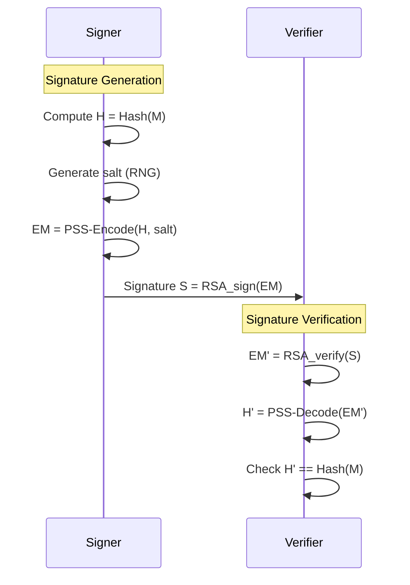

# RSA-PSS — Chữ ký số RSA (FileVault)

## 0. FileVault context
FileVault sử dụng RSA-PSS (theo chuẩn PKCS#1) để ký và xác thực file, bảo đảm tính xác thực nguồn gốc và toàn vẹn dữ liệu trong hệ thống lưu trữ mã hóa.

## 1. Khái niệm & mục tiêu
- Vấn đề giải quyết: đảm bảo rằng một file/metadata được ký bởi chủ sở hữu khóa riêng và không bị thay đổi.
- Bảo vệ: xác thực nguồn (authenticity) và toàn vẹn (integrity). RSA-PSS thêm tính ngẫu nhiên để chống replay và tấn công chuyển đổi chữ ký.

## 2. Toán học, công thức
- Khóa: $(n,e)$ (public), $d$ (private).
- Hash: $mHash = H(M)$ (FileVault: SHA-256).
- Encoding (PSS) cho ra octet string EM có độ dài $emLen$.
- Tạo chữ ký:
    - Chuyển EM sang số $m = \text{OS2IP}(EM)$.
    - $S = m^d \bmod n$.
- Verify:
    - $m' = S^e \bmod n$; $EM' = \text{I2OSP}(m', emLen)$; kiểm tra PSS-encoding.
- Các thành phần chính PSS:
    - MGF1: mask generation function dựa trên hash $H$.
    - Salt: ngẫu nhiên độ dài $sLen$.

## 3. Cách hoạt động (tóm tắt)
1. Hash file: $mHash = H(M)$.
2. Sinh salt ngẫu nhiên $salt$ (độ dài $sLen$).
3. Tạo $M' = \text{0x00}^{8} || mHash || salt$; $H' = H(M')$.
4. Tạo DB = PS || 0x01 || salt; maskedDB = DB \oplus MGF1(H', emLen - hLen -1).
5. EM = maskedDB || H' || 0xbc.
6. Chữ ký $S = \text{RSA\_priv}(EM)$; gửi $S$.

## 4. Cấu trúc dữ liệu
- EM (encoded message): octet string có cấu trúc [maskedDB || H' || 0xbc].
- DB chứa PS (padding zeros), 0x01, salt.
- Salt: ngẫu nhiên, sLen byte.
- Kích thước liên quan: emLen (bytes), hLen = len(H).

## 5. So sánh với thuật toán khác
- RSA-PSS vs PKCS#1 v1.5:
    - PSS: probabilistic, bảo mật chứng minh (provable security).
    - v1.5: deterministic, dễ bị một số tấn công chuyển đổi.
- PSS vs ECDSA:
    - ECDSA kích thước khóa nhỏ hơn; PSS phù hợp khi hệ thống đã dùng RSA.

## 6. Luồng hoạt động (mermaid)

## 7. Sai lầm triển khai phổ biến
- Dùng RNG yếu để sinh salt.
- Salt length = 0 (loại bỏ tính probabilistic).
- Không kiểm tra đúng emLen/hLen boundary.
- Dùng hash không đủ mạnh hoặc không đồng nhất trong cả 2 bên.
- So sánh kết quả không dùng constant-time (thời gian rò rỉ).

## 8. Threat Model
- Kẻ tấn công: có thể quan sát/can thiệp mạng; có mục tiêu tạo chữ ký giả hoặc tái sử dụng/chuyển đổi chữ ký.
- Mục tiêu tấn công: chiếm private key, đánh lừa verifier bằng chữ ký hợp lệ.

## 9. Biện pháp giảm thiểu
- Dùng RNG mạnh (CSPRNG) cho salt.
- Chọn sLen ≈ hLen (thông lệ: 20..32 cho SHA-256).
- Bảo vệ khóa riêng (HSM, TPM, filesystem encrypted).
- Kiểm tra toàn vẹn thư viện crypto và cập nhật.
- So sánh kết quả bằng constant-time.

## 10. Test Vectors (hướng dẫn)
- Lưu ý: PSS probabilistic → chữ ký khác nhau mỗi lần. Dùng salt cố định để tạo vector kiểm thử deterministic.
- Ví dụ kiểm thử với OpenSSL (SHA-256, sLen=32):
    - Sinh key:
        - openssl genpkey -algorithm RSA -pkeyopt rsa_keygen_bits:2048 -out key.pem
    - Ký (deterministic salt không trực tiếp hỗ trợ bằng openssl CLI; dùng test harness/lib để cố định salt).
- Đề xuất: dùng thư viện (BoringSSL/openssl lib) trong test mode để ép salt cố định và kiểm tra EM/Signature hex.

## 11. Code (tham khảo nhanh, bỏ qua chi tiết)
- Sử dụng thư viện chuẩn (Go crypto/rsa, Python cryptography, Java BouncyCastle) và gọi RSA-PSS API thay vì tự triển khai PSS.
- Ví dụ ngắn (Python, ý tưởng):
    - from cryptography.hazmat.primitives.asymmetric import padding
    - signature = private_key.sign(message, padding.PSS(mgf=padding.MGF1(hashes.SHA256()), salt_length=32), hashes.SHA256())

## 12. Checklist bảo mật
- [ ] Dùng SHA-256 (hoặc mạnh hơn).
- [ ] RNG cho salt là CSPRNG.
- [ ] sLen được cấu hình (khuyến nghị ≈ hLen).
- [ ] Kiểm tra emLen/hLen boundaries.
- [ ] Sử dụng thư viện chuẩn, tránh tự triển khai.
- [ ] Bảo vệ khóa riêng (HSM/TPM/encrypted storage).
- [ ] So sánh constant-time khi verify.
- [ ] Kiểm thử với vectors deterministic trong môi trường CI.

## Nguồn tham khảo
- PKCS#1 v2.1 / RFC 3447 (RSA-PSS)
- RFC 8017 (PKCS#1 updates)
- NIST FIPS 186-4
- Tài liệu OpenSSL, cryptography library docs

(Điền thêm code/test vectors cụ thể theo yêu cầu triển khai.)
