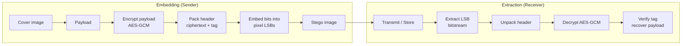

# Steganography (LSB) — FileVault

## 0. FileVault context
FileVault cung cấp tính năng nhúng dữ liệu vào ảnh lossless (BMP/PNG) bằng kỹ thuật LSB kèm mã hóa AES‑GCM trước khi nhúng để bảo mật và tăng entropy.

## 1. Khái niệm & mục tiêu
- Mục tiêu: ẩn payload trong cover image sao cho sự tồn tại của payload khó bị phát hiện.
- Giải quyết: bảo mật tính kín đáo (confidentiality of existence) và bảo vệ nội dung payload (confidentiality + integrity via AE).
- Bảo vệ: mã hóa (AES‑GCM) trước embedding; tránh nén mất dữ liệu và thao tác ảnh.

## 2. Toán học / công thức
- Ký hiệu:
    - W, H: chiều rộng / chiều cao ảnh (pixel)
    - C: số kênh trên mỗi pixel (thường 3 cho RGB)
    - b: số bit LSB dùng trên mỗi kênh (thường 1)

- Dung lượng tối đa (bytes):
    - Công thức: $\,\text{capacity\_bytes} = \left\lfloor \dfrac{W\cdot H\cdot C\cdot b}{8} \right\rfloor\,$
    - Ví dụ: với $W=1024$, $H=768$, $C=3$, $b=1$:
        $$
        \text{capacity\_bytes} = \left\lfloor \dfrac{1024\cdot 768\cdot 3\cdot 1}{8} \right\rfloor = 294912
        $$

- Entropy:
    - Dữ liệu nhúng nên có độ entropy cao (ví dụ: output của AES‑GCM) để tránh các mẫu dễ bị phát hiện bởi steganalysis.

## 3. Cách hoạt động (tóm tắt)
1. Mã hóa payload với AES‑GCM (key, nonce) → ciphertext || tag.
2. Định dạng payload: header (length, nonce, tag) + ciphertext.
3. Duyệt pixel → thay LSB mỗi kênh bằng bit payload (bitstream).
4. Lưu ảnh mới (lossless).

Extraction:
1. Đọc LSB theo thứ tự đã dùng → bitstream → bytes.
2. Tách header (length, nonce, tag) → giải mã AES‑GCM → kiểm tra tag.

## 4. Cấu trúc dữ liệu (trong cover)
- Byte stream nhúng:
    - [MAGIC][VERSION][payload_len (4B)][nonce (12B)][ciphertext][tag (16B)]
- MAGIC giúp xác định presence; VERSION để tương thích.
- Sắp xếp bit: thường MSB-first trong mỗi byte payload khi ghép từ LSB của kênh.

## 5. So sánh với thuật toán khác
- LSB vs Spread Spectrum: LSB cao dung lượng nhưng fragile; spread spectrum bền hơn trước chỉnh sửa nhưng phức tạp hơn.
- LSB vs Transform-domain (DCT/DFT): transform-domain bền với nén/biến đổi nhưng thường phức tạp và có footprint lớn hơn.

## 6. Luồng hoạt động (mermaid)


## 7. Sai lầm triển khai phổ biến
- Không mã hóa payload trước khi nhúng → dễ phát hiện.
- Sử dụng cố định MAGIC dễ bị fingerprinting.
- Không kiểm tra kích thước (overflow) khi nhúng.
- Lưu file với nén lossy (JPEG) sau embedding.
- Sử dụng nonce lặp cho AES‑GCM.

## 8. Threat Model
- Attacker: passive observer (statistical detection), active manipulator (resave, resize, recompress), or steganalysis tool (RS analysis, chi-square).
- Goal: detect presence, extract, hoặc phá hủy payload.

## 9. Biện pháp giảm thiểu
- Luôn mã hóa với AE (AES‑GCM) và per‑message nonce.
- Randomize embedding positions via PRNG keyed bằng key/seed (keeps deterministic per key).
- Thêm cover-aware encoding: use pseudo-random pixel order, skip edges/alpha channel.
- Kiểm tra capacity trước khi nhúng; abort nếu không đủ.
- Tích hợp integrity (tag) và sanity checks.

## 10. Test Vectors
- Setup: 2 pixels RGB (6 channels), b=1 → 6 bits capacity.
- Cover RGB bytes: [0xAA,0x55,0xFF, 0x00,0x12,0x34] (bin: 10101010 01010101 ...)
- Payload bits to embed (6 bits): 1 0 1 0 1 1
- LSBs before → after: map each channel LSB := payload bit
- Resulting RGB LSBs produce stego bytes where each channel LSB set accordingly.
(Use small handcrafted examples during unit tests; validate round-trip: embed → extract → decrypt → match.)

## 11. Code (pseudo)
- Pseudocode embed/extract (sketch):
```text
embed(image, payload, key):
    c, tag, nonce = AES_GCM_Encrypt(key, payload)
    stream = pack(MAGIC, LEN(c), nonce, c, tag)
    idx_seq = PRNG_positions(seed_from_key, image_capacity)
    for i, bit in enumerate(bits(stream)):
        pixel_byte = image[ idx_seq[i] ]
        image[ idx_seq[i] ] = (pixel_byte & ~1) | bit
    return image
```

## 12. Checklist bảo mật
- [ ] Kiểm tra capacity trước embed
- [ ] AES‑GCM với unique nonce per message
- [ ] PRNG dùng key-derived seed cho vị trí nhúng (not public)
- [ ] Không lưu/đổi định dạng sang lossy
- [ ] Kiểm tra và validate tag khi extract
- [ ] Rotate MAGIC/VERSION để tránh fingerprinting

## 13. Hạn chế & ứng dụng
- Hạn chế:
    - Dung lượng thấp (≈ 1/8 file bytes khi b=1)
    - Fragile với nén lossy, resize, chỉnh sửa
    - Dễ phát hiện bởi steganalysis nếu không randomize
- Ứng dụng:
    - Trao đổi thông tin kín đáo trên kênh công khai (ẩn trong ảnh)
    - Watermarking nhẹ (không thay thế watermark chuyên dụng)
    - Tiện cho test/demo, không thay thế secure covert channels cho threat model cao

## Nguồn tham khảo
- Bender, Gruhl, Morimoto, Lu, “Techniques for Data Hiding”, 1996.
- Anderson & Petitcolas, “On the Limits of Steganography”, 1998.
- Cox et al., “Digital Watermarking and Steganography”, 2007.
- Tutorials/whitepapers về AES‑GCM và steganalysis (RS test, chi-square).

Ghi chú: luôn kiểm tra pháp lý khi sử dụng steganography trên hệ thống thực tế.
