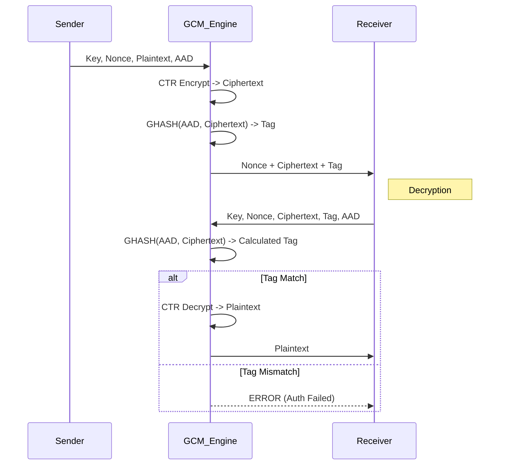

# AES-GCM (Galois/Counter Mode)

## 1. Tóm tắt
**AES-GCM** là một chế độ mã hóa xác thực (Authenticated Encryption with Associated Data - AEAD). Nó cung cấp đồng thời cả tính bảo mật (confidentiality), tính toàn vẹn (integrity) và tính xác thực (authenticity) cho dữ liệu.

Trong FileVault, **AES-256-GCM** là thuật toán mặc định và được khuyến nghị cho mọi mục đích sử dụng (chế độ `PROFESSIONAL` và `ADVANCED`). Nó khắc phục các điểm yếu của AES-CBC bằng cách tích hợp xác thực và có hiệu năng cao nhờ khả năng tính toán song song.

## 2. Thuật toán & Toán học
### Thuật toán chi tiết (AES-CTR + GHASH / GMAC)

- AES-GCM kết hợp:
    1. AES-CTR để mã hóa (keystream từ AES).
    2. GHASH/GMAC để tính giá trị xác thực trên AAD và ciphertext.

- Định nghĩa cơ bản:
    - $H = E_K(0^{128})$ (block AES của 128-bit số 0).
    - Nonce 96-bit: $J_0 = \text{Nonce} \parallel 0^{31} \parallel 1$. Nếu Nonce không phải 96-bit thì $J_0 = \text{GHASH}(H, \text{Nonce})$ theo chuẩn.

- CTR (mã hóa):
    - Với $J_0$ đã có, định nghĩa bộ đếm cho block thứ $i$:
        $$
        \text{CTR}_i = \text{inc32}(J_0, i)
        $$
    - Keystream block: $S_i = E_K(\text{CTR}_i)$.
    - Mã hóa block plaintext $P_i$:
        $$
        C_i = P_i \oplus S_i
        $$

- GHASH (mã hóa đa thức trong $GF(2^{128})$):
    - Xác định các block 128-bit:
        - Chia AAD thành $A_1,\dots,A_u$ (padding cuối bằng 0 nếu cần).
        - Chia ciphertext thành $C_1,\dots,C_v$ (padding cuối bằng 0 nếu cần).
        - Khối cuối: $L = \text{len}(A)_{64} \parallel \text{len}(C)_{64}$ (độ dài tính bằng bit).
    - Tạo dãy khối:
        $$
        X = [A_1,\dots,A_u,\,C_1,\dots,C_v,\,L]
        $$
    - Khởi tạo $Y_0 = 0$. Với mỗi $i\ge1$:
        $$
        Y_i = (Y_{i-1} \oplus X_i)\cdot H
        $$
        trong đó phép $\cdot$ là phép nhân trong trường Galois $GF(2^{128})$ (carry-less polynomial multiplication) và giảm modulo đa thức chuẩn
        $$
        R(x)=x^{128}+x^7+x^2+x+1.
        $$
    - Kết quả GHASH:
        $$
        \text{GHASH}(H,A,C)=Y_{u+v+1}.
        $$

- Tính Tag (Authentication Tag):
    - Giá trị xác thực trung gian $S=\text{GHASH}(H,A,C)$.
    - Tag đầy đủ (128-bit):
        $$
        T = E_K(J_0)\ \oplus\ S.
        $$
    - Nếu cần tag rút gọn thì lấy $t$ bit cao của $T$: $\text{Tag}=\text{MSB}_t(T)$ (không khuyến nghị rút gọn dưới 96 bit).

- Ghi chú ngắn:
    - GMAC là trường hợp đặc biệt của GHASH khi chỉ có AAD (ciphertext rỗng).
    - An toàn yêu cầu $H$ được lấy từ cùng key $K$ dùng cho AES; nonce phải là duy nhất cho mỗi $K$ (nonce reuse phá vỡ tính bảo mật).

Phép nhân trong trường Galois $GF(2^{128})$ được sử dụng để tính toán tag xác thực, cho phép xử lý song song và hiệu quả phần cứng cao.

## 3. Cách hoạt động
1.  **Key & Nonce**: Sử dụng Key (AES) và Nonce (96-bit recommended).
2.  **Encryption (CTR mode)**:
    *   Tạo counter block $J_0$ từ Nonce.
    *   Increment counter cho mỗi block tiếp theo.
    *   Mã hóa counter block bằng AES để tạo keystream.
    *   XOR keystream với Plaintext để tạo Ciphertext.
3.  **Authentication (GHASH)**:
    *   Dữ liệu liên kết (AAD - Associated Data) và Ciphertext được đưa qua hàm GHASH.
    *   Kết quả được mã hóa với block đầu tiên của keystream để tạo Authentication Tag (thường là 16 bytes).

## 4. Cấu trúc dữ liệu
*   **Key Size**: 256 bits (32 bytes) - FileVault default.
*   **Nonce (IV)**: 96 bits (12 bytes). **CỰC KỲ QUAN TRỌNG: KHÔNG BAO GIỜ ĐƯỢC DÙNG LẠI (NONCE REUSE IS FATAL).**
*   **Tag Size**: 128 bits (16 bytes).
*   **Block Size**: 128 bits (16 bytes).

## 5. So sánh với AES-CBC
| Đặc điểm | AES-GCM | AES-CBC |
| :--- | :--- | :--- |
| **Loại** | AEAD (Mã hóa + Xác thực) | Chỉ mã hóa |
| **Bảo mật** | Rất cao (nếu Nonce unique) | Trung bình (dễ bị Padding Oracle) |
| **Hiệu năng** | Rất cao (Parallelizable) | Thấp hơn (Sequential) |
| **Padding** | Không cần (Stream cipher) | Cần (PKCS#7) |
| **Rủi ro** | Nonce reuse = Lộ Key | Padding Oracle, Bit-flipping |

## 6. Luồng dữ liệu (Sequence Diagram)



## 7. Các sai lầm triển khai phổ biến
1.  **Nonce Reuse (IV Reuse)**: Đây là lỗi nghiêm trọng nhất của GCM. Nếu dùng cùng Key và Nonce cho 2 message khác nhau:
    *   Kẻ tấn công có thể khôi phục XOR của 2 plaintext.
    *   Kẻ tấn công có thể giả mạo thông điệp (forge authentication tag).
    *   *FileVault Check*: Code sử dụng `Botan::AutoSeeded_RNG` sinh 12-byte nonce ngẫu nhiên cho mỗi lần mã hóa. Xác suất trùng lặp là cực thấp ($1/2^{96}$), an toàn cho lượng file vừa phải.
2.  **Tag Truncation**: Cắt ngắn tag xuống dưới 96 bits làm giảm độ an toàn xác thực.
    *   *FileVault Check*: Code dùng full 128-bit tag (16 bytes).
3.  **Bỏ qua AAD**: Không xác thực metadata (như filename, version) trong AAD cho phép kẻ tấn công tráo đổi file context.

## 8. Threat Model
*   **Attack Scenarios**:
    1.  **Forgery**: Attacker sửa đổi ciphertext trên đĩa.
        *   *Result*: Khi giải mã, GCM sẽ phát hiện tag không khớp và từ chối giải mã. Dữ liệu rác không bao giờ được trả về cho user.
    2.  **Nonce Reuse**: Do bug hoặc RNG kém.
        *   *Result*: Mất tính bảo mật hoàn toàn.

## 9. Biện pháp giảm thiểu
*   Luôn dùng RNG chất lượng cao (CSPRNG) cho Nonce.
*   Nếu mã hóa lượng dữ liệu cực lớn (> $2^{32}$ files) với cùng một key, cân nhắc xoay vòng key (key rotation) hoặc dùng **AES-GCM-SIV** (nonce-misuse resistant).
*   Xác thực cả header file (AAD) để tránh tấn công replay hoặc context confusion.

## 10. Test Vectors (AES-256-GCM)
*   Key: `feffe9928665731c6d6a8f9467308308feffe9928665731c6d6a8f9467308308`
*   Nonce: `cafebabefacedbaddecaf888` (12 bytes)
*   Plaintext: `d9313225f88406e5a55909c5aff5269a86a7a9531534f7da2e4c303d8a318a721c3c0c95956809532fcf0e2449a6b525b16aedf5aa0de657ba637b39`
*   Ciphertext: `42831ec2217774244b7221b784d0d49ce3aa212f2c02a4e035c17e2329aca12e21d514b25466931c7d8f6a5aac84aa051ba30b396a0aac973d58e091`
*   Tag: `5bc94fbc3221a5db94fae95ae7121a47`

## 11. Ví dụ Code (Python)
```python
import os
from cryptography.hazmat.primitives.ciphers.aead import AESGCM

def encrypt_aes_gcm(key, plaintext, aad=b""):
    # Key: 32 bytes (256 bits)
    aesgcm = AESGCM(key)
    nonce = os.urandom(12) # 96 bits
    
    # Encrypt returns ciphertext + tag appended
    ciphertext_with_tag = aesgcm.encrypt(nonce, plaintext, aad)
    
    return nonce + ciphertext_with_tag

def decrypt_aes_gcm(key, data, aad=b""):
    nonce = data[:12]
    ciphertext_with_tag = data[12:]
    
    aesgcm = AESGCM(key)
    
    # Raises InvalidTag if verification fails
    plaintext = aesgcm.decrypt(nonce, ciphertext_with_tag, aad)
    return plaintext
```

## 12. Checklist Bảo Mật
- [ ] Sử dụng AES-256-GCM làm mặc định.
- [ ] Nonce phải là 12 bytes (96 bits).
- [ ] Nonce phải ngẫu nhiên (hoặc counter) và **duy nhất** cho mỗi key.
- [ ] Kiểm tra Tag trước khi xử lý bất kỳ dữ liệu plaintext nào.
- [ ] Đưa metadata quan trọng (filename, version) vào AAD để bảo vệ tính toàn vẹn của ngữ cảnh.

## 13. Hạn chế (nếu có)
- Yêu cầu nonce duy nhất cho mỗi key — nonce reuse phá vỡ toàn bộ bảo mật.
- Không chống được nonce-misuse; nếu cần kháng lỗi nonce, cân nhắc AES‑GCM‑SIV.
- Trích ngắn Tag (dưới ~96 bit) làm giảm mạnh an toàn xác thực.
- Giới hạn an toàn theo khuyến nghị tiêu chuẩn (giới hạn lượng dữ liệu/khối mã hóa trên một key) — tuân thủ NIST SP 800‑38D.
- Rủi ro triển khai: side‑channel (timing, cache), lỗi padding/length handling, sai xử lý AAD.
- Không thích hợp khi cần xác thực trước khi biết toàn bộ luồng dữ liệu (streaming với tag trước tính toàn vẹn khó xử lý).

## 14. Ứng dụng
- Mã hóa giao thức: TLS (AES‑GCM cipher suites), IPsec.
- Lưu trữ & bảo vệ file: disk/volume encryption, file containers (FileVault).
- Giao tiếp bảo mật: VPN, messaging, secure backups.
- Ứng dụng nhúng và phần cứng nhờ hiệu năng cao và khả năng tính toán song song.

## 15. Nguồn tham khảo
- NIST SP 800‑38D — Recommendation for Block Cipher Modes of Operation: GCM and GMAC. https://csrc.nist.gov/publications/detail/sp/800-38d/final
- McGrew, D. & Viega, J. — The Galois/Counter Mode (GCM). (gốc/paper).  
- RFC 5116 — An Interface and Algorithms for Authenticated Encryption. https://tools.ietf.org/html/rfc5116
- RFC 5288 — AES GCM Cipher Suites for TLS. https://tools.ietf.org/html/rfc5288
- RFC 8452 — AES‑GCM‑SIV: Nonce‑misuse resistant AEAD. https://tools.ietf.org/html/rfc8452
- Practical implementation guides and crypto libraries' docs (e.g., OpenSSL, Botan, cryptography) — kiểm tra API và khuyến nghị nonce/tag.
- Các bài viết về side‑channel và pitfalls (McGrew & Viega, blog/security analyses) — đọc kỹ trước khi triển khai sản xuất.