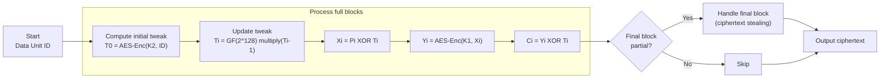

# AES-XTS

## 0. Ngữ cảnh Filevault
AES-XTS là chế độ mã hoá block được thiết kế cho mã hoá ổ đĩa/khối dữ liệu (disk encryption). Thích hợp cho hệ thống lưu trữ như FileVault, LUKS, BitLocker — nơi dữ liệu được chia thành "data unit" (sector/cluster) mã hoá độc lập.

## 1. Khái niệm
AES-XTS (XEX Tweakable Block Cipher with ciphertext stealing) là chế độ block-tweak dùng AES làm khối cơ sở để cung cấp tính bảo mật cho khối dữ liệu theo đơn vị. Mục tiêu: bảo vệ tính bí mật của dữ liệu trên ổ đĩa, cho phép mã hoá từng sector độc lập, ngăn việc tái sử dụng mẫu bằng "tweak".

## 2. Toán học, công thức
- Hai khoá: $K_1$ (dữ liệu), $K_2$ (tweak).
- Tweak ban đầu: $T_0 = E_{K_2}(IV)$, với $IV$ thường là số đơn vị dữ liệu (data unit number).
- Tweak cho block thứ $i$: $T_i = \alpha^i \otimes T_0$ trong $GF(2^{128})$, với $\alpha = 2$.
- Mã hoá block:
    $$
    C_i = E_{K_1}(P_i \oplus T_i) \oplus T_i
    $$
- Với block không đầy: dùng ciphertext stealing (CTS).

Phép nhân $\alpha$ trong GF(2^{128}) tương đương:
- shift-left 1 bit; nếu MSB trước shift = 1 thì XOR với $0x87$.

## 3. Cách hoạt động (tóm tắt)
- Nhận data unit ID → tính $T_0 = E_{K_2}(ID)$.
- Với mỗi block i: tính $T_i$ từ $T_{i-1}$, áp dụng XOR với plaintext, AES encrypt với $K_1$, XOR lại tweak → ciphertext.
- Nếu cuối data unit có block không đầy, áp dụng CTS để giữ kích thước.

## 4. Cấu trúc dữ liệu
- Data unit: sequence of 128‑bit blocks (AES block size), cuối có thể partial block.
- Keys: $K_1, K_2$ (kích thước 128/192/256 bits).
- IV/data unit number: 64- hoặc 128‑bit (thường 128‑bit little-endian sector number).

## 5. So sánh với các chế độ khác
- Vs CBC: XTS cho phép truy cập ngẫu nhiên sector, tránh propagation lỗi sang sector khác; CBC không phù hợp cho disk.
- Vs CTR: CTR cho truy cập ngẫu nhiên nhưng cần quản lý nonce; CTR cũng không cung cấp integrity.
- Vs AEAD (GCM/ChaCha20-Poly1305): AEAD cung cấp tính toàn vẹn; XTS chỉ cung cấp tính bảo mật (confidentiality) cho blocks, không integrity/authentication.

## 6. Luồng hoạt động (flow)
Mermaid:


## 7. Các sai lầm triển khai phổ biến
- Tweak reuse với cùng ID và cùng key giữa dữ liệu khác nhau.
- Sai thứ tự endianness khi tạo IV/sector number.
- Sai phép nhân trong GF(2^128) (quên XOR 0x87).
- Không xử lý đúng ciphertext stealing cho partial block.
- Tin rằng XTS cung cấp integrity (không có).
- Khóa weak quản lý (chia sẻ K1/K2 hoặc dùng K1=K2).

## 8. Threat Model
- Kẻ tấn công có thể đọc/ghi đến đĩa nhưng không biết khóa.
- Mục tiêu: ngăn kẻ tấn công biết nội dung dữ liệu (confidentiality).
- Không bảo vệ chống thay đổi dữ liệu (tampering) nếu không có cơ chế integrity.

## 9. Biện pháp giảm thiểu
- Kết hợp với MAC/AEAD để đảm bảo integrity (ví dụ: encrypt-then-MAC hoặc dùng AEAD).
- Giữ K1 và K2 riêng biệt, quản lý khóa an toàn (HSM/KMS).
- Không tái sử dụng data unit ID/tweak.
- Kiểm tra và chuẩn hóa endianness.
- Bảo vệ chống side-channel (constant-time AES, tránh table lookups).

## 10. Test Vectors
Ví dụ mẫu (không phải tiêu chuẩn — dùng để kiểm tra luồng):
- K1 = 000102030405060708090a0b0c0d0e0f
- K2 = 0f0e0d0c0b0a09080706050403020100
- Data unit = 00000000000000000000000000000001
- Plaintext block 0 = 00112233445566778899aabbccddeeff
- Ciphertext block 0 = (kiểm tra triển khai bằng vector tiêu chuẩn NIST/IEEE)

Để kiểm tra thực tế, dùng vectors chính thức trong NIST SP 800-38E / IEEE P1619.

## 11. Code (mẫu ngắn)
Python (pseudo):
```python
def xts_mul(t):
        msb = t[0] >> 7
        t = ((t << 1) & ((1<<128)-1))
        if msb: t ^= 0x87
        return t

def xts_encrypt_block(k1,k2,tid,pi,i):
        if i==0: t = AES(k2,tid)
        else: t = xts_mul(prev_t)
        ci = AES(k1, pi ^ t) ^ t
        prev_t = t
```

## 12. Checklist bảo mật
- [ ] K1 ≠ K2; khóa được tạo an toàn.
- [ ] Data unit IDs duy nhất / đúng endianness.
- [ ] Xác thực xử lý partial blocks.
- [ ] Sử dụng MAC/AE nếu cần integrity.
- [ ] Bảo vệ chống side-channel.
- [ ] Kiểm thử với vectors NIST/IEEE.

## 13. Hạn chế
- Không cung cấp integrity/authentication.
- Không chống replay nếu attacker thay sector.
- Thiết kế cho lưu trữ block-oriented, không tối ưu cho stream nhỏ/khối dữ liệu ngắn.

## 14. Ứng dụng
- Mã hoá ổ đĩa (FileVault, LUKS, BitLocker), thiết bị lưu trữ, hệ thống file mã hoá.

## 15. Nguồn tham khảo
- NIST SP 800-38E — Recommendation for Block Cipher Modes of Operation: XTS-AES.
- IEEE P1619 — Standard for Cryptographic Protection of Data on Block-Oriented Storage Devices.
- Các thư viện thực hiện: OpenSSL, libgcrypt, Linux kernel dm-crypt.

Thêm: kiểm tra vectors chính thức trong NIST/IEEE khi triển khai.
