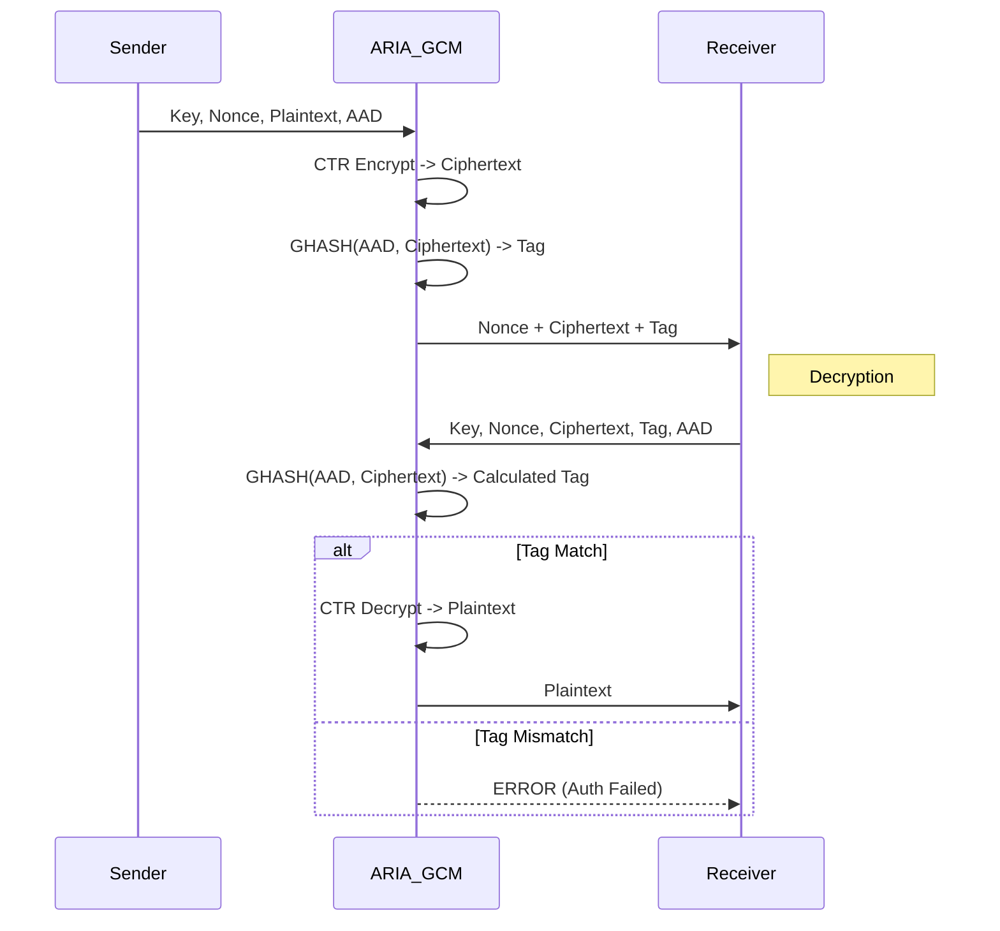

# ARIA-GCM (Galois/Counter Mode)

## 1. Khái niệm & mục tiêu
**ARIA-GCM** kết hợp block cipher ARIA (chuẩn quốc gia Hàn Quốc KS X 1213, mô tả trong RFC 5794) với chế độ AEAD Galois/Counter Mode. Mục tiêu: bảo vệ đồng thời tính bảo mật, toàn vẹn và xác thực của dữ liệu; tránh padding oracle như CBC và giảm nguy cơ lỗi tích hợp MAC rời.

## 2. Toán học, công thức
### 2. Toán học & Thuật toán (chi tiết, math syntax)

Đặt ký hiệu:
- Các block là 128-bit, ký hiệu bằng chữ hoa: $A_i, C_i, X_i,\dots$
- $|\cdot|$ là độ dài bằng bit. Biểu diễn độ dài của A và C là hai số 64-bit: $\mathrm{len}_A= \mathrm{int64}(|A|),\ \mathrm{len}_C=\mathrm{int64}(|C|)$.
- Phép nhân trong trường hữu hạn $GF(2^{128})$ sử dụng nhân carry-less và rút gọn theo đa thức bất khả quy
	$$P(x)=x^{128}+x^7+x^2+x+1.$$
	Ký hiệu nhân là $\otimes$ (nghĩa là carry-less mul rồi mod $P(x)$).

1) Khởi tạo
- Tính $H = E_K(0^{128})$ (block cipher ARIA trên block số 0).
- Nếu |IV| = 96 thì
	$$J_0 = IV \,\|\, 0^{31} \,\|\, 1.$$
	(tức: IV (96-bit) nối với 31 bit 0 và một bit 1.)
	Ngược lại (nếu $|IV|\neq 96$) thì
	$$J_0 = \mathrm{GHASH}(H,\ \emptyset,\ IV)$$
	theo quy tắc GHASH (xem dưới).

2) GHASH — hàm xác thực
- Chia A (AAD) thành $u$ block 128-bit: $A_1,\dots,A_u$ (cuối cùng padded bằng 0 nếu cần).
- Chia ciphertext C thành $v$ block 128-bit: $C_1,\dots,C_v$ (cuối cùng padded bằng 0 nếu cần).
- Định nghĩa chuỗi trạng thái:
	\begin{align*}
	X_0 &= 0^{128},\\
	X_i &= (X_{i-1}\oplus A_i)\otimes H,\quad i=1..u,\\
	X_{u+j} &= (X_{u+j-1}\oplus C_j)\otimes H,\quad j=1..v,\\
	X_{u+v+1} &= \bigl(X_{u+v}\oplus (\mathrm{len}_A\ \|\ \mathrm{len}_C)\bigr)\otimes H.
	\end{align*}
- Kết quả:
	$$\mathrm{GHASH}(H,A,C) = X_{u+v+1}.$$
	(Ở đây $\mathrm{len}_A\|\mathrm{len}_C$ là hai số 64-bit nối thành 128-bit, theo chuẩn GCM.)

3) CTR encryption/decryption
- Đếm bộ counter: cho $i=1..v$,
	$$\mathrm{CTR}_i = \mathrm{inc32}(J_0,i)$$
	(tăng phần 32-bit cuối modulo $2^{32}$).
- Keystream block:
	$$S_i = E_K(\mathrm{CTR}_i).$$
- Mã hóa:
	$$C_i = P_i \oplus S_i.$$
- Giải mã tương tự:
	$$P_i = C_i \oplus S_i.$$

4) Tag (authentication tag)
- Tính:
	$$S = \mathrm{GHASH}(H,A,C).$$
- Tag (128-bit mặc định; có thể rút gọn xuống $t$ bit):
	$$T = E_K(J_0)\oplus S.$$
- So sánh tag phải thực hiện constant-time; chỉ trả plaintext khi tag khớp.

5) Ghi chú tính toán
- Phép nhân $\otimes$ thực hiện bằng CLMUL (carry-less) + giảm theo $P(x)$.
- GHASH là tuyến tính theo $H$ và các block; vì thế reuse của $J_0$/nonce hoặc lộ $H$ phá vỡ bảo mật.
- Các tham số kích thước: block 128-bit, tag 128-bit (mặc định), nonce khuyến nghị 96-bit.

Tóm tắt thuật toán (pseudo):
$$
\begin{aligned}
H &= E_K(0^{128})\\
J_0 &=
\begin{cases}
IV\|0^{31}\|1 & \text{nếu }|IV|=96,\\[4pt]
\mathrm{GHASH}(H,\varnothing,IV) & \text{khác}
\end{cases}\\
\text{for } i=1,\dots,v:\quad &S_i = E_K(\mathrm{inc32}(J_0,i)),\quad C_i = P_i\oplus S_i\\
S &= \mathrm{GHASH}(H,A,C)\\
T &= E_K(J_0)\oplus S
\end{aligned}
$$

(Trả về $(IV,\,C,\,T)$; khi giải mã, tái tính $T$ và so sánh constant-time.)

## 3. Cách hoạt động
1. Sinh nonce 12 byte bằng CSPRNG; tạo $J_0$ và counter tăng dần.
2. ARIA-CTR tạo keystream; XOR với plaintext để ra ciphertext.
3. GHASH(AAD, ciphertext) tạo giá trị xác thực; kết hợp với block keystream đầu để sinh tag 16 byte.
4. Giải mã: tính tag, so sánh hằng thời gian; chỉ giải mã khi khớp.

## 4. Cấu trúc dữ liệu
*   **Key Size**: 128/192/256 bit (FileVault mặc định 256).
*   **Nonce (IV)**: 96 bit (12 byte), duy nhất per-key.
*   **Tag Size**: 128 bit (16 byte).
*   **Block Size**: 128 bit.

## 5. So sánh với AES-GCM
| Đặc điểm | ARIA-GCM | AES-GCM |
| :--- | :--- | :--- |
| **Chuẩn** | KS X 1213, RFC 5794 | FIPS 197, NIST SP 800-38D |
| **Hiệu năng HW (AES-NI)** | Chậm hơn do thiếu AES-NI | Rất nhanh |
| **Tương thích khu vực** | Ưu tiên hệ thống Hàn Quốc | Phổ biến toàn cầu |

## 6. Luồng dữ liệu (Sequence Diagram)



## 7. Sai lầm triển khai phổ biến
1. **Nonce reuse**: dùng lại nonce với cùng key làm lộ XOR plaintext và cho phép giả mạo tag.
2. **Không kiểm tra tag hằng thời gian**: so sánh byte-by-byte rò rỉ timing.
3. **Không xác thực header**: bỏ AAD khiến kẻ tấn công tráo đổi metadata (version, filename).
4. **Sai độ dài nonce**: dùng nonce != 96 bit khiến GHASH tính $J_0$ khác chuẩn.

## 8. Threat Model
*   **Forgery/bit-flip trên lưu trữ**: attacker sửa ciphertext; tag sẽ không khớp và giải mã bị từ chối.
*   **Nonce collision**: do RNG kém hoặc triển khai counter sai; mất bảo mật mật mã.
*   **Side-channel**: cần triển khai constant-time, tránh rò rỉ S-box truy cập bộ nhớ.

## 9. Biện pháp giảm thiểu
*   Dùng CSPRNG mạnh cho nonce hoặc counter monotonic per-key; lưu trạng thái để không lặp.
*   Kiểm tra tag trước khi xuất plaintext; so sánh hằng thời gian.
*   Đưa metadata quan trọng vào AAD; ký thêm nếu cần chống replay.
*   Xoay vòng key nếu số bản tin lớn (>$2^{32}$) hoặc khi nghi ngờ rò rỉ nonce.

## 10. Test Vectors
*   Bộ vector chính thức: RFC 5794 (ARIA modes, có ARIA-GCM) và bộ thử KS X 1213/KISA (public test set).
*   Gợi ý kiểm thử thực tế: dùng Botan `aead` CLI hoặc OpenSSL (nếu build có ARIA) để sinh vector riêng; lưu lại (key, nonce, AAD, ciphertext, tag) vào regression tests của FileVault.

## 11. Ví dụ code (C++ với Botan)
```cpp
#include <botan/aead.h>
#include <botan/auto_rng.h>

std::vector<uint8_t> encrypt_aria_gcm(const std::vector<uint8_t>& key,
									  const std::vector<uint8_t>& pt,
									  const std::vector<uint8_t>& aad) {
	Botan::AutoSeeded_RNG rng;
	auto aead = Botan::AEAD_Mode::create("ARIA-256/GCM", Botan::ENCRYPTION);
	aead->set_key(key);
	std::vector<uint8_t> nonce(12);
	rng.randomize(nonce.data(), nonce.size());
	aead->start(nonce);
	aead->set_associated_data(aad);
	std::vector<uint8_t> buf = pt;
	aead->finish(buf);
	buf.insert(buf.begin(), nonce.begin(), nonce.end());
	return buf;
}
```

## 12. Checklist bảo mật
- [ ] Nonce 96-bit, duy nhất per-key, sinh từ CSPRNG/counter.
- [ ] Kiểm tra tag hằng thời gian trước khi dùng plaintext.
- [ ] Đưa metadata (filename, version, policy) vào AAD.
- [ ] Chọn key 256-bit cho hồ sơ `PROFESSIONAL/ADVANCED`.
- [ ] Xoay key nếu nguy cơ vượt giới hạn bản tin hoặc nghi ngờ nonce reuse.

## 13. Hạn chế (nếu có)
- Nonce reuse: tái sử dụng nonce với cùng key phá huỷ tính bảo mật (mất bí mật và cho phép giả mạo).
- Tag truncation: rút gọn tag giảm độ mạnh chống giả mạo; không rút quá mức (thường ≥96 bit nếu phải).
- Giới hạn dữ liệu trên một key: tránh làm tràn counter/tiêu thụ quá nhiều block trên cùng key (không dùng vô hạn — tránh gần giới hạn counter 32-bit).
- Hiệu năng phụ thuộc HW: không có AES-NI/CLMUL sẽ chậm hơn AES-GCM trên phần cứng có hỗ trợ.
- Kênh bên (side-channels) và so sánh tag: cần triển khai constant-time; sai sót dễ rò rỉ.
- Tương thích/tuân thủ: ARIA được chuẩn hoá ở Hàn Quốc — có thể không phổ biến hoặc không được hỗ trợ rộng ở một số nền tảng.

## 14. Ứng dụng
- Mã hoá ổ/volume, khoá dữ liệu, backup bảo mật (FileVault-style) trong môi trường ưu tiên ARIA.
- Giao thức bảo mật nội bộ hoặc khu vực (VPN, secure storage, messaging) nơi cần AEAD.
- Ứng dụng tuân thủ chuẩn Hàn Quốc/KISA hoặc yêu cầu thuật toán ngoài AES để đa dạng hoá thuật toán.

## 15. Nguồn tham khảo
- RFC 5794 — The ARIA Block Cipher (KISA / IETF).  
- KISA KS X 1213 — ARIA specification (Korean Industrial Standard).  
- NIST SP 800-38D — Recommendation for Block Cipher Modes of Operation: GCM.  
- McGrew & Viega — “The Galois/Counter Mode of Operation (GCM)” (original analysis/paper).  
- RFC 5116 — An Interface and Algorithms for Authenticated Encryption (AEAD).  
- Các nghiên cứu về lạm dụng nonce và phân tích an toàn GCM (nonce-misuse papers / implementation guidance).
- Tri thức triển khai: thư viện như Botan/OpenSSL (khi build có ARIA) để test vector và kiểm thử.  
- Tài liệu nội bộ FileVault: lưu vector test (key, nonce, AAD, ciphertext, tag) và policy nonce/key rotation.