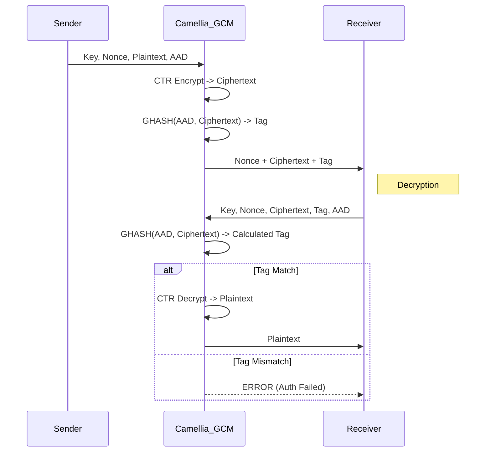

# Camellia-GCM (Galois/Counter Mode)

## 1. Khái niệm & mục tiêu
**Camellia-GCM** kết hợp block cipher Camellia (ISO/IEC 18033-3, RFC 6367 cho IPsec) với chế độ AEAD GCM. Mục tiêu: cung cấp một lựa chọn chuẩn công nghiệp ngoài AES, giữ tính bảo mật/xác thực và giảm phụ thuộc vào AES-NI.

## 2. Toán học, công thức
*   **Camellia**: mạng Feistel (18 vòng cho key 128-bit; 24 vòng cho 192/256-bit) với các phép tuyến tính P-function và F-function dùng 4 S-boxes.
*   **GCM**: CTR + GHASH trong $GF(2^{128})$; tag 128 bit được tính như $\text{Tag}=E_K(J_0)\oplus \text{GHASH}(AAD, C)$.
*   **Độ phức tạp**: tương tự AES-GCM, khác biệt chủ yếu nằm ở primitive block cipher.

## 3. Cách hoạt động
1. Nonce 96-bit sinh ngẫu nhiên; tạo counter $J_0$.
2. Camellia-CTR tạo keystream, XOR với plaintext → ciphertext.
3. GHASH(AAD, ciphertext) tạo giá trị xác thực; kết hợp block keystream đầu để ra tag.
4. Giải mã: tính tag, so sánh hằng thời gian; chỉ trả plaintext khi khớp.

## 4. Cấu trúc dữ liệu
*   **Key Size**: 128/192/256 bit (FileVault hỗ trợ đầy đủ).
*   **Nonce**: 96 bit (12 byte), duy nhất per-key.
*   **Tag**: 128 bit (16 byte).
*   **Block Size**: 128 bit.

## 5. So sánh với AES-GCM
| Đặc điểm | Camellia-GCM | AES-GCM |
| :--- | :--- | :--- |
| **Hiệu năng HW (AES-NI)** | Chậm hơn (không có AES-NI) | Rất nhanh |
| **Hiệu năng SW thuần** | Sát AES, đôi khi tốt hơn trên kiến trúc không có AES-NI | Tốt, nhưng phụ thuộc AES-NI để tối ưu |
| **Chuẩn khu vực** | Được CRYPTREC/NESSIE khuyến nghị, phổ biến tại JP/EU | Chuẩn toàn cầu (FIPS/NIST) |

## 6. Luồng dữ liệu (Sequence Diagram)



## 7. Sai lầm triển khai phổ biến
1. **Nonce reuse**: tái sử dụng nonce với cùng key → rò rỉ keystream, cho phép giả mạo.
2. **Sai độ dài nonce/tag**: nonce ≠ 96 bit hoặc cắt tag < 96 bit làm giảm an toàn.
3. **Không xác thực AAD**: bỏ metadata (version, filename) khỏi AAD làm tăng rủi ro tráo đổi ngữ cảnh.
4. **Không kiểm tra tag hằng thời gian**: so sánh không constant-time gây side-channel.

## 8. Threat Model
*   **Modification at rest**: attacker sửa ciphertext; tag mismatch làm giải mã thất bại.
*   **Nonce collision**: RNG kém hoặc counter tràn; mất bảo mật mật mã.
*   **Side-channel**: Camellia cần triển khai constant-time ở S-box và hoán vị.

## 9. Biện pháp giảm thiểu
*   CSPRNG sinh nonce hoặc counter monotonic; log/kiểm soát để tránh trùng.
*   Duy trì tag 128 bit; cấm truncate < 96 bit.
*   Đưa header quan trọng vào AAD; chống replay bằng version/timestamp trong AAD.
*   Triển khai constant-time, tránh bảng S-box cache-leak.

## 10. Test Vectors
*   Nguồn chính thức: RFC 6367 (Camellia Counter Modes) và NIST CAVP Camellia-GCM (public). Các vector bao gồm đủ key 128/192/256, AAD có/không, nhiều độ dài plaintext.
*   Gợi ý nội bộ: sinh vector bằng OpenSSL (build hỗ trợ Camellia-GCM) và thêm vào bộ regression của FileVault.

## 11. Ví dụ code (OpenSSL CLI)
```bash
openssl enc -camellia-256-gcm -K <hexkey> -iv <hexnonce> -in plaintext.bin \
  -aad <hexaad> -out ciphertext.bin -nopad -p
# Tag sẽ được in trong stdout ("tag = ...")
```

## 12. Checklist bảo mật
- [ ] Nonce 96-bit duy nhất cho mỗi key.
- [ ] Tag 128-bit, so sánh hằng thời gian trước khi dùng plaintext.
- [ ] Bao gồm metadata quan trọng trong AAD.
- [ ] Dùng key 256-bit cho hồ sơ an toàn cao; xoay key nếu số bản tin lớn.
- [ ] Kiểm thử lại bằng vector chuẩn (RFC 6367/NIST CAVP) sau mỗi thay đổi mã hóa.

## 13. Hạn chế (nếu có)
* Ít hỗ trợ HW tăng tốc (không có tương đương AES-NI) → hiệu năng thấp trên CPU có AES-NI.  
* Phổ biến/tuân chuẩn kém hơn AES (không phải chuẩn FIPS/NIST phổ biến) → khả năng tương thích với một số hệ sinh thái hạn chế.  
* Rủi ro GCM chung: reuse nonce hoặc truncate tag ảnh hưởng nghiêm trọng đến an toàn.  
* Công cụ, thư viện, và audit ít hơn so với AES → khả năng phát hiện lỗi triển khai/chỗ hổng chậm.

## 14. Ứng dụng
* IPsec / VPN (RFC 6367 tham khảo triển khai counter modes của Camellia).  
* TLS/SSL và OpenSSL khi cần lựa chọn ngoài AES (tùy build).  
* Mã hóa file (FileVault), container, và lưu trữ tại nơi muốn giảm phụ thuộc vào AES.  
* Thiết bị nhúng hoặc môi trường tuân thủ tiêu chuẩn khu vực (JP/EU) nơi Camellia được khuyến nghị.

## 15. Nguồn tham khảo
* RFC 6367 — Camellia Counter Modes: https://datatracker.ietf.org/doc/html/rfc6367  
* ISO/IEC 18033-3 — Encryption algorithms (Camellia): https://www.iso.org/standard/36529.html  
* CRYPTREC / NESSIE reports (đánh giá Camellia): CRYPTREC site và các báo cáo NESSIE  
* OpenSSL enc (Camellia-GCM) docs: https://www.openssl.org/docs/man1.1.1/man1/enc.html  
* NIST CAVP / Cryptographic Algorithm Validation Program: https://csrc.nist.gov/projects/cryptographic-algorithm-validation-program