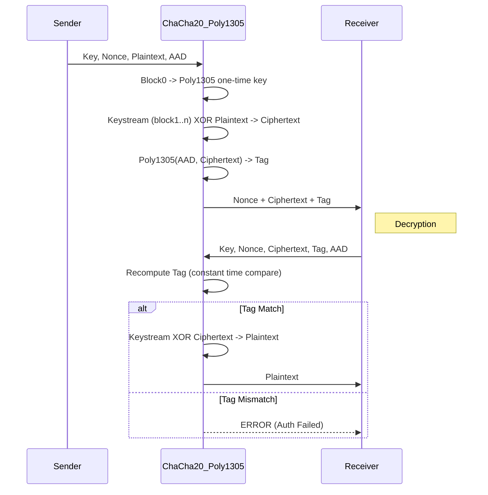

# ChaCha20-Poly1305

## 1. Khái niệm & mục tiêu
**ChaCha20-Poly1305** là AEAD hiện đại kết hợp stream cipher ChaCha20 với MAC Poly1305. Mục tiêu: hiệu năng cao trên CPU không có AES-NI, đồng thời kháng side-channel tự nhiên nhờ phép toán ARX (Add-Rotate-Xor).

## 2. Toán học, công thức
*   **ChaCha20**: state 512 bit; 20 round quarter-rounds dựa trên phép cộng modulo $2^{32}$, xoay vòng, XOR.
*   **Poly1305**: MAC một lần, tính mod số nguyên tố $2^{130}-5$, khóa một lần lấy từ block keystream đầu tiên (counter=0).
*   Tag = Poly1305(AAD || ciphertext || lengths) với khóa $r||s$ sinh từ ChaCha20 block0.

## 3. Cách hoạt động
1. Nonce 96-bit (IETF) + counter 32-bit (bắt đầu từ 1 cho dữ liệu, 0 cho MAC key).
2. Block0 → khóa Poly1305.
3. Block1..n → keystream XOR plaintext → ciphertext.
4. Poly1305(AAD, ciphertext, length fields) → tag 16 byte.
5. Giải mã: tính lại tag, so sánh hằng thời gian; chỉ giải mã khi khớp.

## 4. Cấu trúc dữ liệu
*   **Key**: 256 bit.
*   **Nonce**: 96 bit (12 byte) IETF; giới hạn 32-bit counter → tối đa 256 GiB mỗi nonce.
*   **Tag**: 128 bit (16 byte).
*   **Block**: 512 bit state; output keystream 64 byte/block.

## 5. So sánh với AES-GCM
| Đặc điểm | ChaCha20-Poly1305 | AES-GCM |
| :--- | :--- | :--- |
| **Hiệu năng không AES-NI** | **Rất nhanh** | Chậm hơn, dễ dính cache timing |
| **Hiệu năng với AES-NI** | Thường chậm hơn | Rất nhanh |
| **Side-channel** | ARX constant-time tự nhiên | Cần tránh lookup S-box/ghash timing |
| **Nonce reuse** | Thảm họa (lộ keystream, giả mạo) | Thảm họa |

## 6. Luồng dữ liệu (Sequence Diagram)



## 7. Sai lầm triển khai phổ biến
1. **Nonce reuse**: lặp nonce với cùng key → lộ keystream, giả mạo ciphertext.
2. **Quên tăng counter**: counter 32-bit tràn sau 256 GiB; tiếp tục mã hóa sẽ tái sử dụng keystream.
3. **Sai thứ tự build Poly1305 input**: thiếu trường độ dài 64-bit little-endian cho AAD/ciphertext.
4. **Tự viết ARX non-constant-time**: dùng rotate/bổ sung không chuẩn dẫn đến rò rỉ.

## 8. Threat Model
*   **Tamper at rest**: sửa ciphertext → tag sai → giải mã từ chối.
*   **Timing/cache attacks**: ChaCha20/Poly1305 gần constant-time mặc định; vẫn cần tránh tối ưu hóa sai.
*   **Nonce collision**: RNG kém hoặc counter reset.

## 9. Biện pháp giảm thiểu
*   Nonce 96-bit ngẫu nhiên hoặc counter-based (per-key monotonic).
*   Giới hạn 256 GiB mỗi nonce; tạo nonce mới nếu vượt.
*   Kiểm tra tag hằng thời gian; không trả về plaintext trước khi xác thực.
*   Giữ AAD bao gồm metadata; thêm chống replay bằng version/timestamp.

## 10. Test Vectors
*   RFC 8439 cung cấp bộ đầy đủ. Vector thực tế (tự sinh với `cryptography`):
    * Key: `000102030405060708090a0b0c0d0e0f101112131415161718191a1b1c1d1e1f`
    * Nonce: `4a00000000000000b0b00000`
    * AAD: `f0f1f2f3f4f5f6f7`
    * Plaintext (ASCII): `FileVault ChaCha20-Poly1305 test`
    * Ciphertext: `04f85a7de8fb17be8f5f9150d7e16daf773b09a9dc16c8dc0a9ea6f0edb4ce86`
    * Tag: `13fd8540caaf8a6d240c72c4652a4cd7`

## 11. Ví dụ code (Python)
```python
import os
from cryptography.hazmat.primitives.ciphers.aead import ChaCha20Poly1305

def encrypt(key: bytes, plaintext: bytes, aad: bytes = b"") -> bytes:
    nonce = os.urandom(12)
    c = ChaCha20Poly1305(key)
    return nonce + c.encrypt(nonce, plaintext, aad)  # ciphertext || tag

def decrypt(key: bytes, data: bytes, aad: bytes = b"") -> bytes:
    nonce, body = data[:12], data[12:]
    c = ChaCha20Poly1305(key)
    return c.decrypt(nonce, body, aad)
```

## 12. Checklist bảo mật
- [ ] Nonce 96-bit duy nhất per-key; reset counter sau 256 GiB/nonce.
- [ ] Tag 128-bit, so sánh hằng thời gian trước khi trả plaintext.
- [ ] Bao gồm metadata vào AAD; cân nhắc chống replay.
- [ ] Sử dụng thư viện chuẩn (Botan/OpenSSL/libsodium); không tự viết ChaCha loop.
- [ ] Fuzz + kiểm tra bằng vector RFC 8439 sau mỗi thay đổi.

## 13. Hạn chế (nếu có)
* Nonce reuse là thảm họa — lộ keystream và cho phép giả mạo; phải đảm bảo nonce duy nhất per-key.  
* Giới hạn counter 32-bit (IETF nonce) → tối đa ~256 GiB dữ liệu trên một nonce.  
* So với AES-GCM trên CPU có AES-NI, ChaCha20-Poly1305 có thể chậm hơn.  
* Triển khai sai (non-constant-time, sai thứ tự build input Poly1305) phá hủy tính an toàn.  
* Không phải lựa chọn cho các kịch bản cần tính năng public-key AEAD — chỉ là cơ chế đối xứng.

## 14. Ứng dụng
* Giao thức mạng/TLS (sử dụng trong TLS 1.3, thường cho thiết bị không có AES-NI).  
* VPN và tunneling (ví dụ WireGuard sử dụng ChaCha20/Poly1305).  
* Thư viện criptography cho ứng dụng mobile/IoT nơi AES-NI không phổ biến.  
* Mã hoá lưu trữ/backup, messaging end-to-end, và bất cứ nơi nào cần AEAD nhanh trên CPU thuần.  
* Thư viện cung cấp variant lớn hơn nonces (XChaCha20-Poly1305) cho các trường hợp nonce dài/ngẫu nhiên.

## 15. Nguồn tham khảo
* RFC 8439 — "ChaCha20 and Poly1305 for IETF Protocols" (IETF).  
* RFC 8446 — "TLS 1.3" (mã hóa AEAD được hỗ trợ, bao gồm ChaCha20-Poly1305).  
* D. J. Bernstein — các bài về ChaCha/Poly1305 (ChaCha, Poly1305-AES).  
* libsodium / NaCl — thư viện tham khảo cho ChaCha20-Poly1305 và XChaCha20-Poly1305.  
* OpenSSL / BoringSSL docs — triển khai và API.  
* cryptography (Python), Go crypto/x/crypto/chacha20poly1305, Rust crates (ring, chacha20poly1305) — ví dụ mã nguồn và test vectors.  