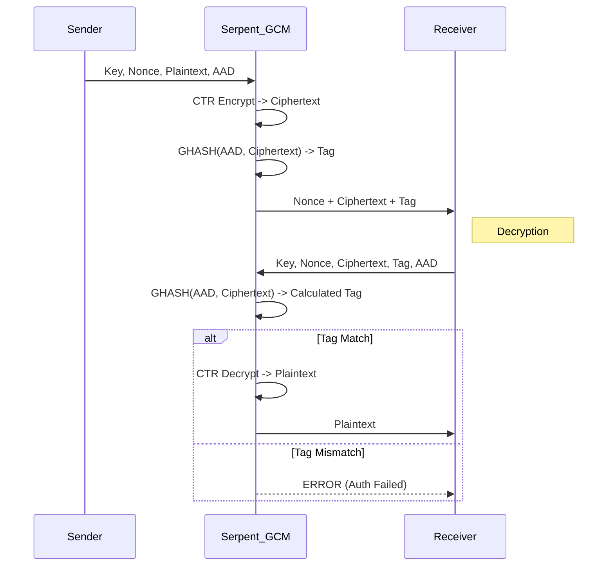

# Serpent-GCM (Galois/Counter Mode)

## 1. Khái niệm & mục tiêu
**Serpent-GCM** kết hợp block cipher Serpent (ứng viên chung kết AES, thiết kế bảo thủ 32 vòng) với AEAD GCM. Mục tiêu: ưu tiên biên độ an toàn dài hạn; dùng cho hồ sơ `PARANOID` của FileVault.

## 2. Toán học, công thức
*   **Serpent**: mạng SP với 8 S-box 4x4, 32 vòng; bit-slice để chạy nhanh và constant-time trên CPU 32/64 bit.
*   **GCM**: CTR + GHASH trên $GF(2^{128})$; tag = $E_K(J_0) \oplus \text{GHASH}(AAD, C)$.
*   **Biên độ an toàn**: 32 vòng > số vòng tối thiểu, nhằm chống các kỹ thuật phân tích trong tương lai.

## 3. Cách hoạt động
1. Sinh nonce 96-bit; tạo counter $J_0$.
2. Serpent-CTR tạo keystream; XOR với plaintext → ciphertext.
3. GHASH(AAD, ciphertext) → tag 16 byte; giải mã chỉ khi tag khớp (so sánh hằng thời gian).

## 4. Cấu trúc dữ liệu
*   **Key**: 256 bit mặc định (hỗ trợ 128/192/256).
*   **Nonce**: 96 bit (12 byte) duy nhất per-key.
*   **Tag**: 128 bit (16 byte).
*   **Block**: 128 bit.

## 5. So sánh với AES-GCM
| Đặc điểm | Serpent-GCM | AES-GCM |
| :--- | :--- | :--- |
| **An toàn dài hạn** | Margin rất cao (32 vòng) | Cao nhưng margin thấp hơn |
| **Hiệu năng SW** | Chậm hơn ~2-3x | Nhanh (đặc biệt với AES-NI) |
| **Ứng dụng** | Archival, dữ liệu cực nhạy cảm | Đa dụng, mặc định |

## 6. Luồng dữ liệu (Sequence Diagram)



## 7. Sai lầm triển khai phổ biến
1. **Nonce reuse**: tái sử dụng nonce với cùng key phá vỡ bảo mật.
2. **Bit-slice không constant-time**: tối ưu SIMD sai gây rò rỉ.
3. **Giảm số vòng**: cắt vòng để tăng tốc làm giảm biên độ an toàn.
4. **Tag truncation**: cắt tag < 96 bit làm yếu xác thực.

## 8. Threat Model
*   **Forgery/tamper**: sửa ciphertext → tag sai → từ chối giải mã.
*   **Side-channel**: tránh bảng S-box phụ thuộc dữ liệu; ưu tiên bit-slice constant-time.
*   **Nonce collision**: RNG/counter lỗi.

## 9. Biện pháp giảm thiểu
*   Nonce 96-bit duy nhất per-key; dùng counter monotonic hoặc CSPRNG + kiểm va chạm.
*   Giữ tag 128 bit; so sánh hằng thời gian.
*   Không thay đổi số vòng; dùng thư viện chuẩn (Botan/OpenSSL nếu có Serpent) với bit-slice constant-time.
*   Đưa metadata vào AAD; thêm chống replay bằng version/timestamp.

## 10. Test Vectors
*   Không có bộ FIPS; dùng vector từ Crypto++/Botan test suite hoặc tự sinh bằng Botan `aead --cipher Serpent/GCM` với (key, nonce, aad, pt) cố định và ghi lại (ct, tag).
*   Lưu vector nội bộ vào tests của FileVault để tránh hồi quy.

## 11. Ví dụ code (C++ với Botan)
```cpp
auto aead = Botan::AEAD_Mode::create("Serpent/GCM", Botan::ENCRYPTION);
aead->set_key(key);
aead->start(nonce);
aead->set_associated_data(aad);
auto buf = plaintext;
aead->finish(buf); // buf = ciphertext || tag
```

## 12. Checklist bảo mật
- [ ] Nonce 96-bit duy nhất; log/counter để chống trùng.
- [ ] Tag 128-bit; so sánh hằng thời gian.
- [ ] Không giảm số vòng, không dùng S-box bảng phụ thuộc dữ liệu.
- [ ] Bao gồm metadata vào AAD; cân nhắc chống replay.
- [ ] Kiểm thử bằng vector nội bộ sau mọi tối ưu hóa.

## 13. Hạn chế (nếu có)
- Hiệu năng: thường chậm hơn AES-GCM (đặc biệt trên CPU có AES-NI) — chi phí CPU cao hơn do bit-slicing/32 vòng.
- Hỗ trợ hạn chế: ít phần cứng tăng tốc và thư viện phổ biến so với AES; có thể gây khó khăn khi tích hợp.
- Chuẩn hóa: Serpent không phải là AES/FIPS; interoperability với hệ thống yêu cầu chuẩn FIPS/AES có thể bị hạn chế.
- Độ phức tạp triển khai: đảm bảo bit-slice constant-time và GHASH an toàn tốn công hơn.
- Rủi ro vận hành: vẫn phụ thuộc nghiêm ngặt vào tính duy nhất của nonce và kích thước tag; nonce reuse hoặc tag truncation phá vỡ bảo mật.

## 14. Ứng dụng
- Lưu trữ lưu trữ dài hạn / hồ sơ cực kỳ nhạy cảm (archival with paranoid security profile).
- Môi trường phần mềm-only nơi hiệu năng không là ưu tiên chính nhưng cần biên độ an toàn cao.
- Hệ thống yêu cầu cipher thay thế có margin bảo mật lớn hơn AES cho dự phòng tương lai.
- Nghiên cứu mật mã và thử nghiệm thuật toán thay thế.

## 15. Nguồn tham khảo
- Serpent — Anderson, Biham, Knudsen (đề xuất Serpent): https://www.cl.cam.ac.uk/~rja14/serpent.html  
- The Galois/Counter Mode (GCM) — McGrew & Viega (2004): https://cse.ucsd.edu/~dan/papers/gcm-spec.pdf  
- NIST SP 800-38D — Recommendation for GCM (GHASH and AEAD details): https://nvlpubs.nist.gov/nistpubs/Legacy/SP/nistspecialpublication800-38d.pdf  
- Botan (AEAD / Serpent usage, test vectors): https://botan.randombit.net/manual/  
- Crypto++ library and test suite (vectors & implementations): https://www.cryptopp.com/
- Thực hành an toàn AEAD: không tái sử dụng nonce, giữ tag đầy đủ, so sánh hằng thời gian (tài liệu NIST/Botan/Crypto++).
