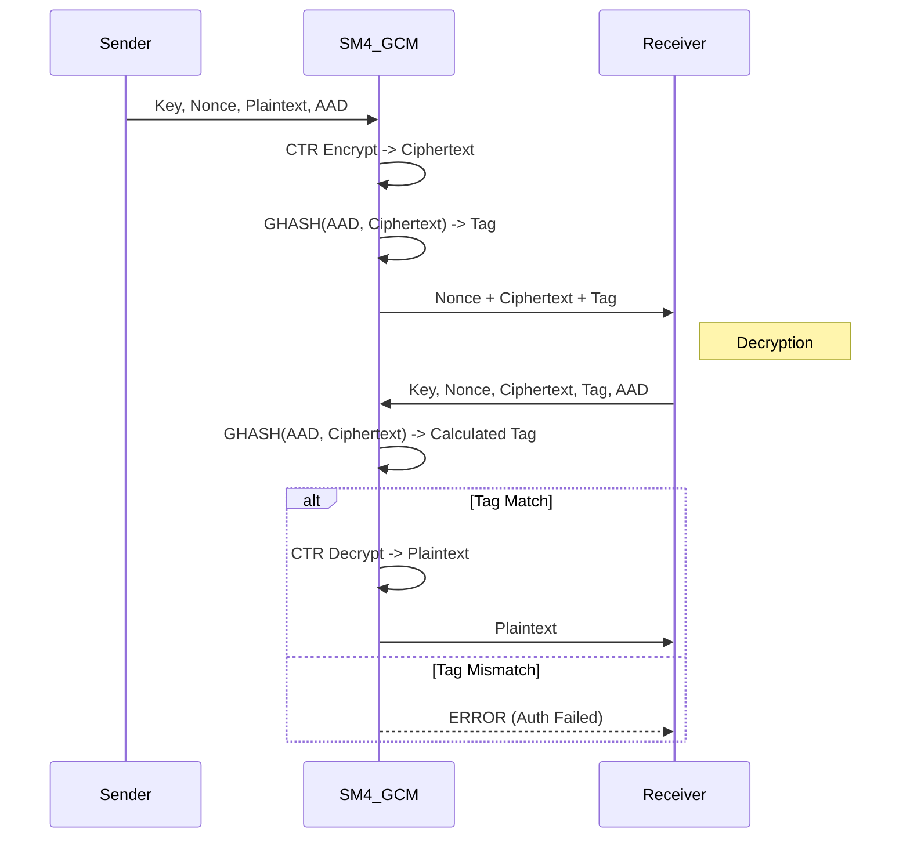

# SM4-GCM (Galois/Counter Mode)

## 1. Khái niệm & mục tiêu
**SM4-GCM** kết hợp block cipher SM4 (GB/T 32907-2016, bắt buộc trong WAPI) với AEAD GCM. Mục tiêu: đáp ứng yêu cầu tuân thủ chuẩn Trung Quốc, đồng thời thêm xác thực và song song hóa thay vì dùng CBC/ECB.

## 2. Toán học, công thức
*   **SM4**: 32 vòng unbalanced Feistel; mỗi vòng dùng S-box 8x8 và tuyến tính L() trên $GF(2^{32})$.
*   **GCM**: CTR + GHASH trên $GF(2^{128})$; tag = $E_K(J_0) \oplus \text{GHASH}(AAD, C)$.
*   Key duy nhất 128 bit; dễ triển khai phần cứng và phần mềm nhẹ.

## 3. Cách hoạt động
1. Nonce 96-bit sinh ngẫu nhiên; tạo counter $J_0$.
2. SM4-CTR tạo keystream; XOR plaintext → ciphertext.
3. GHASH(AAD, ciphertext) → tag 16 byte; giải mã chỉ khi tag khớp.

## 4. Cấu trúc dữ liệu
*   **Key**: 128 bit (cố định).
*   **Nonce**: 96 bit (12 byte) duy nhất per-key.
*   **Tag**: 128 bit (16 byte).
*   **Block**: 128 bit.

## 5. So sánh với AES-GCM
| Đặc điểm | SM4-GCM | AES-GCM |
| :--- | :--- | :--- |
| **Chuẩn** | GB/T 32907 (CN), WAPI | FIPS 197, toàn cầu |
| **Hiệu năng HW nội địa** | Tốt (chip TPM/TCM hỗ trợ) | Rất tốt với AES-NI |
| **Độ dài key** | 128 bit cố định | 128/192/256 |

## 6. Luồng dữ liệu (Sequence Diagram)



## 7. Sai lầm triển khai phổ biến
1. **Nonce reuse**: dùng lại nonce với cùng key → rò rỉ keystream và giả mạo.
2. **Không kiểm tag trước giải mã**: dễ bị tấn công bit-flip trả về rác.
3. **Sai padding độ dài trong GHASH**: quên thêm trường length 64-bit cho AAD/ciphertext.
4. **Dùng CBC/ECB thay vì GCM**: mất xác thực, dễ tấn công hoán vị block.

## 8. Threat Model
*   **Tamper trên đĩa**: sửa ciphertext → tag sai → giải mã bị từ chối.
*   **Nonce collision**: RNG kém hoặc counter lỗi.
*   **Side-channel**: triển khai bảng S-box phải constant-time (tránh cache timing).

## 9. Biện pháp giảm thiểu
*   Nonce 96-bit duy nhất; lưu counter hoặc dùng CSPRNG chất lượng cao.
*   Kiểm tra tag hằng thời gian trước khi xử lý plaintext.
*   Đưa metadata (filename, version, policy) vào AAD; cân nhắc chống replay.
*   Nếu mã hóa khối lượng lớn, cân nhắc xoay key để giảm rủi ro nonce collision.

## 10. Test Vectors
*   Bộ vector công khai: GM/T 0002-2012 test set, RFC 8998 Appendix A (SM4 suite), và NIST CAVP (SM4-GCM) nếu có.
*   Khuyến nghị tự sinh vector bằng OpenSSL (bản có SM4) hoặc Botan và lưu vào tests của FileVault.

## 11. Ví dụ code (OpenSSL CLI)
```bash
openssl enc -sm4-gcm -K <hexkey> -iv <hexnonce> -in plaintext.bin -aad <hexaad> -out ciphertext.bin -nopad -p
# Tag in ra màn hình (tag = ...)
```

## 12. Checklist bảo mật
- [ ] Nonce 96-bit duy nhất; không reuse.
- [ ] Tag 128-bit; so sánh hằng thời gian.
- [ ] Metadata vào AAD; chống replay nếu cần.
- [ ] Dùng thư viện được kiểm toán (OpenSSL/Botan) thay vì tự cài đặt.
- [ ] Kiểm thử bằng vector GM/T hoặc nội bộ sau mỗi thay đổi.
## 13. Hạn chế (nếu có)
- Khóa cố định 128-bit — không có tùy chọn độ dài lớn hơn như AES; không tự động cung cấp forward secrecy (phải kết hợp với KDF/EPHEMERAL keys).
- Rủi ro nếu reuse nonce hoặc cắt tag (truncated tag) → mất bảo mật/khả năng bị tấn công giả mạo.
- Giới hạn thực tế về lượng dữ liệu xử lý trên một cặp key/nonce (xem NIST SP 800-38D); vượt ngưỡng giảm an toàn.
- Vấn đề hiện thực: side-channel (S-box, table lookups), lỗi lập trình GHASH (padding/length) hoặc so sánh tag không hằng thời gian.
- Hỗ trợ phần cứng/driver có thể khác nhau theo nền tảng—tại một số môi trường ngoài Trung Quốc, SM4 HW acceleration ít phổ biến.

## 14. Ứng dụng
- Mã hóa file/volume và lưu trữ bảo mật (FileVault, secure backups).
- Giao thức mạng: TLS/DTLS/IPsec/SSH extensions khi cần chuẩn SM4 cho môi trường CN hoặc tương thích WAPI.
- Mã hóa endpoint/firmware, messaging và containers trong hệ sinh thái yêu cầu chuẩn Trung Quốc.
- Tích hợp TPM/TCM và thiết bị nhúng có hỗ trợ SM4 để tăng hiệu năng phần cứng.

## 15. Nguồn tham khảo
- GB/T 32907-2016 — SM4 standard (Trung Quốc).  
- GM/T 0002-2012 — bộ test vectors SM4.  
- NIST SP 800-38D — Galois/Counter Mode (GCM) specification.  
- RFC 8998 — SM4 suite (tham khảo triển khai/profiles).  
- NIST CAVP — kiểm thử và test vectors cho thuật toán khối/AEAD.  
- OpenSSL, Botan documentation — ví dụ CLI/API cho SM4-GCM.  
- Tài liệu nội bộ/whitepapers về WAPI và triển khai SM4 trên TPM/TCM.

(Add hoặc tham chiếu chính xác các link/tài liệu nội bộ theo chính sách dự án.)
