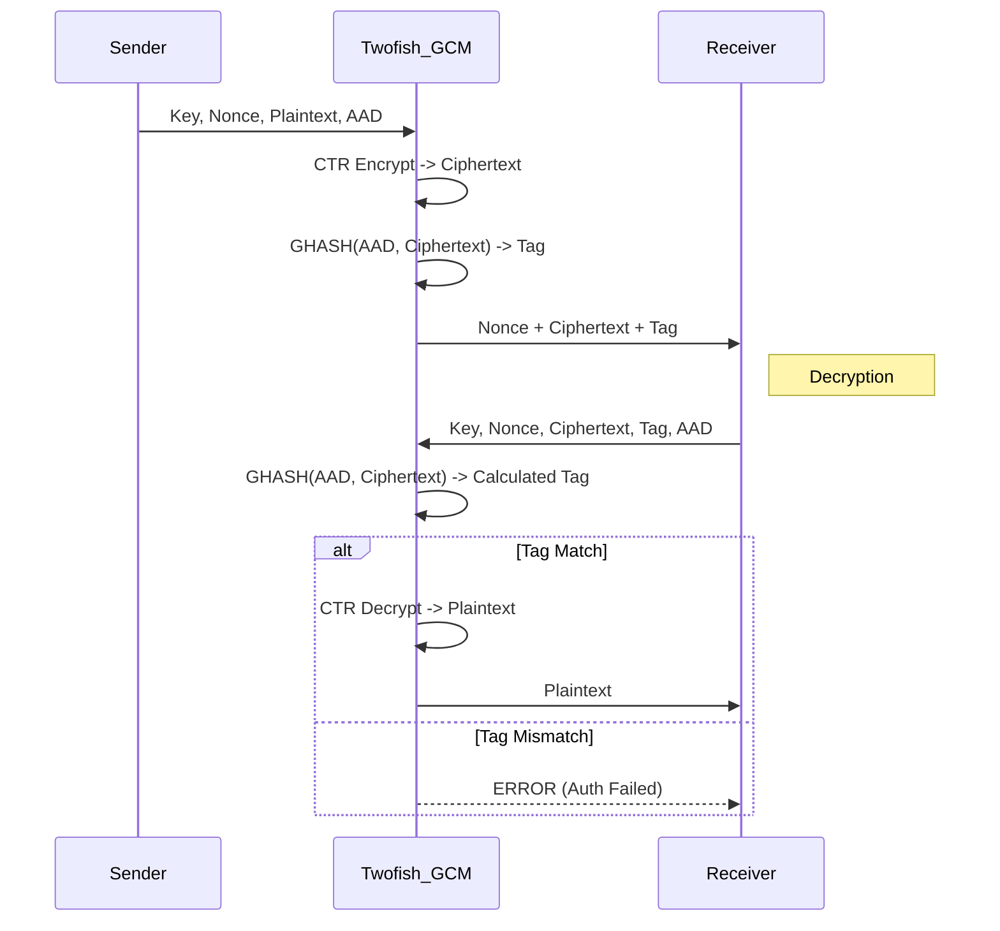

# Twofish-GCM (Galois/Counter Mode)

## 1. Khái niệm & mục tiêu
**Twofish-GCM** ghép block cipher Twofish (ứng viên chung kết AES của Schneier et al.) với AEAD GCM. Mục tiêu: cung cấp lựa chọn ngoài AES, với S-box phụ thuộc khóa và thiết kế mở.

## 2. Toán học, công thức
*   **Twofish**: 16 vòng Feistel; S-box phụ thuộc khóa; hàm $h()$ dựa trên MDS matrix và Reed-Solomon code; whitening keys cho cả trước và sau vòng.
*   **GCM**: CTR + GHASH trên $GF(2^{128})$; tag = $E_K(J_0) \oplus \text{GHASH}(AAD, C)$.
*   **Key sizes**: 128/192/256 bit; FileVault ưu tiên 256.

## 3. Cách hoạt động
1. Lập lịch khóa Twofish để sinh subkeys + S-box phụ thuộc khóa.
2. Twofish-CTR tạo keystream; XOR plaintext → ciphertext.
3. GHASH(AAD, ciphertext) → tag 16 byte; giải mã chỉ khi tag khớp hằng thời gian.

## 4. Cấu trúc dữ liệu
*   **Key**: 128/192/256 bit.
*   **Nonce**: 96 bit (12 byte) duy nhất per-key.
*   **Tag**: 128 bit (16 byte).
*   **Block**: 128 bit.

## 5. So sánh với AES-GCM
| Đặc điểm | Twofish-GCM | AES-GCM |
| :--- | :--- | :--- |
| **Bảo mật** | S-box phụ thuộc khóa, margin tốt | An toàn, cấu trúc đơn giản |
| **Hiệu năng** | Chậm hơn (không có AES-NI) | Rất nhanh (AES-NI) |
| **Key schedule** | Nặng hơn (tính S-box) | Nhẹ hơn |

## 6. Luồng dữ liệu (Sequence Diagram)



## 7. Sai lầm triển khai phổ biến
1. **Nonce reuse**: tái sử dụng nonce với cùng key phá vỡ bảo mật.
2. **Không cache subkeys/S-box**: tính lại cho từng file nhỏ làm giảm hiệu năng.
3. **Tag truncation < 96 bit**: giảm an toàn xác thực.
4. **Key schedule tự viết**: dễ sai trong bước Reed-Solomon/MDS; nên dùng thư viện.

## 8. Threat Model
*   **Tamper/forgery**: sửa ciphertext → tag sai → từ chối giải mã.
*   **Side-channel**: triển khai Twofish có bảng S-box; cần constant-time để tránh cache timing.
*   **Nonce collision**: RNG/counter lỗi.

## 9. Biện pháp giảm thiểu
*   Nonce 96-bit duy nhất; dùng counter monotonic hoặc CSPRNG mạnh.
*   Duy trì tag 128 bit; so sánh hằng thời gian.
*   Dùng thư viện đã kiểm toán (Botan/OpenSSL nếu build có Twofish) thay vì tự triển khai.
*   Bao gồm metadata (filename, version) trong AAD; chống replay bằng version/timestamp.

## 10. Test Vectors
*   NESSIE/Twofish test set và bộ vector cộng đồng (Botan/Crypto++); không có bộ FIPS chính thức.
*   Khuyến nghị tự sinh vector (key/nonce/aad/pt → ct/tag) và thêm vào tests FileVault cho hồi quy.

## 11. Ví dụ code (C++ với Botan)
```cpp
auto aead = Botan::AEAD_Mode::create("Twofish/GCM", Botan::ENCRYPTION);
aead->set_key(key);
aead->start(nonce);
aead->set_associated_data(aad);
auto buf = plaintext;
aead->finish(buf); // buf = ciphertext || tag
```

## 12. Checklist bảo mật
- [ ] Nonce 96-bit duy nhất per-key.
- [ ] Tag 128-bit, so sánh hằng thời gian.
- [ ] Dùng key 256-bit cho mức bảo mật cao; xoay key nếu cần.
- [ ] Đưa metadata vào AAD; chống replay.
- [ ] Kiểm thử bằng vector NESSIE/Botan hoặc nội bộ sau mỗi thay đổi.


## 13. Hạn chế (nếu có)
* Hiệu năng kém so với AES-GCM trên phần cứng có AES-NI; không có gia tốc phổ biến.
* Hỗ trợ thư viện/protocol hạn chế — có thể gặp vấn đề tương thích.
* Rủi ro triển khai: nonce reuse, không thực hiện constant-time cho S-box/table gây side-channel.
* GCM có giới hạn an toàn về số block/khóa và yêu cầu quản lý nonce chính xác.
* Ít bộ vector chuẩn và đánh giá cộng đồng so với AES.

## 14. Ứng dụng
* Mã hóa ổ đĩa và FileVault như lựa chọn thay thế AES.
* Lưu trữ/các hệ thống sao lưu cần AEAD với cipher ngoài AES.
* Môi trường yêu cầu đa dạng thuật toán (crypto agility) hoặc tránh AES vì chính sách.
* Ứng dụng phần mềm/embedded nơi không có AES hardware support nhưng chấp nhận chi phí CPU.

## 15. Nguồn tham khảo
* Schneier, et al. — The Twofish Encryption Algorithm (1998).
* McGrew & Viega — The Galois/Counter Mode of Operation (GCM), 2004.
* NIST SP 800-38D — Recommendation for Block Cipher Modes of Operation: GCM.
* RFC 5116 — An Interface and Algorithms for Authenticated Encryption.
* NESSIE test vectors; Botan and Crypto++ documentation (Twofish implementations).
* Tham khảo triển khai đã được kiểm toán khi áp dụng (ví dụ: Botan, OpenSSL nếu hỗ trợ).