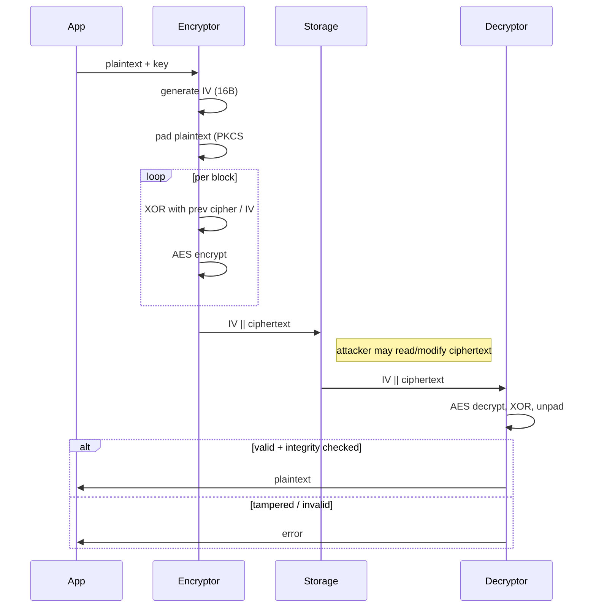

# AES-CBC — Tài liệu (FileVault context)

## 0. FileVault context
AES-CBC được FileVault dùng để mã hóa dữ liệu trên đĩa; hỗ trợ khóa 128/192/256 bit và padding PKCS#7. Trong codebase, AES-CBC được xếp mức bảo mật MEDIUM/WEAK; khuyến nghị dùng AEAD (AES-GCM / ChaCha20-Poly1305) cho các chế độ STRONG/PARANOID.

## 1. Khái niệm — Thuật toán, giải quyết vấn đề gì, bảo vệ cái gì
AES-CBC là một mode of operation cho AES (mã hóa khối) nhằm bảo mật tính bảo mật (confidentiality) của dữ liệu lớn hơn một block. CBC bảo vệ nội dung khỏi đọc trực tiếp song không cung cấp tính toàn vẹn hoặc xác thực — do đó cần kết hợp thêm MAC/AEAD để ngăn sửa đổi.

## 2. Toán học, công thức
CBC vận hành trên các block $P_i$ (plaintext) và $C_i$ (ciphertext) với IV $C_0$:
- Mã hóa: $C_i = E_K(P_i \oplus C_{i-1})$
- Giải mã: $P_i = D_K(C_i) \oplus C_{i-1}$
- $C_0 = IV$ (IV phải ngẫu nhiên và độc nhất cho mỗi mã hóa)

(Chú ý: AES block size cố định = 128 bit)

## 3. Cách hoạt động (tóm tắt bước)
1. Mở rộng khóa (Key Expansion).
2. Sinh IV ngẫu nhiên 16 bytes nếu chưa có.
3. Pad plaintext theo PKCS#7 tới bội số 16 bytes.
4. Với mỗi block:
    - XOR $P_i$ với $C_{i-1}$ (hoặc IV cho $i=1$).
    - Áp dụng AES encrypt với khóa $K$ để ra $C_i$.
5. Kết quả thường được lưu dưới dạng: $IV \parallel C_1 \parallel \dots \parallel C_n$.

## 4. Cấu trúc dữ liệu
- Block size: 128 bits (16 bytes).  
- Key size: 128 / 192 / 256 bits (FileVault khuyến nghị 256-bit).  
- IV (nonce): 16 bytes, phải ngẫu nhiên và không tái sử dụng.  
- Padding: PKCS#7 (giá trị byte bằng số byte padding).

## 5. So sánh với các mode khác
- AES-ECB: đơn giản, nhưng không an toàn (lộ mẫu).  
- AES-CTR: parallelizable, nhưng không có xác thực; cần nonce duy nhất.  
- AES-GCM: AEAD (xác thực + mã hóa), parallelizable; ưu tiên dùng cho bảo mật cao.  
Tóm tắt: CBC cung cấp confidentiality nhưng không integrity — kém hơn AEAD.

## 6. Luồng hoạt động (sequence diagram)


## 7. Các sai lầm triển khai phổ biến
- Dùng IV tĩnh hoặc dự đoán được → lộ mẫu, CPA.  
- Không dùng MAC / xác thực → bit-flipping attack.  
- Xử lý lỗi padding khác biệt (padding oracle).  
- Tái sử dụng key/IV cho nhiều mục tiêu.  
- Không xóa key khỏi bộ nhớ sau dùng.

## 8. Threat Model
- Asset: nội dung file người dùng.  
- Attacker: có thể đọc và sửa file ciphertext (local attacker hoặc attacker với write access).  
- Vectơ tấn công chính: bit-flipping, padding oracle, replay (IV reuse).  
- Mức nguy cơ: padding oracle — Critical; bit-flipping — High.

## 9. Biện pháp giảm thiểu
- Ưu tiên: chuyển sang AEAD (AES-GCM / ChaCha20-Poly1305).  
- Nếu bắt buộc dùng CBC:
  - Sử dụng Encrypt-then-MAC (HMAC-SHA256) với MAC kiểm tra trước khi giải mã.  
  - IV = CSPRNG 16 bytes, không lặp lại.  
  - Key management: dùng KDF/CSPRNG; chia key cho AES và HMAC.  
  - Xử lý lỗi thống nhất (constant-time responses).  
  - Xóa key ra khỏi RAM (secure zeroization).

## 10. Test Vectors (hex)
Vector minh họa (trích, 1 block):
- AES-128-CBC  
  - Key: 2b7e151628aed2a6abf7158809cf4f3c  
  - IV: 000102030405060708090a0b0c0d0e0f  
  - Plaintext: 6bc1bee22e409f96e93d7e117393172a  
  - Ciphertext: 7649abac8119b246cee98e9b12e9197d
- AES-256-CBC  
  - Key: 603deb1015ca71be2b73aef0857d77811f352c073b6108d72d9810a30914dff4  
  - IV: 000102030405060708090a0b0c0d0e0f  
  - Plaintext: 6bc1bee22e409f96e93d7e117393172a  
  - Ciphertext: f58c4c04d6e5f1ba779eabfb5f7bfbd6

## 11. Ví dụ code (Python, ngắn)
```python
# minimal AES-CBC encrypt/decrypt (no MAC) — dùng cryptography
import os
from cryptography.hazmat.primitives.ciphers import Cipher, algorithms, modes
from cryptography.hazmat.primitives import padding

def encrypt_aes_cbc(key, plaintext):
     iv = os.urandom(16)
     padder = padding.PKCS7(128).padder()
     pt = padder.update(plaintext) + padder.finalize()
     cipher = Cipher(algorithms.AES(key), modes.CBC(iv))
     ct = cipher.encryptor().update(pt) + cipher.encryptor().finalize()
     return iv + ct

def decrypt_aes_cbc(key, data):
     iv, ct = data[:16], data[16:]
     cipher = Cipher(algorithms.AES(key), modes.CBC(iv))
     pt_padded = cipher.decryptor().update(ct) + cipher.decryptor().finalize()
     unpadder = padding.PKCS7(128).unpadder()
     return unpadder.update(pt_padded) + unpadder.finalize()
```
(Lưu ý: luôn kèm HMAC hoặc dùng AEAD trong thực tế.)

## 12. Checklist bảo mật
- [ ] Key từ CSPRNG / KDF, không hardcode.  
- [ ] IV ngẫu nhiên 16 bytes mỗi lần, không tái sử dụng.  
- [ ] Dùng Encrypt-then-MAC hoặc AEAD.  
- [ ] Kiểm tra MAC trước giải mã.  
- [ ] Trả lỗi đồng nhất (constant-time).  
- [ ] Zeroize key sau dùng.  
- [ ] Logging hạn chế, không lộ thông tin padding/error nội bộ.

## 13. Hạn chế (nếu có)
- Không cung cấp integrity/authentication.  
- Dễ bị padding oracle nếu xử lý lỗi kém.  
- Giải mã khó parallelize (hiệu năng thấp so với CTR/GCM).

## 14. Ứng dụng
- Lưu trữ mã hóa file/volume (khi kết hợp MAC).  
- Hệ thống tương thích cũ; không dùng cho giao tiếp mạng mới nếu AEAD khả dụng.

## 15. Nguồn tham khảo
- NIST SP 800-38A (modes of operation)  
- RFC 3602 / RFC 5649 (AES-CBC usage and padding topics)  
- Vaudenay, S. — Padding oracle attack papers and analyses  
- Cryptography libraries docs: Botan, OpenSSL, cryptography.io

— End of document.
