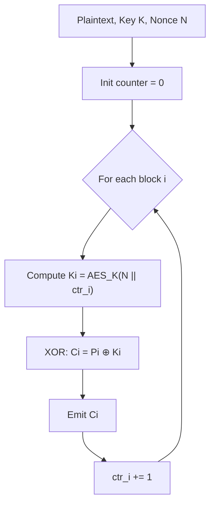

# AES-CTR (Counter Mode)

## 0. Filevault context  
- Vị trí: /algorithms/symmetric/non-ahead/aes-ctr.md  
- Mục tiêu: mô tả AES-CTR cho tài liệu Filevault (block-level/stream-like encryption, random access).

## 1. Khái niệm — Thuật toán giải quyết vấn đề gì, bảo vệ cái gì  
- AES-CTR biến AES (block cipher) thành stream cipher bằng cách mã hóa các counter để sinh keystream.  
- Giải quyết: mã hóa dữ liệu kích thước bất kỳ, cho phép random-access và song song hóa.  
- Bảo vệ: tính bí mật (confidentiality) của plaintext nếu Nonce/Key đúng; không cung cấp integrity/authentication.

## 2. Toán học, công thức  
- Định nghĩa ký hiệu:
	- K: khóa AES; P_i, C_i: plaintext/ciphertext block i (128-bit); N: nonce; ctr_i: giá trị counter cho block i; n_ctr: số bit dành cho counter.
	- Kết hợp nonce/counter thành khối đầu vào AES là IV_i = N || ctr_i (độ dài 128 bit).
- Công thức (hiển thị):
	$$\text{IV}_i = N \,\|\, \text{ctr}_i,\qquad \text{ctr}_i = (\text{ctr}_0 + i)\bmod 2^{n_{ctr}}$$
	$$S_i = E_K(\text{IV}_i)$$
	$$C_i = P_i \oplus S_i$$
	$$P_i = C_i \oplus S_i$$
- Ràng buộc quan trọng:
	- $N$ phải là unique per key; $n_{ctr}$ đủ lớn để tránh tràn.  
	- Quy định rõ endianness và kích thước của trường $\text{ctr}_i$ khi nối ($\|$).
- Thuật toán (pseudocode, block size = 128 bit):
```python
# inputs: K, N, ctr0, plaintext P (bytes)
# parameters: n_ctr (bits), block_size = 16
def aes_ctr_encrypt(K, N, ctr0, P):
		C = b''
		for i in range(0, ceil(len(P)/block_size)):
				ctr_i = (ctr0 + i) % (1 << n_ctr)
				IV = concat_nonce_and_counter(N, ctr_i, n_ctr, endian='big')  # specify endian
				S = AES_encrypt_block(K, IV)
				Pblock = get_block(P, i, block_size)  # pad or handle partial block as defined
				C += xor_bytes(Pblock, S)[: len(Pblock)]
		return C
```
- Ghi chú: dùng thư viện CTR mode của crypto provider khi có sẵn để tránh lỗi định dạng counter.

## 3. Cách hoạt động (tóm tắt)  
- Chọn Nonce N (unique per key), khởi tạo counter (thường từ 0).  
- Với mỗi block i: sinh keystream bằng AES encrypt của (N || ctr_i), XOR với block plaintext.  
- Tăng counter cho block tiếp theo.

## 4. Cấu trúc dữ liệu  
- Key: 128 / 192 / 256 bit.  
- Nonce/IV: thường 64–128 bit (must be unique per key).  
- Counter: phần tăng dần (doanh số bit cho phép increment).  
- Block: 128-bit (AES block size).  
- Lưu trữ metadata: nonce per-file/segment, initial counter, block index.

## 5. So sánh với các thuật toán khác  
- CTR vs CBC: CTR cho random access và parallel, CBC không cho random access và cần IV ngẫu nhiên.  
- CTR vs GCM: GCM cung cấp cả confidentiality + integrity (AEAD); CTR cần kết hợp MAC/HMAC để có integrity.  
- CTR vs OFB/CFB: CTR đơn giản hơn, parallelizable; OFB/CFB có khác biệt về lỗi-sinh và lỗi lan truyền.

## 6. Luồng hoạt động (mermaid)


## 7. Các sai lầm triển khai phổ biến  
- Tái sử dụng Nonce với cùng Key (CRITICAL).  
- Sử dụng Nonce ngẫu nhiên nhưng không kiểm soát trùng lặp ở scale lớn.  
- Kết hợp CTR mà không có authentication (không dùng MAC/AEAD).  
- Không chuẩn hóa endian/format của counter dẫn tới incompatibility.  
- Dùng counter quá ngắn, tràn counter.

## 8. Threat Model  
- Kẻ tấn công có thể đọc/bit-flip ciphertext, chèn/tái phát.  
- Không ngăn chặn rò rỉ metadata (nonce, counters) nếu không bảo vệ.  
- Mối nguy chính: nonce reuse -> phá hủy tính bảo mật.

## 9. Biện pháp giảm thiểu  
- Guarantee unique Nonce per Key (use per-file monotonic counter, or construct from (file-id || block-index)).  
- Sử dụng AEAD (AES-GCM) hoặc thêm HMAC/Encrypt-then-MAC.  
- Kiểm soát và rotate key khi cần.  
- Kiểm tra overflow counter, dự phòng khi counter đầy.  
- Log/verify metadata integrity.

## 10. Test Vectors (AES-128-CTR, minh họa)  
- Key: 2b7e151628aed2a6abf7158809cf4f3c  
- Nonce/IV (initial counter block): f0f1f2f3f4f5f6f7f8f9fafbfcfdfeff  
- Plaintext (1 block): 6bc1bee22e409f96e93d7e117393172a  
- Keystream (AES-128 encrypt IV): 874d6191b620e3261bef6864990db6ce  
- Ciphertext:  (plaintext XOR keystream) = f5f1c9379a8b5f77b68a4d7da537f294

(Tham khảo NIST/ RFC cho test vectors chính thức.)

## 11. Code (tùy chọn, Python pseudocode)
```python
# requires cryptography
from cryptography.hazmat.primitives.ciphers import Cipher, algorithms, modes

def aes_ctr_encrypt(key, nonce, plaintext):
		# Construct initial counter block (nonce || counter)
		# Use library CTR mode to avoid manual counter mistakes
		cipher = Cipher(algorithms.AES(key), modes.CTR(nonce))
		encryptor = cipher.encryptor()
		return encryptor.update(plaintext) + encryptor.finalize()
```

## 12. Checklist bảo mật (ngắn)  
- [ ] Nonce unique per key.  
- [ ] Use AEAD or Encrypt-then-MAC.  
- [ ] Proper counter size and overflow handling.  
- [ ] Consistent endian/format.  
- [ ] Key management & rotation.  
- [ ] Testing with official vectors.

## 13. Hạn chế (nếu có)  
- Không cung cấp integrity by default.  
- Nonce reuse dẫn tới catastrophic failure.  
- Keystream reuse dễ dàng lộ thông tin.

## 14. Ứng dụng  
- Disk/volume encryption (random access).  
- Network streaming, VPNs (khi có integrity layer).  
- Protocols cần parallel encryption.

## 15. Nguồn tham khảo  
- NIST SP 800-38A (Block Cipher Modes of Operation)  
- FIPS 197 (AES specification)  
- RFC 3686 (AES-CTR usage)  
- Các bài viết về misuse of IV/nonce (nonce-reuse pitfalls)

Ghi chú: luôn ưu tiên AEAD (ví dụ AES-GCM hoặc ChaCha20-Poly1305) nếu cần confidentiality + integrity.
