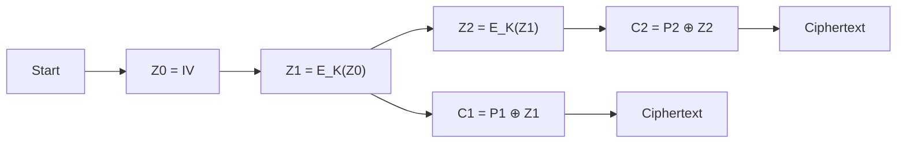

# AES-OFB (Output Feedback Mode)

## 0. Filevault context
Tài liệu này mô tả AES-OFB dùng trong Filevault để biến AES block cipher thành một synchronous stream cipher — phù hợp cho mã hóa luồng dữ liệu, pre-computation keystream, nhưng không cung cấp tính toàn vẹn.

## 1. Khái niệm thuật toán
AES-OFB sinh keystream độc lập với plaintext và XOR với plaintext để tạo ciphertext. Giải quyết vấn đề: mã hóa luồng/stream, bảo vệ tính bí mật (confidentiality) của dữ liệu. Không bảo vệ tính toàn vẹn hay xác thực.

## 2. Toán học / Công thức
Khởi tạo với IV (initialization vector) và khóa $K$:
- $Z_0 = IV$
- $Z_i = E_K(Z_{i-1})$
- $C_i = P_i \oplus Z_i$
Giải mã: $P_i = C_i \oplus Z_i$ với cùng $Z_i$.

## 3. Cách hoạt động
- Tính liên tiếp $Z_i$ bằng việc mã hóa khối trước đó (không phụ thuộc plaintext/ciphertext).
- Keystream $Z_1,Z_2,\dots$ có thể được tiền tính trước (pre-computation).
- Mỗi khối plaintext XOR với keystream tương ứng → ciphertext.

## 4. Cấu trúc dữ liệu
- Key: 128/192/256 bit.
- IV: kích thước khối AES (128 bit). Nên là nonce duy nhất per encryption.
- Blocks: plaintext/ciphertext chia theo kích thước khối; nếu dữ liệu không chia hết, OFB cho phép xử lý ở mức bit/byte stream (no padding needed).

## 5. So sánh với các chế độ khác
- CTR: cũng là stream-mode, có thể precompute; CTR dùng counter thay vì mã hóa chaining IV. CTR có tính linh hoạt cao hơn về random access.
- CFB: keystream phụ thuộc ciphertext trước đó → có error propagation khác.
- CBC: block-mode, cần padding, propagation khác.
- Lợi thế OFB: không error propagation, precomputation. Hạn chế: IV reuse là thảm họa (giống CTR).

## 6. Luồng hoạt động (sequence)
mermaid


## 7. Các sai lầm triển khai phổ biến
- Tái sử dụng IV/nonce cho nhiều lần mã hóa với cùng khóa → keystream trùng → tiết lộ XOR của plaintexts.
- Không dùng IV đủ entropy hoặc IV dễ đoán.
- Coi OFB là cung cấp integrity (không).
- Lỗi trong cắt nối stream làm lộ keystream phần.

## 8. Threat Model
- Kẻ tấn công có thể quan sát ciphertexts, có thể gửi/chỉnh sửa ciphertexts (tampering).
- Không giả định kẻ tấn công biết khóa.
- Mục tiêu tấn công: phục hồi plaintext, phân tích keystream khi IV trùng, replay attacks.

## 9. Biện pháp giảm thiểu
- Luôn dùng nonce/IV duy nhất cho mỗi lần mã hóa với cùng khóa.
- Kết hợp MAC/AES-GCM hoặc encrypt-then-MAC để đảm bảo tính toàn vẹn và xác thực.
- Sử dụng KDF/nonce management để tránh reuse.
- Log và kiểm tra nguồn IV.

## 10. Test Vectors
Tham khảo NIST SP 800-38A cho test vectors chính thức. (Ở môi trường test, kiểm tra rằng việc mã hóa rồi giải mã khôi phục plaintext và rằng cùng IV+key tạo ra same keystream.)

Ví dụ minh họa (pseudo):
- Key = 0x00...01 (128-bit)
- IV  = 0x00...02 (128-bit)
- P1  = 0x11223344...
- Kiểm tra: Z1 = AES_Encrypt(K, IV); C1 = P1 ⊕ Z1

## 11. Code (ngắn — tuỳ chọn)
Python (pycryptodome):
```python
from Crypto.Cipher import AES
key = b'16bytekeyforaes'
iv  = b'16byteinitvector'
cipher = AES.new(key, AES.MODE_OFB, iv=iv)
ct = cipher.encrypt(plaintext)
```

## 12. Checklist bảo mật
- [ ] IV là nonce/unique mỗi lần.
- [ ] Key management đúng (rotation, storage).
- [ ] Dùng AEAD hoặc encrypt-then-MAC cho integrity.
- [ ] Kiểm thử với test vectors chính thức.
- [ ] Log/monitor reuse or atypical IV patterns.

## 13. Hạn chế
- Không cung cấp integrity/authentication.
- Dữ liệu bị lộ nếu IV reuse.
- Không phù hợp nếu cần random-access chặn nhỏ mà không quản lý counter/positions.

## 14. Ứng dụng
- Mã hóa luồng dữ liệu, thiết bị nhúng, khi cần pre-computation keystream.
- Không dùng làm phương pháp duy nhất nếu cần authentication.

## 15. Nguồn tham khảo
- NIST SP 800-38A — Recommendation for Block Cipher Modes of Operation
- FIPS 197 — Advanced Encryption Standard (AES)
- RFCs và tài liệu triển khai (ví dụ pycryptodome docs)
- Bài viết tham khảo về modes: Wikipedia "Block cipher mode of operation"

(Thêm test vectors chính thức → xem NIST SP 800-38A)

<!-- End of AES-OFB -->
