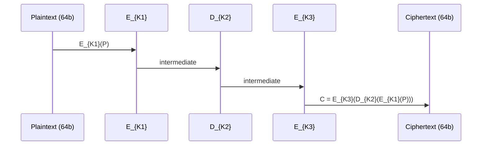

# 3DES (Triple DES)

## 0. FileVault Context
FileVault hỗ trợ 3DES chỉ để tương thích ngược với các file/hệ thống legacy. KHÔNG khuyến nghị dùng cho dữ liệu mới. Nếu có thể, migrate sang AES-GCM hoặc AEAD hiện đại.

## 1. Khái niệm — Thuật toán giải quyết vấn đề gì, bảo vệ cái gì
3DES là biến thể của DES nhằm tăng cường độ khó phá bằng cách chạy DES ba lần (EDE): bảo vệ tính bí mật (confidentiality) của khối dữ liệu 64‑bit bằng khóa dài hơn so với DES đơn.

## 2. Toán học, công thức
- Công thức (EDE) — mã hóa (hiển thị):
$$
C = E_{K_3}\bigl(D_{K_2}\bigl(E_{K_1}(P)\bigr)\bigr)
$$
- Giải mã:
$$
P = D_{K_1}\bigl(E_{K_2}\bigl(D_{K_3}(C)\bigr)\bigr)
$$
- Thông số kích thước:
    - Block size: 64 bit.
    - Keying options:
        - 3‑key: K1, K2, K3 độc lập → nominal 3×56 = 168 bit.
        - 2‑key: K1 = K3 → nominal 2×56 = 112 bit.
    - Lưu ý bảo mật: mỗi khóa DES thực tế có 56 effective bits (64 bit bao gồm 8 parity bits). Do meet‑in‑the‑middle, 3‑key 3DES thường được xem là chỉ ≈112‑bit security trong thực tế; 2‑key variant còn yếu hơn.  
- Ghi chú: tránh nêu giá trị an toàn vượt quá thực tế — tham khảo bài toán meet‑in‑the‑middle và phân tích Sweet32 cho các giới hạn thêm.

## 3. Cách hoạt động
- Với mỗi khối 64‑bit:
    1. DES encrypt với K1.
    2. DES decrypt với K2.
    3. DES encrypt với K3 → sinh ciphertext.
- Có thể dùng 2 khóa (K1=K3) hoặc 3 khóa độc lập.

## 4. Cấu trúc dữ liệu
- Khóa: K1, K2, K3 (56 effective bits mỗi DES; thực tế 168/112 bits).
- IV (nếu mode CBC): 64 bit, nên random.
- Padding: PKCS#7 hoặc tương đương cho block 64‑bit.
- Không có authentication built‑in — cần AEAD extern.

## 5. So sánh với thuật toán khác
- So với DES: bảo mật hơn do 3 bước.
- So với AES (128/192/256): AES nhanh hơn, block 128‑bit (an toàn hơn), hỗ trợ chế độ AEAD (AES‑GCM).
- So với ChaCha20: tốt cho hiệu năng trên phần mềm; 3DES chậm và block nhỏ → không khuyến nghị.

## 6. Luồng hoạt động (sequence)
Mermaid sequence:

## 7. Các sai lầm triển khai phổ biến
- Dùng ECB cho nhiều khối → rò rỉ mẫu.
- Tái sử dụng IV hoặc dùng IV không ngẫu nhiên trong CBC.
- Không kiểm tra parity/weak keys DES.
- Sử dụng 2‑key 3DES khi cần bảo mật tương đương 168‑bit.
- Không cung cấp xác thực (MAC/AE) → vulnerable to tampering.

## 8. Threat Model
- Mục tiêu: bảo vệ confidentiality chống lại kẻ tấn công passive/active.
- Khả năng kẻ tấn công: có thể quan sát ciphertext, làm chosen‑plaintext nếu local, có khả năng brute‑force tới ≈2^112 work nếu 2‑key.
- Không chống replay/tamper nếu không có AE/MAC.

## 9. Biện pháp giảm thiểu
- KHÔNG dùng 3DES cho dữ liệu mới; migrate sang AES‑GCM/ChaCha20‑Poly1305.
- Nếu bắt buộc dùng 3DES:
    - Chỉ dùng 3‑key (K1≠K2≠K3).
    - Giới hạn lượng dữ liệu trên một cặp khóa (mitigate Sweet32).
    - Dùng CBC với IV ngẫu nhiên + MAC (Encrypt‑then‑MAC) hoặc wrap trong AEAD.
    - Sử dụng KDF mạnh để sinh khóa từ master key.

## 10. Test Vectors
- Ví dụ minh họa (EDE, single block, hex):
    - K1 = 0123456789ABCDEF
    - K2 = 23456789ABCDEF01
    - K3 = 456789ABCDEF0123
    - P  = 0123456789ABCDEF
    - (Kết quả phụ thuộc triển khai DES: kiểm tra bằng thư viện tiêu chuẩn như OpenSSL để xác nhận.)
- Kiểm thử bằng OpenSSL:
    - Encryption (CBC, hex): echo -n "0123456789ABCDEF" | xxd -r -p | openssl enc -des-ede3-cbc -K <Khexs> -iv <IVhex> -nopad -nosalt | xxd -p

## 11. Code (tùy chọn)
- Lời khuyên: dùng thư viện crypto chuẩn (OpenSSL, libsodium không hỗ trợ 3DES vì deprecated). Tránh tự hiện thực DES.

## 12. Checklist bảo mật
- [ ] Không dùng cho dữ liệu mới.
- [ ] Nếu cần, dùng 3‑key, không dùng ECB.
- [ ] IV random và unique cho CBC.
- [ ] Áp dụng Encrypt‑then‑MAC hoặc AEAD wrapper.
- [ ] Giới hạn lượng dữ liệu trên một khóa (mitigate Sweet32).
- [ ] Kiểm tra/loại bỏ weak keys.
- [ ] Lưu trữ khóa an toàn, dùng KDF/HSM.

## 13. Hạn chế (nếu có)
- Block size 64‑bit → vulnerable Sweet32 khi lượng dữ liệu lớn.
- Chậm do ba lần DES.
- Không có authentication tích hợp.
- Bị NIST deprecated cho hầu hết ứng dụng mới.

## 14. Ứng dụng
- Tương thích ngược với dữ liệu legacy, phần mềm cũ, hoặc giao tiếp với hệ thống không thể nâng cấp.
- Không dùng cho hệ thống mới hoặc dữ liệu nhạy cảm.

## 15. Nguồn tham khảo
- NIST SP 800‑131A (transitioning away from 3DES) — https://csrc.nist.gov
- NIST SP 800‑67 (block cipher modes & recommendations)
- Sweet32 analysis (vulnerabilities of 64‑bit block ciphers)
- OpenSSL docs: openssl enc -des-ede3

Ghi chú: bản tóm tắt này để dùng trong FileVault docs; giữ chính sách không dùng 3DES cho dữ liệu mới và ưu tiên AES/AEAD.

