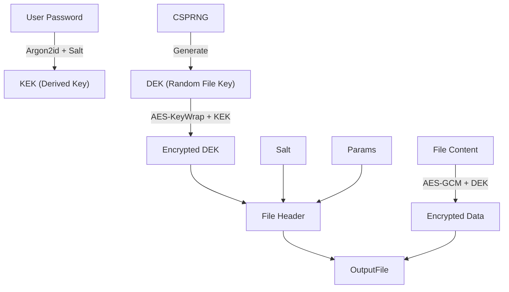

# Quản lý Khóa (Key Management)

## 1. Tổng quan
Quản lý khóa là phần quan trọng nhất và cũng khó nhất của bất kỳ hệ thống mật mã nào. "Mã hóa mạnh đến đâu cũng vô dụng nếu khóa bị lộ".

FileVault áp dụng mô hình quản lý khóa phân cấp (Hierarchy of Keys) để đảm bảo an toàn và linh hoạt.

## 2. Các loại khóa trong FileVault

### 2.1. Master Password (User Secret)
*   **Nguồn**: Do người dùng nhập vào.
*   **Lưu trữ**: **KHÔNG BAO GIỜ** được lưu trữ dưới dạng plain text. Chỉ lưu hash (Argon2) để xác thực (nếu cần).
*   **Vai trò**: Dùng để derive ra Master Key hoặc KEK.

### 2.2. Key Encryption Key (KEK)
*   **Nguồn**: Derived từ Master Password + Salt bằng Argon2id.
*   **Vai trò**: Dùng để mã hóa/giải mã Data Encryption Key (DEK).

### 2.3. Data Encryption Key (DEK)
*   **Nguồn**: Sinh ngẫu nhiên (CSPRNG) cho **mỗi file**.
*   **Độ dài**: 256 bits (32 bytes).
*   **Vai trò**: Trực tiếp mã hóa dữ liệu file (dùng AES-GCM hoặc ChaCha20).
*   **Lưu trữ**: Được mã hóa bởi KEK và lưu trong header của file (Encrypted DEK).

## 3. Vòng đời của khóa (Key Lifecycle)

1.  **Generation (Sinh khóa)**:
    *   DEK được sinh bằng `Botan::AutoSeeded_RNG` (dùng entropy từ OS).
    *   Salt và Nonce cũng được sinh mới cho mỗi file.

2.  **Derivation (Phái sinh)**:
    *   Khi người dùng nhập password, KEK được tái tạo lại bằng Argon2id với salt đọc từ file header.

3.  **Usage (Sử dụng)**:
    *   KEK giải mã Encrypted DEK -> Raw DEK.
    *   Raw DEK được nạp vào Crypto Engine để giải mã dữ liệu.
    *   **Quan trọng**: Raw DEK chỉ tồn tại trong RAM.

4.  **Destruction (Hủy)**:
    *   Ngay sau khi mã hóa/giải mã xong, biến chứa Raw DEK và KEK trong RAM phải được ghi đè (zeroized/wiped) để tránh lộ qua memory dump hoặc swap file.
    *   Botan `secure_vector` tự động làm việc này khi object bị hủy.

## 4. Sơ đồ đóng gói (Envelope Encryption)

## 5. Best Practices
1.  **Zeroization**: Luôn xóa sạch bộ nhớ chứa key nhạy cảm.
2.  **Unique Salt**: Mỗi file có salt riêng, ngăn chặn tấn công Rainbow Table hàng loạt.
3.  **Key Isolation**: Việc lộ DEK của file A không ảnh hưởng đến file B (vì DEK khác nhau). Việc lộ Password ảnh hưởng toàn bộ (do đó cần Argon2 mạnh).
