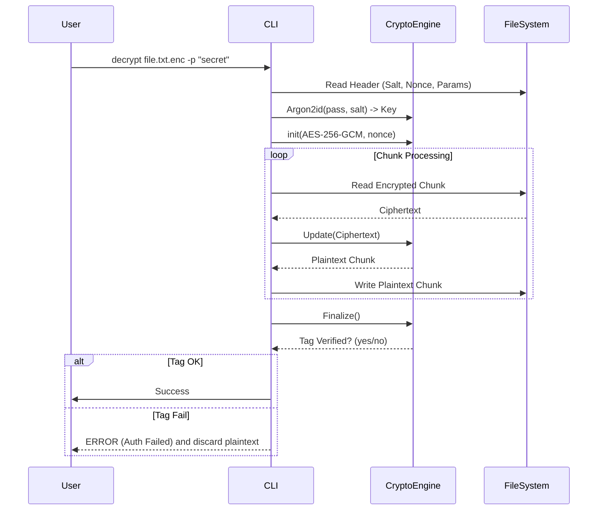

# Luồng Giải Mã (Decryption Workflow)

Tài liệu này mô tả các bước FileVault thực hiện khi giải mã một file đã được mã hóa bằng AEAD (mặc định AES-256-GCM).

## 1. Chuẩn bị (Setup)
1. **Input**: Đường dẫn file mã hóa (`file.txt.enc`) và mật khẩu.
2. **Open & Read Header**: Đọc magic/version, thuật toán, KDF params (salt, memory, iterations), nonce/IV, và vị trí/độ dài tag.

## 2. Khôi phục Key
1. **Derive Key**: `Argon2id(password, salt)` -> Key (32 bytes) theo tham số header.
2. **Nonce**: Lấy nonce 12 byte từ header.

## 3. Giải mã Dữ liệu (Streaming)
1. **Open Files**: Mở file mã hóa (read) và file đích (write).
2. **Decrypt Loop**:
   * Đọc từng chunk ciphertext (trừ phần tag cuối cùng nếu tách riêng).
   * Gửi vào AEAD decrypt (stream). Thư viện sẽ giữ trạng thái GHASH/Poly để kiểm tag.
   * Nhận plaintext chunk và ghi ra file tạm/output.
3. **Finalize**: AEAD kiểm tra Authentication Tag (so sánh hằng thời gian). Nếu tag không khớp → báo lỗi và không trả plaintext hợp lệ.

## 4. Sequence Diagram

## 5. Lưu ý An toàn
- Tag phải được kiểm tra thành công trước khi coi plaintext là hợp lệ.
- Nếu tag sai, không dùng dữ liệu đã ghi; nên ghi ra tệp tạm và chỉ đổi tên khi tag hợp lệ.
- Không chạm vào nonce/salt trong header; chúng phải được đọc nguyên bản.
- Mật khẩu sai hoặc file bị sửa sẽ dẫn đến lỗi tag.
