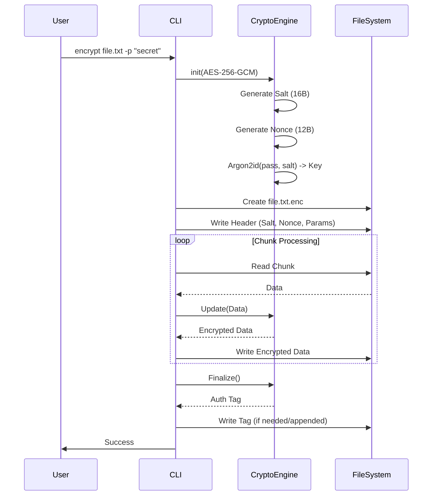

# Luồng Mã Hóa (Encryption Workflow)

Tài liệu này mô tả chi tiết các bước diễn ra khi người dùng thực hiện lệnh mã hóa một file trong FileVault.

## 1. Chuẩn bị (Setup)
1.  **Input**: Người dùng cung cấp đường dẫn file nguồn (`input.txt`) và mật khẩu.
2.  **Config**: Hệ thống xác định thuật toán (ví dụ: AES-256-GCM) và KDF (Argon2id) dựa trên cấu hình hoặc mặc định.

## 2. Xử lý Header & Key
1.  **Generate Salt**: Sinh ngẫu nhiên 16 bytes salt.
2.  **Derive KEK**: Chạy `Argon2id(password, salt)` -> thu được KEK (32 bytes).
3.  **Generate DEK**: Sinh ngẫu nhiên 32 bytes DEK (Data Encryption Key).
4.  **Encrypt DEK**: Mã hóa DEK bằng KEK (thường dùng AES-KeyWrap hoặc đơn giản là XOR/Encrypt nếu dùng mô hình đơn giản hơn). *Lưu ý: Trong implementation hiện tại của FileVault CLI đơn giản, có thể dùng trực tiếp Derived Key làm Key mã hóa file (Direct Encryption) hoặc dùng Envelope. Tài liệu này mô tả mô hình Direct Encryption (nếu code dùng cách đó) hoặc Envelope (nếu code dùng cách đó).*

*(Dựa trên code `crypto_engine.cpp` và `encrypt_cmd.cpp`, FileVault hiện tại có vẻ dùng Direct Encryption: Password -> Key -> Encrypt File. Sẽ cập nhật luồng theo Direct Encryption cho chính xác với code hiện tại).*

### Luồng Direct Encryption (Hiện tại)
1.  **Generate Salt**: Sinh 16 bytes salt.
2.  **Derive Key**: `Argon2id(password, salt)` -> Key (32 bytes).
3.  **Generate Nonce**: Sinh 12 bytes nonce (cho GCM).

## 3. Xử lý Dữ liệu (Streaming)
Do file có thể lớn hơn RAM, FileVault xử lý theo chunk (khối):

1.  **Open Files**: Mở file input (read) và output (write).
2.  **Write Header**: Ghi metadata vào đầu file output:
    *   Magic Bytes (`FVLT`)
    *   Version
    *   Algorithm ID
    *   KDF ID & Params (Salt, Iterations, Memory)
    *   Nonce/IV
3.  **Encryption Loop**:
    *   Đọc một chunk từ input (ví dụ 64KB).
    *   Mã hóa chunk đó bằng Key & Nonce (Lưu ý: Với GCM/ChaCha, thường phải mã hóa toàn bộ stream hoặc dùng chunk có tag riêng. FileVault dùng thư viện Botan filter/pipe để xử lý stream trong suốt).
    *   Ghi dữ liệu đã mã hóa vào output.
4.  **Finalize**: Tính toán và ghi Authentication Tag (nếu thuật toán AEAD).

## 4. Sequence Diagram

